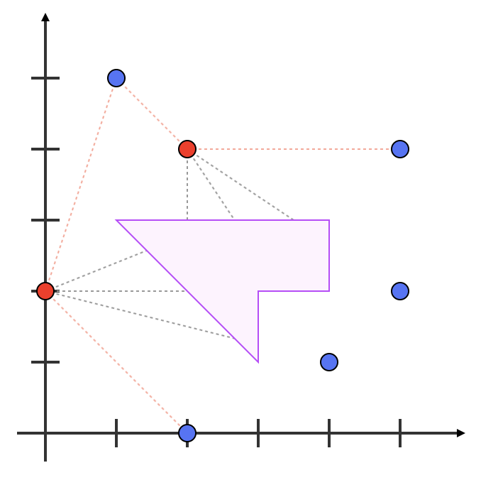

## Lab07 - Exercise - Call of Duty: Advanced Algebra

Rather than spending your spare time playing Call of Duty, you decide you're going to think about the mathematics behind it. In this simplified version, there are commandos, turrets and an enemy base.

The enemy's base is protected by fixed position machine gun turrets that can fire in any direction (red in the diagram below). The headshed want to position our commandos (blue in the diagram below) where the turrets can't shoot them because they're protected by the walls of the enemy's base. They're going to give you a strategy, and you must say who will be safe.

For this simulation, you will be provided with three lists of `(x,y)` co-ordinates to a function `simulate(commandos, turrets, base)`, where `commandos` is the list of `C` commandos, `turrets` is a list of `T` enemy turrets, and `base` contain the co-ordinates of the `B` vertices of the base.

There will be at least three vertices, and they will be listed in clockwise order. No points will overlap, and no commandos or turrets will be on the edge of or contained within the base.


Above is an example situation. The blue dots are the commandos, the red dots are the turrets, and the base is the purple polygon. Your function should return the `x` and `y` co-ordinates of each surviving commando after the machine guns have fired. The scenario in the diagram above is shown in this example.

```
>>> simulate([(1,5), (5,4), (5,2), (4,1), (2,0)], [(2,4), (0,2)], [(1,3), (4,3), (4,2), (3,2), (3,1)])
[(5,2), (4,1)]
```

In this example, the commandos at co-ordinates `(5,2)` and `(4,1)` did not die as neither turret can see them:



All `x` and `y` values provided to your program will be integers. In the input format, there is an implicit edge between the first and last co-ordinate of the base. The order in which you print out the co-ordinates of the surviving commandos does not matter.

If the machine gun's line of sight hits any part of the base, including a corner or and edge of the base, it does not extend past the point of intersection. For example:

```
>>> simulate([(1,1) (2,2) (3,3)], [ (6,6) ] [ (3,4), (3,5), (4,5), (4,4) ])
[(1,1), (2,2), (3,3)]
```

Complete your solution in `cod.py`.

Problem sourced from Grok Learning NCSS Challenge (Advanced), 2015.
