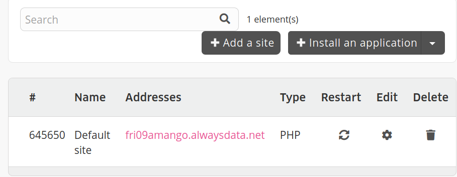
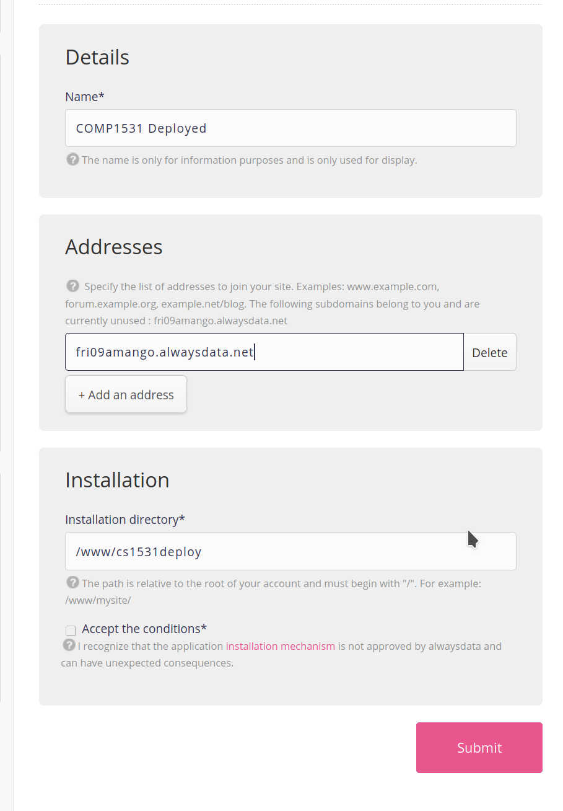
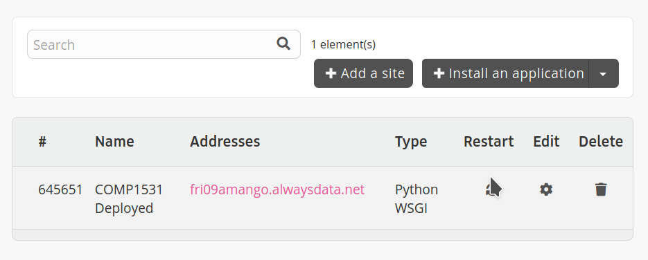
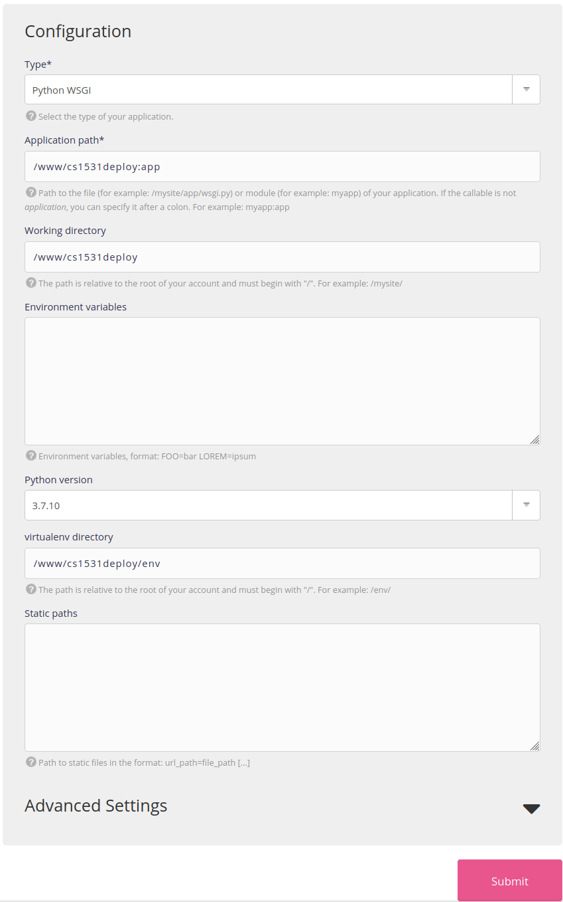
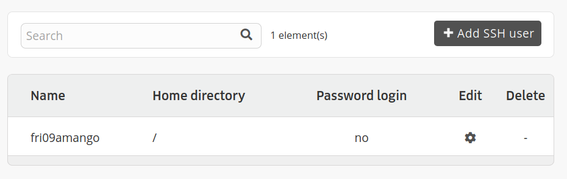
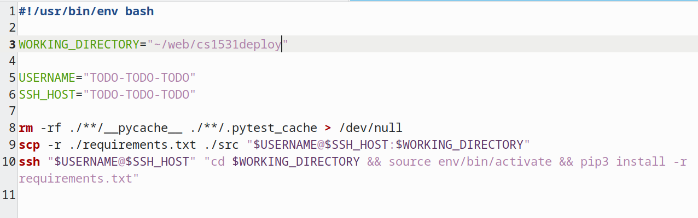

# COMP1531 Major Project

 **✨ Teamwork makes the [UNSW] Dream[s] work 🌈**

## Contents

  1. Aims
  2. Overview
  3. Iteration 1: Basic functionality and tests
  4. Iteration 2: Building a web server
  5. Iteration 3: Completing the lifecycle
  6. Interface specifications
  7. Style and documentation
  8. Due Dates and Weightings
  9. Other Expectations
  10. Plagiarism

## 0. Change Log

* 07/04: Added `v1` to `auth/passwordreset/reset/` route name
* 10/04: Clarified tracking of utilization and involvement
* 13/04: Removed the rest of a paragraph in requirements & design section that was taken out
* 16/04: Removed duplicates of `user` and `messages` data type. To be clear, in iteration 2 `user` has had properties `reacts` and `is_pinned` added to it, and `messages` has had properties `profile_img_url` added to it.
* 16/04: Extend due date back by 3 hours (new date: Tuesday 20th April @ 1pm)

## 1. Aims:

* To provide students with hands on experience testing, developing, and maintaining a backend server in python.
* To develop students' problem solving skills in relation to the software development lifecycle.
* Learn to work effectively as part of a team by managing your project, planning, and allocation of responsibilities among the members of your team.
* Gain experience in collaborating through the use of a source control and other associated modern team-based tools.
* Apply appropriate design practices and methodologies in the development of their solution
* Develop an appreciation for product design and an intuition of how a typical customer will use a product.

## 2. Overview

To manage the transition from trimesters to hexamesters in 2020, UNSW has established a new focus on building an in-house digital collaboration and communication tool for groups and teams to support the high intensity learning environment.

Rather than re-invent the wheel, UNSW has decided that it finds the functionality of **<a href="https://www.microsoft.com/en-au/microsoft-teams/group-chat-software">Microsoft Teams</a>** to be nearly exactly what it needs. For this reason, UNSW has contracted out Penguin Pty Ltd (a small software business run by Hayden) to build the new product. In UNSW's attempt to try and add a lighter not to the generally fatigued and cynical student body, they have named their UNSW-based product **UNSW Dreams** (or just **Dreams** for short). **UNSW Dreams** is the communication tool that allows you to share, communication, and collaborate to (attempt to) make dreams a reality.

Penguin Pty Ltd has sub-contracted two software firms:

* BlueBottle Pty Ltd (two software developers, Andrea and Andrew, who will build the initial web-based GUI)
* YourTeam Pty Ltd (a team of talented misfits completing COMP1531 in 21T1), who will build the backend python server and possibly assist in the GUI later in the project

In summary, UNSW contracts Penguin Pty Ltd, who sub contracts:

* BlueBottle (Andrea and Andrew) for front end work
* YourTeam (you and others) for backend work

Penguin Pty Ltd met with Andrea and Andrew (the front end development team) 2 weeks ago to brief them on this project. While you are still trying to get up to speed on the requirements of this project, Andrea and Andrew understand the requirements of the project very well.

Because of this they have already specified a **common interface** for the frontend and backend to operate on. This allows both parties to go off and do their own development and testing under the assumption that both parties will comply with the common interface. This is the interface **you are required to use**

Besides the information available in the interface that Andrea and Andrew provided, you have been told (so far) that the features of **Dreams** that UNSW would like to see implemented include:

1. Ability to login, register if not registered, and log out
2. Ability to reset password if forgotten
3. Ability to see a list of channels
4. Ability to create a channel, join a channel, invite someone else to a channel, and leave a channel
5. Within a channel, ability to view all messages, view the members of the channel, and the details of the channel
6. Within a channel, ability to send a message now, or to send a message at a specified time in the future
7. Within a channel, ability to edit, share between channels, remove, pin, unpin, react, or unreact to a message
8. Ability to view anyone's user profile, and modify a user's own profile (name, email, handle, and profile photo)
9. Ability to search for messages based on a search string
10. Ability to modify a user's admin permissions: (MEMBER, OWNER)
11. Ability to begin a "standup", which is an X minute period where users can send messages that at the end of the period will automatically be collated and summarised to all users
12. Ability to send message directly to a user (or group of users) via direct messaging (DM).

The specific capabilities that need to be built for this project are described in the interface at the bottom. This is clearly a lot of features, but not all of them are to be implemented at once (see below)

## 3. Iteration 1: Basic functionality and tests

This iteration is now complete. Please see commit history to view information pertaining to iteration 1.

## 4. Iteration 2: Building a web server

This iteration is now complete. Please see commit history to view information pertaining to iteration 2.


## 5. Iteration 3: Completing the lifecycle


Iteration 3 builds off all of the work you've completed in iteration 2.

If you haven't completed the implementations for iteration 2, you must complete them as part of this iteration. The automarking for iteration 3 will test on a fully completed interface.

### 5.1. Task

In this iteration, you are expected to:

1. Implement and test the HTTP Flask server according to the entire interface provided in the specification, including features that were added in iteration 3, including:
    * `message/sendlater`
    * `message/sendlaterdm`
    * `message/react`
    * `message/unreact`
    * `message/pin`
    * `message/unpin`
    * `user/profile/uploadphoto`
    * `user/stats`
    * `users/stats`
    * `standup/start`
    * `standup/active`
    * `standup/send`
    * `auth/passwordreset/request`
    * `auth/passwordreset/reset`

    * Part of this section will be automarked.

    * It is required that your data is persistent just like iteration 2.

    * Pylint is assessed identical to that of iteration 2.

    * *Branch* coverage for all .py files that aren't tests is assessed identical to that of iteration 2.

    * You can structure your tests however you choose, as long as they are appended with `_test.py`.

    * A frontend has been built by Andrea and Andrew that you can use in this iteration, and use your backend to power it (note: an incomplete backend will mean the frontend cannot work). **You can, if you wish, make changes to the frontend code, but it is not required for this iteration.** As part of this iteration it's required that your backend code can correctly power the frontend.

    * You must comply with instructions laid out in `5.2`

2. Continue demonstrating effective project management and effective git usage

    * Part of this section may be automarked.

    * You will be heavily marked for your use of thoughtful project management and use of git effectively. The degree to which your team works effectively will also be assessed.

    * As for iteration 1 all task tracking and management will need to be done via the GitLab Taskboard.

3. Document the planning of new features.

    * You are required to scope out 2-3 problems to solve for future iterations of **Dreams**. You aren't required to build/code them, but you are required to go through SDLC steps of requirements analysis, conceptual modelling, and design.

    * Full detail of this can be found in `5.3`.

4. Analytics

   You are required to begin keeping track of certain metrics in your backend to be displayed on the frontend.

   Full detail of this can be found `5.4`

6. Deploy your backend to the cloud.

   You are required to deploy your backend to AlwaysData so that it can be accessed from anywhere in the world.

   Full detail of this can be found in `5.5`

### 5.2. How to implement and test features

Continue working this project by making distinct "features". Each feature should add some meaningful functionality to the project, but still be as small as possible. You should aim to size features as the smallest amount of functionality that adds value without making the project more unstable. For each feature you should:

1. Create a new branch.
2. Write tests for that feature and commit them to the branch.
3. Implement that feature.
4. Make any changes to the tests such that they pass with the given implementation. You should not have to do a lot here. If you find that you are, you're not spending enough time on step 2.
5. Create a merge request for the branch.
6. Get someone in your team who **did not** work on the feature to review the merge request. When reviewing, **not only should you ensure the new feature has tests that pass, but you should also check that the coverage percentage has not been significantly reduced.**
7. Fix any issues identified in the review.
8. Merge the merge request into master.

For this project, a feature is typically sized somewhere between a single function, and a whole file of functions (e.g. `auth.py`). It is up to you and your team to decide what each feature is.

There is no requirement that each feature be implemented by only one person. In fact, we encourage you to work together closely on features, especially to help those who may still be coming to grips with python.

Please pay careful attention to the following:

Your tests, keep in mind the following:
* We want to see **evidence that you wrote your tests before writing the implementation**. As noted above, the commits containing your initial tests should appear *before* your implementation for every feature branch. If we don't see this evidence, we will assume you did not write your tests first and your mark will be reduced.
* You should have black-box tests for all tests required (i.e. testing each function/endpoint). However, you are also welcome to write whitebox unit tests in this iteration if you see that as important.
* Merging in merge requests with failing pipelines is **very bad practice**. Not only does this interfere with your teams ability to work on different features at the same time, and thus slow down development, it is something you will be penalised for in marking.
* Similarly, merging in branches with untested features is also **very bad practice**. We will assume, and you should too, that any code without tests does not work.
* Pushing directly to `master` is not possible for this repo. The only way to get code into master is via a merge request. If you discover you have a bug in `master` that got through testing, create a bugfix branch and merge that in via a merge request.

### 5.3. Planning for the next problems to solve

Software development is an iterative process - we're never truly finished. As we complete the development and testing of one feature, we're often then trying to understand the requirements and needs of our users to design the next set of features in our product.

For iteration 3 you are going to produce a short report in `planning.pdf` and place it in the repository. The contents of this report will be a simplified approach to understanding user problems, developing requirements, and doing some early designs.

N.B. If you don't know how to produce a PDF, you can easily make one in google docs and then export to PDF.

#### [Requirements] Elicitation

Find 2-3 people to interview as target users. Target users are people who currently use a tool like **Dreams**, or intend to. Collect their name and email address.

Develop a series of questions to ask these target users to understand what *problems* they might have with teamwork-driven communication tools that are currently unsolved by **Dreams**. Give these questions to your target users and record their answers.

#### [Requirements] Analysis & Specification - Use Cases

Once you've elicited this information, it's time to consolidate it.

Take the responses from the elicitation and express these requirements as **User Stories**. Document these user stories. For each user story, add User Acceptance Criteria as notes so that you have a clear definition of when a story has been completed.

Once documented, generate at least one use case that attempts to tell a story of a solution that satifies the requirements elicited. You can generate a visual diagram or a more written-recipe style, as per lectures.

#### [Requirements] Validation

With your completed use case work, reach out to the 2-3 people you interviewed originally and inquire as to the extent to which these use cases would adequately describe the problem they're trying to solve. Ask them for a comment on this, and record their comments in the PDF.

#### [Design] Interface Design

Now that we've established our _problem_ (described as requirements), it's time to think about our _solution_ in terms of what capabilities would be necessary. You will specify these capabilities as HTTP endpoints, similar to what is described in `6.2`. There is no minimum or maximum of what is needed - it will depend on what problem you're solving.

#### [Design] Conceptual Modelling (State)

Now that you have a sense of the problem to solve, and what capabilities you will need to provide to solve it, add at least one state diagram to your PDF to show how the state of the application would change based on user actions. The aim of this diagram is how to a developer understand the different states the user or application.

### 5.4. Analytics

Andrea and Andrew have implemented analytics pages for users and for the Dream workspace in the front-end and need data.
Your task is to add to your back-end functionality that keeps track of these metrics:

For users:
  * The number of channels the user is a part of
  * The number of DMs the user is a part of
  * The number of messages the user has sent
  * The user's involvement, as defined by this pseudocode: `sum(num_channels_joined, num_dms_joined, num_msgs_sent)/sum(num_dreams_channels, num_dreams_dms, num_dreams_msgs)`

For the Dream workspace:
  * The number of channels that exist currently
  * The number of DMs that exist currently
  * The number of messages that exist currently
  * The workspace's utilization, which is a ratio of the number of users who have joined at least one channel/DM to the total number of users, as defined by this pseudocode: `num_users_who_have_joined_at_least_one_channel_or_dm / total_num_users`

As UNSW is very interested in its users' engagement, all analytics **except for utilization and involvement** must be tracked as **time-series data**. This means every change must be timestamped and archived, rather than just the most recent change. Only the **latest** utilization and involvement rates are required to be tracked.

In addition to keeping track of these metrics, you are required to implement two new endpoints, the details of which can be found in Section `6.2`.

### 5.5. Deployment

You and your team are to host your back-end on a cloud-provider such as <a href="https://www.alwaysdata.com/en/" > AlwaysData</a>. Once your back-end has been deployed to the cloud, you will be able to point the front-end to use the new URL of where the back-end is deployed and use your back-end from anywhere in the world.

Depending on how you and your team have structured your project, your current method of using data may have to be rethought. Deploying to cloud and developing locally require two different mindsets and you and your team may find that you held some assumptions that are valid when developing locally but do not hold when being hosted on the cloud.


#### 5.5.1. One-time setup

### Setup

1. Navigate to https://admin.alwaysdata.com/ and sign up with a new account (one per team is fine). Use a password you're happy both sharing with your team members and being made public on the internet in the worst case. Set your "Account name" as your 1531 group name (e.g. FRI09AMANGO) for simplicity. Don't worry about any of the "Payment" sections, you won't be charged any money.

2. After logging in, in the sidebar click on "Web > Sites" in the sidebar


3. Delete the "Default Site", and then click the "Install an an application" button and choose "Flask".



4. On the details page, choose a name "COMP1531 Deployed", set the address to be the one stated immediately above the input as "currently unused" (this will be similar to your username), and for installation set it as as /www/cs1531deploy. Submit the form.



5. On the "Web > Sites" page go to "Edit" for your one site.



6. Scroll down and change "Application path" to `/www/cs1531deploy/src/server.py:APP` and change the Python version to `3.9.2`. Click submit.



7. Navigate to the "Remote access" tab in the sidebar, and select "SSH". Click on the "edit" button for the one entry that is there.



8. Enter another password (another one you would be feel comfortable if became public in a worse case), and tick the "Enable password login" button. Submit the form.


9. Open `deploy.sh` in your cloned repository. You will need to replace the `TODO-TODO-TODO` with the following:
 * USERNAME: Your username you signed up with (e.g. fri09amango)
 * SSH_HOST: The name of the host at the top of the SSH page (e.g. ssh-fri09amango.alwaysdata.net)





#### 5.5.2. For each deployment

Every time you want to deploy the code that is on your local machine, simply run:
```bash
bash deploy.sh
```

This script will deploy the code to alwaysdata. While it's deploying you will be asked to enter your SSH password (determined in step 8) on two occasions.

Once you have done this, navigate back to "Web > Sites" on alwaysdata and click the "Restart" button for your one site.


Then navigate to the URL of that particular site. Now you have your backend running on the internet.

Note: This is only supported on linux terminals (including VLAB).

### 5.6. Marking Criteria


<table>
  <tr>
    <th>Section</th>
    <th>Weighting</th>
    <th>Criteria</th>
  </tr>
  <tr>
    <td>Automarking (Testing)</td>
    <td>10%</td>
    <td><ul>
      <li>Correctly written tests based on the specification requirements</li>
      <li>Code coverage (99% coverage gives 30% of the marks for this section)</li>
    </ul>
  </td>
  </tr>
  <tr>
    <td>Automarking (Implementation)</td>
    <td>40%</td>
    <td><ul>
      <li>Correct implementation of specified functions</li>
      <li>Correctly linted code (worth 10% of this section)</li>
    </ul>
  </td>
  </tr>
  <tr>
    <td>Code Quality</td>
    <td>20%</td>
    <td><ul>
      <li>Demonstrated an understanding of good test <b>coverage</b></li>
      <li>Demonstrated an understanding of the importance of <b>clarity</b> on the communication test and code purposes</li>
      <li>Demonstrated an understanding of thoughtful test <b>design</b></li>
      <li>Appropriate use of python data structures (lists, dictionaries, etc.)</li>
      <li>Appropriate style as described in section 8.4</li>
      <li>Appropriate application of good software design and pythonic patterns</li>
      <li>Implementation of persistent state</li>
    </ul>
  </td>
  </tr>
  <tr>
    <td>Integrations</td>
    <td>5%</td>
    <td><ul>
      <li>Successful deployment to AlwaysData</li>
    </ul>
  </td>
  </tr>
  <tr>
    <td>Git & Project Management</td>
    <td>10%</td>
    <td><ul>
      <li>Meaningful and informative git commit names being used</li>
      <li>At least 12 merge requests into master made</li>
      <li>A generally equal contribution between team members</li>
      <li>Clear evidence of reflection on group's performance and state of the team, with initiative to improve in future iterations</li>
      <li>Effective use of course-provided MS Teams for communicating, demonstrating an ability to communicate and manage effectivelly digitally</li>
      <li>Use of task board on Gitlab to track and manage tasks</li>
      <li>Effective use of agile methods such as standups</li>
      <li>Minutes/notes taken from group meetings (and stored in a logical place in the repo)</li>
    </ul>
  </td>
  </tr>
  <tr>
    <td>Requirements & Design for future work</td>
    <td>15%</td>
    <td><ul>
      <li>Requirements elicited from potential users, recorded as user stories</li>
      <li>User journey justified and expressed as use case(s)</li>
      <li>Interface proposed as a potential solution to provide capabilities</li>
      <li>State diagram drawn to demonstrate how application responds to actions</li>
    </ul>
  </td>
  </tr>
  <tr>
      <td>(Bonus Marks) Extra Features</td>
      <td>10%</td>
      <td><ul>      
            <li>Up to 10% extra marks can be gained through additions of "extra feature(s)".</li>
            <li>Marks will be awarded based on 1) Originality, 2) Technical or creative achievement, 3) Lack of bugs associated with it, 4) Size/scale of the addition.</li>
            <li>To give a rough indication of how much time should be spent on extra features, a group which has spent half of their collective iteration 3 time on extra features (which are functional) would receive full marks</li>
      </ul>
      </td>
  </tr>
</table>

### 5.7. Submission

This iteration due date and demonstrate week is described in section 7. You will demonstrate this submission inline with the information provided in section 7.

### 5.8. Extra Features

Your tutor is not required to provide any assistance with this, as it's intended for more advanced students once they complete all other criteria at a high level of quality.
A brief explanation of your additions must be written in a file <code>extra.md</code> that is added to your repo.

Here are some suggestions for extra features.

1. Frontend - **Hangman on Frontend**

    After a game of Hangman has been started any user in the channel can type /guess X where X is an individual letter. If that letter is contained in the word or phrase they're trying to guess, the app should indicate where it occurs. If it does not occur, more of the hangman is drawn. There is a lot of flexibility in how you achieve this. It can be done only by modifying the backend and relying on messages to communicate the state of the game (e.g. after making a guess, the "Hangman" posts a message with a drawing of the hangman in ASCII/emoji art). Alternatively you can modify the frontend, if you want to experiment with fancier graphics.

    The app should use words and phrases from an external source, not just a small handful hardcoded into the app. One suitable source is /usr/share/dict/words available on Unix-based systems. Alternatively, the python wikiquote module is available via pip and can be used to retrieve quotes and phrases from Wikiquote.

    Note that this part of the specification is deliberately open-ended. You're free to make your own creative choices in exactly how the game should work, as long as the end result is something that could be fairly described as Hangman.

2. Frontend - **Dark Mode** - Modify the frontend code so that on the flip of a switch in the navbar, the website is now in "dark mode" with a colour schema of your choosing.

3. Frontend - **LaTEX / Markdown Support** - Modify the frontend code so that messages in channels and dms can be rendered in LaTEX and/or Markdown.

4. **Databases** - Implementing persistence using a form of database. This can be done in python using the `sqlite3` or `peewee` or `psycopg2` modules to run SQL queries on a local .db file or a remote db.

5. **Object-Oriented Programming** - Refactor your code so data is stored in objects instead of dictionaries.

6. **Type Checking** - Use the `typing` module to statically type-check your functions.

7. **New Features** - Implement one or more of the features you have elicited in your Requirements & Design.

## 6. Interface specifications

These interface specifications come from Andrea and Andrew, who are building the frontend to the requirements set out below.

### 6.1. Data types

<table>
  <tr>
    <th>Variable name</th>
    <th>Type</th>
  </tr>
  <tr>
    <td>named exactly <b>email</b></td>
    <td>string</td>
  </tr>
  <tr>
    <td>has suffix <b>id</b></td>
    <td>integer</td>
  </tr>
  <tr>
    <td>named exactly <b>length</b></td>
    <td>integer</td>
  </tr>
  <tr>
    <td>contains substring <b>password</b></td>
    <td>string</td>
  </tr>
  <tr>
    <td>named exactly <b>token</b></td>
    <td>string</td>
  </tr>
  <tr>
    <td>named exactly <b>message</b></td>
    <td>string</td>
  </tr>
  <tr>
    <td>contains substring <b>name</b></td>
    <td>string</td>
  </tr>
  <tr>
    <td>has prefix <b>is_</b></td>
    <td>boolean</td>
  </tr>
  <tr>
    <td>has prefix <b>time_</b></td>
    <td>integer (unix timestamp), [check this out](https://www.tutorialspoint.com/How-to-convert-Python-date-to-Unix-timestamp)</td>
  </tr>
  <tr>
    <td>(outputs only) named exactly <b>channels</b></td>
    <td>List of dictionaries, where each dictionary contains types { channel_id, name }</td>
  </tr>
  <tr>
    <td>has suffix <b>_str</b></td>
    <td>string</td>
  </tr>
  <tr>
    <td>(outputs only) named exactly <b>dms</b></td>
    <td>List of dictionaries, where each dictionary contains types { dm_id, name }</td>
  </tr>
  <tr>
    <td>(outputs only) name ends in <b>members</b></td>
    <td>List of dictionaries, where each dictionary contains types of <b>user</b></td>
  </tr>
  <tr>
    <td>(outputs only) named exactly <b>users</b></td>
    <td>List of dictionaries, where each dictionary contains types of <b>user</b></td>
  </tr>
  <tr>
    <td>(outputs only) named exactly <b>notifications</b></td>
    <td>List of dictionaries, where each dictionary contains types { channel_id, dm_id, notification_message } where channel_id is the id of the channel that the event happened in, and is <code>-1</code> if it is being sent to a DM. dm_id is the DM that the event happened in, and is <code>-1</code> if it is being sent to a channel. The list should be ordered from most to least recent. Notification_message is a string of the following format for each trigger action:<ul><li>tagged: "{User’s handle} tagged you in {channel/DM name}: {first 20 characters of the message}"</li><li>reacted message: "{User’s handle} reacted to your message in {channel/DM name}"</li><li>added to a channel/DM: "{User’s handle} added you to {channel/DM name}"</li></ul>
    </td>
  </tr>
  <tr>
    <td>named exactly <b>u_ids</b></td>
    <td>List of user ids</td>
  </tr>
  <tr>
    <td>contains substring <b>code</b></td>
    <td>string</td>
  </tr>
  <tr>
    <td>has suffix <b>_id</b></td>
    <td>integer</td>
  </tr>
  <tr>
    <td>has prefix <b>num_</b></td>
    <td>integer</td>
  </tr>
  <tr>
    <td>has suffix <b>_rate</b></td>
    <td>float between 0 and 1 inclusive</td>
  </tr>
  <tr>
    <td>(outputs only) named exactly <b>user_stats</b></td>
    <td> Dictionary of shape {<br />
    &emsp;channels_joined: [{num_channels_joined, time_stamp}],<br/>
    &emsp;dms_joined: [{num_dms_joined, time_stamp}], <br />
    &emsp;messages_sent: [{num_messages_sent, time_stamp}], <br />
    &emsp;involvement_rate <br />
    }
    </td>
  </tr>
  <tr>
    <td>(outputs only) named exactly <b>dreams_stats</b></td>
    <td> Dictionary of shape {<br />
    &emsp;channels_exist: [{num_channels_exist, time_stamp}], <br />
    &emsp;dms_exist: [{num_dms_exist, time_stamp}], <br />
    &emsp;messages_exist: [{num_messages_exist, time_stamp}], <br />
    &emsp;utilization_rate <br />
    }
    </td>
  </tr>
  <tr>
    <td>has suffix <b>end</b></td>
    <td>integer</td>
  </tr>
  <tr>
    <td>has suffix <b>start</b></td>
    <td>integer</td>
  </tr>
  <tr>
    <td>has suffix <b>_url</b></td>
    <td>string</td>
  </tr>
  <tr>
    <td>(outputs only) name ends in <b>reacts</b></td>
    <td>List of dictionaries, where each dictionary contains types { react_id, u_ids, is_this_user_reacted } where react_id is the id of a react, and u_ids is a list of user id's of people who've reacted for that react. is_this_user_reacted is whether or not the authorised user has been one of the reacts to this post</td>
  </tr>
  <tr>
    <td>(outputs only) named exactly <b>user</b></td>
    <td>Dictionary containing u_id, email, name_first, name_last, handle_str, profile_img_url</td>
  </tr>
  <tr>
    <td>(outputs only) named exactly <b>messages</b></td>
    <td>List of dictionaries, where each dictionary contains types { message_id, u_id, message, time_created, reacts, is_pinned  }</td>
  </tr>
</table>

### 6.2. Interface

<table>
  <tr>
    <th>Name & Description</th>
    <th>HTTP Method</th>
    <th>Data Types</th>
    <th>Exceptions</th>
  </tr>
  <tr>
    <td><code>auth/login/v2</code><br /><br />Given a registered users' email and password and returns a new `token` for that session</td>
    <td style="font-weight: bold; color: blue;">POST</td>
    <td><b>Parameters:</b><br /><code>(email, password)</code><br /><br /><b>Return Type:</b><br /><code>{ token, auth_user_id }</code></td>
    <td>
      <b>InputError</b> when any of:
      <ul>
        <li>Email entered is not a valid email</li>
        <li>Email entered does not belong to a user</li>
        <li>Password is not correct</li>
      </ul>
    </td>
  </tr>
  <tr>
    <td><code>auth/register/v2</code><br /><br />Given a user's first and last name, email address, and password, create a new account for them and return a new `token` for that session. A handle is generated that is the concatenation of a lowercase-only first name and last name. If the concatenation is longer than 20 characters, it is cutoff at 20 characters. The handle will not include any whitespace or the '@' character. Once you've concatenated it, if the handle is once again taken, append the concatenated names with the smallest number (starting from 0) that forms a new handle that isn't already taken. The addition of this final number may result in the handle exceeding the 20 character limit.</td>
    <td style="font-weight: bold; color: blue;">POST</td>
    <td><b>Parameters:</b><br /><code>(email, password, name_first, name_last)</code><br /><br /><b>Return Type:</b><br /><code>{ token, auth_user_id }</code></td>
    <td>
      <b>InputError</b> when any of:
      <ul>
        <li>Email entered is not a valid email using the method provided [here](https://www.geeksforgeeks.org/check-if-email-address-valid-or-not-in-python/) (unless you feel you have a better method).</li>
        <li>Email address is already being used by another user</li>
        <li>Password entered is less than 6 characters long</li>
        <li>name_first is not between 1 and 50 characters inclusively in length</li>
        <li>name_last is not between 1 and 50 characters inclusively in length</li>
      </ul>
    </td>
  </tr>
  <tr>
    <td><code>auth/logout/v1</code><br /><br />Given an active token, invalidates the token to log the user out. If a valid token is given, and the user is successfully logged out, it returns true, otherwise false.</td>
    <td style="font-weight: bold; color: blue;">POST</td>
    <td><b>Parameters:</b><br /><code>(token)</code><br /><br /><b>Return Type:</b><br /><code>{ is_success }</code></td>
    <td>N/A</td>
  </tr>
  <tr>
    <td><code>channel/invite/v2</code><br /><br />Invites a user (with user id u_id) to join a channel with ID channel_id. Once invited the user is added to the channel immediately</td>
    <td style="font-weight: bold; color: blue;">POST</td>
    <td><b>Parameters:</b><br /><code>(token, channel_id, u_id)</code><br /><br /><b>Return Type:</b><br /><code>{}</code></td>
    <td>
      <b>InputError</b> when any of:
      <ul>
        <li>channel_id does not refer to a valid channel.</li>
        <li>u_id does not refer to a valid user</li>
      </ul>
      <b>AccessError</b> when any of:
      <ul>
        <li>the authorised user is not already a member of the channel</li>
      </ul>
    </td>
  </tr>
  <tr>
    <td><code>channel/details/v2</code><br /><br />Given a Channel with ID channel_id that the authorised user is part of, provide basic details about the channel</td>
    <td style="font-weight: bold; color: green;">GET</td>
    <td><b>Parameters:</b><br /><code>(token, channel_id)</code><br /><br /><b>Return Type:</b><br /><code>{ name, is_public, owner_members, all_members }</code></td>
    <td>
      <b>InputError</b> when any of:
      <ul>
        <li>Channel ID is not a valid channel</li>
      </ul>
      <b>AccessError</b> when any of:
      <ul>
        <li>Authorised user is not a member of channel with channel_id</li>
      </ul>
    </td>
  </tr>
  <tr>
    <td><code>channel/messages/v2</code><br /><br />Given a Channel with ID channel_id that the authorised user is part of, return up to 50 messages between index "start" and "start + 50". Message with index 0 is the most recent message in the channel. This function returns a new index "end" which is the value of "start + 50", or, if this function has returned the least recent messages in the channel, returns -1 in "end" to indicate there are no more messages to load after this return.</td>
    <td style="font-weight: bold; color: green;">GET</td>
    <td><b>Parameters:</b><br /><code>(token, channel_id, start)</code><br /><br /><b>Return Type:</b><br /><code>{ messages, start, end }</code></td>
    <td>
      <b>InputError</b> when any of:
      <ul>
        <li>Channel ID is not a valid channel</li>
        <li>start is greater than the total number of messages in the channel</li>
      </ul>
      <b>AccessError</b> when any of:
      <ul>
        <li>Authorised user is not a member of channel with channel_id</li>
      </ul>
    </td>
  </tr>
  <tr>
    <td><code>channel/join/v2</code><br /><br />Given a channel_id of a channel that the authorised user can join, adds them to that channel</td>
    <td style="font-weight: bold; color: blue;">POST</td>
    <td><b>Parameters:</b><br /><code>(token, channel_id)</code><br /><br /><b>Return Type:</b><br /><code>{}</code></td>
    <td>
      <b>InputError</b> when any of:
      <ul>
        <li>Channel ID is not a valid channel</li>
      </ul>
      <b>AccessError</b> when any of:
      <ul>
        <li>channel_id refers to a channel that is private (when the authorised user is not a global owner)</li>
      </ul>
    </td>
  </tr>

  <tr>
    <td><code>channel/addowner/v1</code><br /><br />Make user with user id u_id an owner of this channel</td>
    <td style="font-weight: bold; color: blue;">POST</td>
    <td><b>Parameters:</b><br /><code>(token, channel_id, u_id)</code><br /><br /><b>Return Type:</b><code>{}</code>
    </td>
    <td>
      <b>InputError</b> when any of:
      <ul>
        <li>Channel ID is not a valid channel</li>
        <li>When user with user id u_id is already an owner of the channel</li>
      </ul>
      <b>AccessError</b> when the authorised user is not an owner of the **Dreams**, or an owner of this channel</li>
      </ul>
    </td>
  </tr>
  <tr>
    <td><code>channel/removeowner/v1</code><br /><br />Remove user with user id u_id an owner of this channel</td>
    <td style="font-weight: bold; color: blue;">POST</td>
    <td><b>Parameters:</b><br /><code>(token, channel_id, u_id)</code><br /><br /><b>Return Type:</b><br /><code>{}</code></td>
    <td>
      <b>InputError</b> when any of:
      <ul>
        <li>Channel ID is not a valid channel</li>
        <li>When user with user id u_id is not an owner of the channel</li>
        <li>The user is currently the only owner</li>
      </ul>
      <b>AccessError</b> when the authorised user is not an owner of the **Dreams**, or an owner of this channel</li>
      </ul>
    </td>
  </tr>
  <tr>
    <td><code>channel/leave/v1</code><br /><br />Given a channel ID, the user removed as a member of this channel. Their messages should remain in the channel</td>
    <td style="font-weight: bold; color: blue;">POST</td>
    <td><b>Parameters:</b><br /><code>(token, channel_id)</code><br /><br /><b>Return Type:</b><br /><code>{}</code></td>
    <td>
      <b>InputError</b> when any of:
      <ul>
        <li>Channel ID is not a valid channel</li>
      </ul>
      <b>AccessError</b> when
      <ul>
        <li>Authorised user is not a member of channel with channel_id</li>
      </ul>
    </td>
  </tr>
  <tr>
    <td><code>channels/list/v2</code><br /><br />Provide a list of all channels (and their associated details) that the authorised user is part of</td>
    <td style="font-weight: bold; color: green;">GET</td>
    <td><b>Parameters:</b><br /><code>(token)</code><br /><br /><b>Return Type:</b><br /><code>{ channels }</code></td>
    <td>N/A</td>
  </tr>
  <tr>
    <td><code>channels/listall/v2</code><br /><br />Provide a list of all channels (and their associated details)</td>
    <td style="font-weight: bold; color: green;">GET</td>
    <td><b>Parameters:</b><br /><code>(token)</code><br /><br /><b>Return Type:</b><br /><code>{ channels }</code></td>
    <td>N/A</td>
  </tr>
  <tr>
    <td><code>channels/create/v2</code><br /><br />Creates a new channel with that name that is either a public or private channel</td>
    <td style="font-weight: bold; color: blue;">POST</td>
    <td><b>Parameters:</b><br /><code>(token, name, is_public)</code><br /><br /><b>Return Type:</b><br /><code>{ channel_id }</code></td>
    <td>
      <b>InputError</b> when any of:
      <ul>
        <li>Name is more than 20 characters long</li>
      </ul>
    </td>
  </tr>
  <tr>
    <td><code>message/send/v2</code><br /><br />Send a message from authorised_user to the channel specified by channel_id. Note: Each message should have it's own unique ID. I.E. No messages should share an ID with another message, even if that other message is in a different channel.</td>
    <td style="font-weight: bold; color: blue;">POST</td>
    <td><b>Parameters:</b><br /><code>(token, channel_id, message)</code><br /><br /><b>Return Type:</b><br /><code>{ message_id }</code></td>
    <td>
      <b>InputError</b> when any of:
      <ul>
        <li>Message is more than 1000 characters</li>
      </ul>
        <b>AccessError</b> when: <li> the authorised user has not joined the channel they are trying to post to</li>
      </ul>
    </td>
  </tr>
  <tr>
    <td><code>message/edit/v2</code><br /><br />Given a message, update its text with new text. If the new message is an empty string, the message is deleted.</td>
    <td style="font-weight: bold; color: brown;">PUT</td>
    <td><b>Parameters:</b><br /><code>(token, message_id, message)</code><br /><br /><b>Return Type:</b><br /><code>{}</code></td>
    <td>
      <b>InputError</b> when any of:
      <ul>
        <li>Length of message is over 1000 characters</li>
        <li>message_id refers to a deleted message</li>
      </ul>
      <b>AccessError</b> when none of the following are true:
      <ul>
        <li>Message with message_id was sent by the authorised user making this request</li>
        <li>The authorised user is an owner of this channel (if it was sent to a channel) or the **Dreams**</li>
      </ul>
    </td>
  </tr>
  <tr>
    <td><code>message/remove/v1</code><br /><br />Given a message_id for a message, this message is removed from the channel/DM</td>
    <td style="color: red; font-weight: bold;">DELETE</td>
    <td><b>Parameters:</b><br /><code>(token, message_id)</code><br /><br /><b>Return Type:</b><br /><code>{}</code></td>
    <td>
      <b>InputError</b> when any of:
      <ul>
        <li>Message (based on ID) no longer exists</li>
      </ul>
      <b>AccessError</b> when none of the following are true:
      <ul>
        <li>Message with message_id was sent by the authorised user making this request</li>
        <li>The authorised user is an owner of this channel (if it was sent to a channel) or the **Dreams**</li>
      </ul>
    </td>
  </tr>
  <tr>
    <td><code>message/share/v1</code><br /><br /><code>og_message_id</code> is the original message. <code>channel_id</code> is the channel that the message is being shared to, and is <code>-1</code> if it is being sent to a DM. <code>dm_id</code> is the DM that the message is being shared to, and is <code>-1</code> if it is being sent to a channel.
    <code>message</code> is the optional message in addition to the shared message, and will be an empty string <code>''</code> if no message is given</td>
    <td style="font-weight: bold; color: blue;">POST</td>
    <td><b>Parameters:</b><br /><code>(token, og_message_id, message, channel_id, dm_id)</code><br /><br /><b>Return Type:</b><br /><code>{shared_message_id}</code></td>
    <td>AccessError when: <ul><li>the authorised user has not joined the channel or DM they are trying to share the message to</li>
    </ul> </td>
  </tr>
  <tr>
    <td><code>dm/details/v1</code><br /><br />Users that are part of this direct message can view basic information about the DM</td>
    <td style="font-weight: bold; color: green;">GET</td>
    <td><b>Parameters:</b><br /><code>(token, dm_id)</code><br /><br /><b>Return Type:</b><br /><code>{ name, members }</code></td>
    <td>
      <b>InputError</b> when any of:
      <ul>
        <li>DM ID is not a valid DM</li>
      </ul>
      <b>AccessError</b> when
      <ul>
        <li>Authorised user is not a member of this DM with dm_id</li>
      </ul>
    </td>
  </tr>
  <tr>
    <td><code>dm/list/v1</code><br /><br />Returns the list of DMs that the user is a member of</td>
    <td style="font-weight: bold; color: green;">GET</td>
    <td><b>Parameters:</b><br /><code>(token)</code><br /><br /><b>Return Type:</b><br /><code>{ dms }</code></td>
    <td> N/A </td>
  </tr>
  <tr>
    <td><code>dm/create/v1</code><br /><br /><code>u_ids</code> contains the user(s) that this DM is directed to, and will not include the creator. The creator is the owner of the DM. <code>name</code> should be automatically generated based on the user(s) that is in this dm. The name should be an alphabetically-sorted, comma-separated list of user handles, e.g. 'handle1, handle2, handle3'.</td>
    <td style="font-weight: bold; color: blue;">POST</td>
    <td><b>Parameters:</b><br /><code>(token, u_ids)</code><br /><br /><b>Return Type:</b><br /><code>{ dm_id, dm_name }</code></td>
    <td>
      <b>InputError</b> when any of:
      <ul>
        <li> u_id does not refer to a valid user</li>
      </ul>
    </td>
  </tr>
  <tr>
    <td><code>dm/remove/v1</code><br /><br />Remove an existing DM. This can only be done by the original creator of the DM.</td>
    <td style="color: red; font-weight: bold;">DELETE</td>
    <td><b>Parameters:</b><br /><code>(token, dm_id)</code><br /><br /><b>Return Type:</b><br /><code>{}</code></td>
    <td> InputError when: <ul> <li> dm_id does not refer to a valid DM </li>
    </ul>
    <b>AccessError</b> when: <ul> <li>the user is not the original DM creator</li>
    </ul>

  </td>
  </tr>
  <tr>
    <td><code>dm/invite/v1</code><br /><br />Inviting a user to an existing dm</td>
    <td style="font-weight: bold; color: blue;">POST</td>
    <td><b>Parameters:</b><br /><code>(token, dm_id, u_id)</code><br /><br /><b>Return Type:</b><br /><code>{}</code></td>
    <td> <b>InputError</b> when any of: <ul>
         <li> dm_id does not refer to an existing dm.</li>
         <li> u_id does not refer to a valid user. </li>
       </ul>
        <b>AccessError</b> when: <ul>
        <li>the authorised user is not already a member of the DM</li>
      </ul>
    </td>
  </tr>
  <tr>
    <td><code>dm/leave/v1</code><br /><br />Given a DM ID, the user is removed as a member of this DM</td>
    <td style="font-weight: bold; color: blue;">POST</td>
    <td><b>Parameters:</b><br /><code>(token, dm_id)</code><br /><br /><b>Return Type:</b><br /><code>{}</code></td>
    <td>
      <b>InputError</b> when any of:
      <ul>
        <li>dm_id is not a valid DM</li>
      </ul>
      <b>AccessError</b> when
      <ul>
        <li>Authorised user is not a member of DM with dm_id</li>
      </ul>
    </td>
  </tr>
  <tr>
     <td><code>dm/messages/v1</code><br /><br />Given a DM with ID dm_id that the authorised user is part of, return up to 50 messages between index "start" and "start + 50". Message with index 0 is the most recent message in the channel. This function returns a new index "end" which is the value of "start + 50", or, if this function has returned the least recent messages in the channel, returns -1 in "end" to indicate there are no more messages to load after this return.</td>
    <td style="font-weight: bold; color: green;">GET</td>
    <td><b>Parameters:</b><br /><code>(token, dm_id, start)</code><br /><br /><b>Return Type:</b><br /><code>{ messages, start, end }</code></td>
    <td>
      <b>InputError</b> when any of:
      <ul>
        <li>DM ID is not a valid DM</li>
        <li>start is greater than the total number of messages in the channel</li>
      </ul>
      <b>AccessError</b> when any of:
      <ul>
        <li>Authorised user is not a member of DM with dm_id</li>
      </ul>
    </td>
  </tr>
  <tr>
    <td><code>message/senddm/v1</code><br /><br />Send a message from authorised_user to the DM specified by dm_id. Note: Each message should have it's own unique ID. I.E. No messages should share an ID with another message, even if that other message is in a different channel or DM.</td>
    <td style="font-weight: bold; color: blue;">POST</td>
    <td><b>Parameters:</b><br /><code>(token, dm_id, message)</code><br /><br /><b>Return Type:</b><br /><code>{ message_id }</code></td>
    <td>
      <b>InputError</b> when any of:
      <ul>
        <li>Message is more than 1000 characters</li>
      </ul>
        <b>AccessError</b> when: <li> the authorised user is not a member of the DM they are trying to post to</li>
      </ul>
    </td>
  </tr>
  <tr>
    <td><code>user/profile/v2</code><br /><br />For a valid user, returns information about their user_id, email, first name, last name, and handle</td>
    <td style="font-weight: bold; color: green;">GET</td>
    <td><b>Parameters:</b><br /><code>(token, u_id)</code><br /><br /><b>Return Type:</b><br /><code>{ user }</code></td>
    <td>
      <b>InputError</b> when any of:
      <ul>
        <li>User with u_id is not a valid user</li>
      </ul>
    </td>
  </tr>
  <tr>
    <td><code>user/profile/setname/v2</code><br /><br />Update the authorised user's first and last name</td>
    <td style="font-weight: bold; color: brown;">PUT</td>
    <td><b>Parameters:</b><br /><code>(token, name_first, name_last)</code><br /><br /><b>Return Type:</b><br /><code>{}</code></td>
    <td>
      <b>InputError</b> when any of:
      <ul>
        <li>name_first is not between 1 and 50 characters inclusively in length</li>
        <li>name_last is not between 1 and 50 characters inclusively in length</ul></ul></li>
  </tr>
  <tr>
    <td><code>user/profile/setemail/v2</code><br /><br />Update the authorised user's email address</td>
    <td style="font-weight: bold; color: brown;">PUT</td>
    <td><b>Parameters:</b><br /><code>(token, email)</code><br /><br /><b>Return Type:</b><br /><code>{}</code></td>
    <td>
      <b>InputError</b> when any of:
      <ul>
        <li>Email entered is not a valid email using the method provided [here](https://www.geeksforgeeks.org/check-if-email-address-valid-or-not-in-python/) (unless you feel you have a better method).</li>
        <li>Email address is already being used by another user</li>
      </ul>
  </tr>  
  <tr>
    <td><code>user/profile/sethandle/v1</code><br /><br />Update the authorised user's handle (i.e. display name)</td>
    <td style="font-weight: bold; color: brown;">PUT</td>
    <td><b>Parameters:</b><br /><code>(token, handle_str)</code><br /><br /><b>Return Type:</b><br /><code>{}</code></td>
    <td>
      <b>InputError</b> when any of:
      <ul>
        <li>handle_str is not between 3 and 20 characters inclusive</li>
        <li>handle is already used by another user</li>
      </ul>
    </td>
  </tr>
  <tr>
    <td><code>users/all/v1</code><br /><br />Returns a list of all users and their associated details</td>
    <td style="font-weight: bold; color: green;">GET</td>
    <td><b>Parameters:</b><br /><code>(token)</code><br /><br /><b>Return Type:</b><br /><code>{ users }</code></td>
    <td>N/A</td>
  </tr>
  <tr>
    <td><code>search/v2</code><br /><br />Given a query string, return a collection of messages in all of the channels/DMs that the user has joined that match the query</td>
    <td style="font-weight: bold; color: green;">GET</td>
    <td><b>Parameters:</b><br /><code>(token, query_str)</code><br /><br /><b>Return Type:</b><br /><code>{ messages }</code></td>
    <td>
      <b>InputError</b> when any of:
      <ul>
        <li>query_str is above 1000 characters</li>
      </ul>
    </td>
  </tr>
  <tr>
    <td><code>admin/user/remove/v1</code><br /><br />Given a User by their user ID, remove the user from the Dreams. Dreams owners can remove other **Dreams** owners (including the original first owner). Once users are removed from **Dreams**, the contents of the messages they sent will be replaced by 'Removed user'. Their profile must still be retrievable with user/profile/v2, with their name replaced by 'Removed user'. </td>
    <td style="color: red; font-weight: bold;">DELETE</td>
    <td><b>Parameters:</b><br /><code>(token, u_id)</code><br /><br /><b>Return Type:</b><br /><code>{}</code></td>
    <td>
      <b>InputError</b> when
      <ul>
        <li>u_id does not refer to a valid user</li>
        <li>The user is currently the only owner</li>
      </ul>
      <b>AccessError</b> when
      <ul>
        <li>The authorised user is not an owner</li>
      </ul>
    </td>
  </tr>
  <tr>
    <td><code>admin/userpermission/change/v1</code><br /><br />Given a User by their user ID, set their permissions to new permissions described by permission_id</td>
    <td style="font-weight: bold; color: blue;">POST</td>
    <td><b>Parameters:</b><br /><code>(token, u_id, permission_id)</code><br /><br /><b>Return Type:</b><br /><code>{}</code></td>
    <td>
      <b>InputError</b> when any of:
      <ul>
        <li>u_id does not refer to a valid user<li>permission_id does not refer to a value permission</li>
      </ul>
      <b>AccessError</b> when
      <ul>
        <li>The authorised user is not an owner</li>
      </ul></li>
  </tr>
  <tr>
    <td><code>notifications/get/v1</code><br /><br />Return the user's most recent 20 notifications</td>
    <td style="font-weight: bold; color: green;">GET</td>
    <td><b>Parameters:</b><br /><code>(token)</code><br /><br /><b>Return Type:</b><br /><code>{ notifications }</code></td>
    <td>N/A</td>
  </tr>
  <tr>
    <td><code>clear/v1</code><br /><br />Resets the internal data of the application to it's initial state</td>
    <td style="color: red; font-weight: bold;">DELETE</td>
    <td><b>Parameters:</b><br /><code>()</code><br /><br /><b>Return Type:</b><br /><code>{}</code></td>
    <td>N/A</td>
  </tr>
  <tr>
    <td><code>standup/start/v1</code><br /><br />For a given channel, start the standup period whereby for the next "length" seconds if someone calls "standup_send" with a message, it is buffered during the X second window then at the end of the X second window a message will be added to the message queue in the channel from the user who started the standup. X is an integer that denotes the number of seconds that the standup occurs for</td>
    <td style="font-weight: bold; color: blue;">POST</td>
    <td><b>Parameters:</b><br /><code>(token, channel_id, length)</code><br /><br /><b>Return Type:</b><br /><code>{ time_finish }</code></td>
    <td>
      <b>InputError</b> when any of:
      <ul>
        <li>Channel ID is not a valid channel</li>
        <li>An active standup is currently running in this channel</li>
      </ul>
        <b>AccessError</b> when any of:<ul><li>Authorised user is not in the channel</li>
        </ul>
      </td>
  </tr>
  <tr>
    <td><code>standup/active/v1</code><br /><br />For a given channel, return whether a standup is active in it, and what time the standup finishes. If no standup is active, then time_finish returns None</td>
    <td style="font-weight: bold; color: green;">GET</td>
    <td><b>Parameters:</b><br /><code>(token, channel_id)</code><br /><br /><b>Return Type:</b><br /><code>{ is_active, time_finish }</code></td>
    <td>
      <b>InputError</b> when any of:
      <ul>
        <li>Channel ID is not a valid channel</li>
      </ul>
    </td>
  </tr>
  <tr>
    <td><code>standup/send/v1</code><br /><br />Sending a message to get buffered in the standup queue, assuming a standup is currently active</td>
    <td style="font-weight: bold; color: blue;">POST</td>
    <td><b>Parameters:</b><br /><code>(token, channel_id, message)</code><br /><br /><b>Return Type:</b><br /><code>{}</code></td>
    <td>
      <b>InputError</b> when any of:
      <ul>
        <li>Channel ID is not a valid channel</li>
        <li>Message is more than 1000 characters (not including the username and colon)</li>
        <li>An active standup is not currently running in this channel</li>
      </ul>
      <b>AccessError</b> when
      <ul>
        <li>The authorised user is not a member of the channel that the message is within</li>
      </ul>
    </td>
  </tr>
  <tr>
    <td><code>auth/passwordreset/request/v1</code><br /><br />Given an email address, if the user is a registered user, sends them an email containing a specific secret code, that when entered in auth_passwordreset_reset, shows that the user trying to reset the password is the one who got sent this email.</td>
    <td style="font-weight: bold; color: blue;">POST</td>
    <td><b>Parameters:</b><br /><code>(email)</code><br /><br /><b>Return Type:</b><br /><code>{}</code></td>
    <td>N/A</td>
  </tr>
  <tr>
    <td><code>auth/passwordreset/reset/v1</code><br /><br />Given a reset code for a user, set that user's new password to the password provided</td>
    <td style="font-weight: bold; color: blue;">POST</td>
    <td><b>Parameters:</b><br /><code>(reset_code, new_password)</code><br /><br /><b>Return Type:</b><br /><code>{}</code></td>
    <td>
      <b>InputError</b> when any of:
      <ul>
        <li>reset_code is not a valid reset code</li>
        <li>Password entered is less than 6 characters long</li>
      </ul>
    </td>
  </tr>
  <tr>
    <td><code>/user/stats/v1</code><br /><br />Fetches the required statistics about this user's use of UNSW Dreams</td>
    <td style="font-weight: bold; color: green;">GET</td>
    <td><b>Parameters:</b><br /><code>(token)</code><br /><br /><b>Return Type:</b><br /><code>{ user_stats }</code></td>
    <td>N/A</td>
  </tr>
  <tr>
    <td><code>/users/stats/v1</code><br /><br />Fetches the required statistics about the use of UNSW Dreams</td>
    <td style="font-weight: bold; color: green;">GET</td>
    <td><b>Parameters:</b><br /><code>(token)</code><br /><br /><b>Return Type:</b><br /><code>{ dreams_stats }</code></td>
    <td>N/A</td>
  </tr>
  <tr>
    <td><code>/user/profile/uploadphoto/v1</code><br /><br />Given a URL of an image on the internet, crops the image within bounds (x_start, y_start) and (x_end, y_end). Position (0,0) is the top left.</td>
    <td style="font-weight: bold; color: blue;">POST</td>
    <td><b>Parameters:</b><br /><code>(token, img_url, x_start, y_start, x_end, y_end)</code><br /><br /><b>Return Type:</b><br /><code>{}</code></td>
    <td>
      <b>InputError</b> when any of:
      <ul>
        <li>img_url returns an HTTP status other than 200.</li>
        <li>any of x_start, y_start, x_end, y_end are not within the dimensions of the image at the URL.</li>
        <li>Image uploaded is not a JPG</li>
      </ul>
    </td>
  </tr>
  <tr>
    <td><code>message/sendlater/v1</code><br /><br />Send a message from authorised_user to the channel specified by channel_id automatically at a specified time in the future</td>
    <td style="font-weight: bold; color: blue;">POST</td>
    <td><b>Parameters:</b><br /><code>(token, channel_id, message, time_sent)</code><br /><br /><b>Return Type:</b><br /><code>{ message_id }</code></td>
    <td>
      <b>InputError</b> when any of:
      <ul>
        <li>Channel ID is not a valid channel</li>
        <li>Message is more than 1000 characters</li>
        <li>Time sent is a time in the past</li>
      </ul>
        <b>AccessError</b> when: <li> the authorised user has not joined the channel they are trying to post to</li>
      </ul>
    </td>
  </tr>
  <tr>
    <td><code>message/sendlaterdm/v1</code><br /><br />Send a message from authorised_user to the DM specified by dm_id automatically at a specified time in the future</td>
    <td style="font-weight: bold; color: blue;">POST</td>
    <td><b>Parameters:</b><br /><code>(token, dm_id, message, time_sent)</code><br /><br /><b>Return Type:</b><br /><code>{ message_id }</code></td>
    <td>
      <b>InputError</b> when any of:
      <ul>
        <li>DM ID is not a valid DM</li>
        <li>Message is more than 1000 characters</li>
        <li>Time sent is a time in the past</li>
      </ul>
        <b>AccessError</b> when: <li> the authorised user is not a member of the DM they are trying to post to</li>
      </ul>
    </td>
  </tr>
  <tr>
    <td><code>message/react/v1</code><br /><br />Given a message within a channel or DM the authorised user is part of, add a "react" to that particular message</td>
    <td style="font-weight: bold; color: blue;">POST</td>
    <td><b>Parameters:</b><br /><code>(token, message_id, react_id)</code><br /><br /><b>Return Type:</b><br /><code>{}</code></td>
    <td>
      <b>InputError</b> when any of:
      <ul>
        <li>message_id is not a valid message within a channel or DM that the authorised user has joined</li>
        <li>react_id is not a valid React ID. The only valid react ID the frontend has is 1</li>
        <li>Message with ID message_id already contains an active React with ID react_id from the authorised user</li>
      </ul>
      <b>AccessError</b> when:
      <ul>
        <li>The authorised user is not a member of the channel or DM that the message is within</li>
      </ul>
    </td>
  </tr>
  <tr>
    <td><code>message/unreact/v1</code><br /><br />Given a message within a channel or DM the authorised user is part of, remove a "react" to that particular message</td>
    <td style="font-weight: bold; color: blue;">POST</td>
    <td><b>Parameters:</b><br /><code>(token, message_id, react_id)</code><br /><br /><b>Return Type:</b><br /><code>{}</code></td>
    <td>
        <b>InputError</b> when any of:
        <ul><li>message_id is not a valid message within a channel or DM that the authorised user has joined</li>
        <li>react_id is not a valid React ID</li>
        <li>Message with ID message_id does not contain an active React with ID react_id from the authorised user</li>
      </ul>
      <b>AccessError</b> when:
      <ul>
        <li>The authorised user is not a member of the channel or DM that the message is within</li>
      </ul>
    </td>
  </tr>
  <tr>
    <td><code>message/pin/v1</code><br /><br />Given a message within a channel or DM, mark it as "pinned" to be given special display treatment by the frontend</td>
    <td style="font-weight: bold; color: blue;">POST</td>
    <td><b>Parameters:</b><br /><code>(token, message_id)</code><br /><br /><b>Return Type:</b><br /><code>{}</code></td>
    <td>
      <b>InputError</b> when any of:
      <ul>
        <li>message_id is not a valid message</li>
        <li>Message with ID message_id is already pinned</li>
      </ul>
        <b>AccessError</b> when any of:<ul><li>The authorised user is not a member of the channel or DM that the message is within</li>
          <li>The authorised user is not an owner of the channel or DM</li>
        </ul>
      </td>
  </tr>
  <tr>
    <td><code>message/unpin/v1</code><br /><br />Given a message within a channel or DM, remove it's mark as unpinned</td>
    <td style="font-weight: bold; color: blue;">POST</td>
    <td><b>Parameters:</b><br /><code>(token, message_id)</code><br /><br /><b>Return Type:</b><br /><code>{}</code></td>
    <td>
      <b>InputError</b> when any of:
      <ul>
        <li>message_id is not a valid message</li>
        <li>Message with ID message_id is already unpinned</li>
      </ul>
        <b>AccessError</b> when any of:<ul><li>The authorised user is not a member of the channel or DM that the message is within</li>
          <li>The authorised user is not an owner of the channel or DM</li>
        </ul>
      </td>
  </tr>
</table>

### 6.3. Errors for all functions

Either an `InputError` or `AccessError` is thrown when something goes wrong. All of these cases are listed in the **Interface** table.

One exception is that, even though it's not listed in the table, for all functions except `auth/register`, `auth/login`, `auth/passwordreset/request` (iteration 3) and `auth/passwordreset/reset` (iteration 3), an `AccessError` is thrown when the token passed in is not a valid id.

### 6.4. Pagination

The behaviour in which channel_messages returns data is called **pagination**. It's a commonly used method when it comes to getting theoretially unbounded amounts of data from a server to display on a page in chunks. Most of the timelines you know and love - Facebook, Instagram, LinkedIn - do this.

For example, in iteration 1, if we imagine a user with `token` "12345" is trying to read messages from channel with ID 6, and this channel has 124 messages in it, 3 calls from the client to the server would be made. These calls, and their corresponding return values would be:
 * channel_messages("12345", 6, 0) => { [messages], 0, 50 }
 * channel_messages("12345", 6, 50) => { [messages], 50, 100 }
 * channel_messages("12345", 6, 100) => { [messages], 100, -1 }

Pagination should also apply to DMs.

### 6.5. Permissions:

 * Members in a channel have one of two channel permissions.
   1) Owner of the channel (the person who created it, and whoever else that creator adds)
   2) Members of the channel
 * Dreams users have two global permissions
   1) Owners (permission id 1), who can also modify other owners' permissions.
   2) Members (permission id 2), who do not have any special permissions
* All **Dreams** users are members by default, except for the very first user who signs up, who is an owner

A user's primary permissions are their global permissions. Then the channel permissions are layered on top. For example:
* An owner of **Dreams** has owner permissions in every channel they've joined
* A member of **Dreams** is a member in channels they are not owners of
* A member of **Dreams** is an owner in channels they are owners of

### 6.6. Token

Many of these functions (nearly all of them) need to be called from the perspective of a user who is logged in already. When calling these "authorised" functions, we need to know:
1) Which user is calling it
2) That the person who claims they are that user, is actually that user

We could solve this trivially by storing the user ID of the logged in user on the front end, and every time the front end (from Andrea and Andrew) calls your background, they just sent a user ID. This solves our first problem (1), but doesn't solve our second problem! Because someone could just "hack" the front end and change their user id and then log themselves in as someone else.

To solve this when a user logs in or registers the backend should return a "token" (an authorisation hash) that the front end will store and pass into most of your functions in future. When these "authorised" functions are called, those tokens returned from register/login will be passed into those functions, and from there you can check if a token or token is valid, and determine the user ID.

Passwords must be stored in an encrypted form, and tokens must use JWTs (or similar).

### 6.7. Working with the frontend

There is a SINGLE repository available for all students at https://gitlab.cse.unsw.edu.au/COMP1531/21T1/project-frontend. You can clone this frontend locally. The course notice said you will receive your own copy of this, however, that isn't necessary anymore since most groups will not modify the frontend repo. If you'd like to modify the frontend repo (i.e. teach yourself some frontend), please FORK the repository.

If you run the frontend at the same time as your flask server is running on the backend, then you can power the frontend via your backend.

#### 6.7.1.

A working example of the frontend can be used at http://**Dreams**-unsw.herokuapp.com/

The data is reset daily, but you can use this link to play around and get a feel for how the application should behave.

#### 6.7.2. Error raising for the frontend

For errors to be appropriately raised on the frontend, they must be raised by the following:

```python
if True: # condition here
    raise InputError(description='Description of problem')
```

The descriptions will not be assessed, they are just there for the frontend to help users.

The types in error.py have been modified appropriately for you.


### 6.8. Tagging users

A user is tagged when a message contains the @ symbol, followed immediately by the user’s handle. If the handle is invalid, or the user is not a member of the channel or DM, no one is tagged.

### 6.9. User Sessions

Iteration 2 introduces the concept of `sessions`. With sessions, when a user logs in or registers, they receive a "token" (think of it like a ticket to a concert). These tokens are stored on the web browser, and nearly every time that user wants to make a request to the server, they will pass this "token" as part of this request. In this way, the server is able to take this token, look at it (like checking a ticket), and determine whether it's really you or not.

This notion of a session is explored in the authentication (Hashing) & authorisation (JWT), and is an expectation that it is implemented in iteration 2 and beyond.

For iteration 2 and beyond, we also expect you to handle multiple concurrent sessions. I.E. One user can log in on two different browser tabs, click logout on tab 1, but still functionally use the website on tab 2.

### 6.10. Valid email format

A valid email should match the following regular expression:

```
'^[a-zA-Z0-9]+[\\._]?[a-zA-Z0-9]+[@]\\w+[.]\\w{2,3}$'
```

The python `re` (regular expression) module allows you to determine whether a string matches a regular expression. You do not need to understand regular expressions to effectively utilise the `re` module to check if the email is correct.


### 6.11. Reacts

The only React ID currently associated with the frontend is React ID 1, which is a thumbs up. You are welcome to add more (this will require some frontend work)

### 6.12. Standups

Once standups are finished, all of the messages sent to standup/send are packaged together in *one single message* posted by *the user who started the standup* and sent as a message to the channel the standup was started in, timestamped at the moment the standup finished.

The structure of the packaged message is like this:

[message_sender1_handle]: [message1]

[message_sender2_handle]: [message2]

[message_sender3_handle]: [message3]

[message_sender4_handle]: [message4]

For example:

```txt
hayden: I ate a catfish
rob: I went to kmart
michelle: I ate a toaster
isaac: my catfish ate a toaster
```

Standups can be started on the frontend by typing "/standup X", where X is the number of seconds that the standup lasts for, into the message input and clicking send.

### 6.13. profile_img_url & image uploads

For outputs with data pertaining to a user, a profile_img_url is present. When images are uploaded for a user profile, after processing them you should store them on the server such that your server now locally has a copy of the cropped image of the original file linked. Then, the profile_img_url should be a URL to the server, such as http://localhost:5001/imgurl/adfnajnerkn23k4234.jpg (a unique url you generate).

For any given user, if they have yet to upload an image, there should be a site-wide default image used.

Note: This is most likely the most challenging part of the project. Don't get lost in this, we would strongly recommend most teams complete this capability *last*.


## 7. Due Dates and Weightings

|Iteration|Due date                             |Demonstration to tutor(s)      |Assessment weighting of project (%)|
|---------|-------------------------------------|-------------------------------|-----------------------------------|
|   1     |10am Monday 8th March (**week 4**)   |In YOUR **week 4** laboratory  |30%                                |
|   2     |10am Tuesday 6th April (**week 8**)   |In YOUR **week 8** laboratory  |40%                                |
|   3     |1pm Tuesday 20th April (**week 10**)   |In YOUR **week 10** laboratory |30%                                |

### 7.1. Late Penalties

There is no late penalty, as we do not accept late submissions. You will be assessed on the most recent version of your work at the due date and time listed. We will automatically collect and submit the code that is on the `master` branch of your repository.

If the deadline is approaching and you have features that are either untested or failing their tests, **DO NOT MERGE IN THOSE MERGE REQUESTS**. Your tutor will look at unmerged branches and may allocate some reduced marks for incomplete functionality, but `master` should only contain working code.

### 7.2. Demonstration

For the demonstrations in weeks 4, 8, and 10, all team members **must** attend this lab session, or they will not receive a mark.

When you demonstrate this iteration in your lab time, it will consist of a 15 minute Q&A either in front of your tutor and some other students in your tutorial. For online classes, webcams are required to be on during this Q&A (your phone is a good alternative if your laptop/desktop doesn't have a webcam).

## 8. Other Expectations

While it is up to you as a team to decide how work is distributed between you, for the purpose of assessment there are certain key criteria all members must.

* Code contribution
* Documentation contribution
* Usage of git/GitLab
* Attendance
* Peer assessment
* Academic conduct

The details of each of these is below.

While, in general, all team members will receive the same mark (a sum of the marks for each iteration), **if you as an individual fail to meet these criteria your final project mark may be scaled down**, most likely quite significantly.

### 8.1. Project check-in

During your lab class, in weeks without project demonstrations, you and your team will conduct a short stand-up in the presence of your tutor. Each member of the team will briefly state what they have done in the past week, what they intend to do over the next week, and what issues they faced or are currently facing. This is so your tutor, who is acting as a representative of the client, is kept informed of your progress. They will make note of your presence and may ask you to elaborate on the work you've done.

Project check-ins are also excellent opportunities for your tutor to provide you with both technical and non-technical guidance.

### 8.2. Code contribution

All team members must contribute code to the project to a generally similar degree. Tutors will assess the degree to which you have contributed by looking at your **git history** and analysing lines of code, number of commits, timing of commits, etc. If you contribute significantly less code than your team members, your work will be closely examined to determine what scaling needs to be applied.

### 8.3. Documentation contribution

All team members must contribute documentation to the project to a generally similar degree. Tutors will assess the degree to which you have contributed by looking at your **git history** but also **asking questions** (essentially interviewing you) during your demonstration.

Note that, **contributing more documentation is not a substitute for not contributing code**.

### 8.4. Code Style and Documentation

You are required to ensure that your code:
 * Follows pythonic principles discussed in lectures and tutorials
 * Follows stylistic convenctions discussed in lectures and tutorials
 * (For iterations 2 & 3) your code should achieve a `10.00/10` `pylint` score

Examples of things to focus on include:
* Correct casing of variable, function and class names
* Meaningful variable and function names
* Readability of code and use of whitespace
* Modularisation and use of helper functions where needed

Your functions such as `auth_register`, `channel_invite`, `message_send`, etc. are also required to contain docstrings of the following format:

```
<Brief description of what the function does>

Arguments:
    <name> (<data type>)    - <description>
    <name> (<data type>)    - <description>
    ...

Exceptions:
    InputError  - Occurs when ...
    AccessError - Occurs when ...

Return Value:
    Returns <return value> on <condition>
    Returns <return value> on <condition>
```

In each iteration you will be assessed on ensuring that every relevant function/endpoint in the specification is appropriately documented.

### 8.5. Peer Assessment

There will be a mid-term peer assessment around Week 5 where you will rate each team member's contribution to the project up until that point and have the chance to raise concerns with any team members in writing.

You will be required to complete a form in week 10 where you rate each team member's contribution to the project and leave any comments you have about them. Information on how you can access this form will be released closer to Week 10.

Your other team members will **not** be able to see how you rated them or what comments you left in either peer assessment. If your team members give you a less than satisfactory rating, your contribution will be scrutinised and you may find your final mark scaled down.

### 8.6. Attendance

It is generally assumed that all team members will be present at the demonstrations and at weekly check-ins. If you're absent for more than 80% of the weekly check-ins or any of the demonstrations, your mark may be scaled down.

If, due to exceptional circumstances, you are unable to attend your lab for a demonstration, inform your tutor as soon as you can so they can record your absence as planned.

## 10. Plagiarism

The work you and your group submit must be your own work. Submission of work partially or completely derived from any other person or jointly written with any other person is not permitted. The penalties for such an offence may include negative marks, automatic failure of the course and possibly other academic discipline. Assignment submissions will be examined both automatically and manually for such submissions.

Relevant scholarship authorities will be informed if students holding scholarships are involved in an incident of plagiarism or other misconduct.

Do not provide or show your project work to any other person, except for your group and the teaching staff of COMP1531. If you knowingly provide or show your assignment work to another person for any reason, and work derived from it is submitted you may be penalized, even if the work was submitted without your knowledge or consent. This may apply even if your work is submitted by a third party unknown to you.

Note, you will not be penalized if your work has the potential to be taken without your consent or knowledge.
