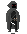
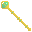
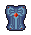
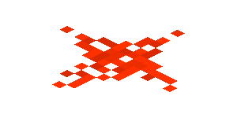

# Milestone 3: Evolution of Requirements

## 0. Changelog

- 2 Nov 2pm - Clarify hydra spawning/movement
- 7 Nov 6pm - Make the random maze generation algorithm more deterministic
- 10 Nov 10pm - JSON Prefix for Switch Doors
- 14 Nov 10am - Wires can trigger logic activation

## 1. Baseline Functionality

60% of your automark will come from testing a completed interface which includes all the requirements in Milestone 2, and incorporation of the following new requirements (1.1 to 1.4).

### 1.1 Bosses

The game has the following new entities.

| Entity    | JSON Prefix | Image         | Description |
| --------- | ----------- | --------------| ------------|
| Assassin | <code>assassin</code> |  | Assassins are exceptionally powerful mercenaries which deal significantly more damage. There is a less than 30% chance that they will spawn in the place of a mercenary. Assassins can only be bribed with The One Ring, as well as the base amount of gold used to bribe standard mercenaries.  |
| Hydra | <code>hydra</code> |  | Hydra are creatures that only spawn in hard mode every 50 ticks. Hydras are limited by the same movement constraints as Zombie Toasts. When a hydra is attacked by the character or allies, there is a 50% chance that its health will increase rather than decrease by the attacking damage as two heads have grown back when one is cut off.  |

### 1.2 Pathfinding

In this Milestone, the movement of mercenaries (and by extension assassins) must follow a Djikstra's algorithm to take the shortest path towards the player.

<details>
<summary>
You can view pseudocode for the algorithm here.
</summary>

> Note: This is not necessarily optimal (A* is probably a better algorithm for our common maze like dungeons), but since this is a design course and not an algorithms course, this is fine.

```
function Dijkstras(grid, source):
    let dist be a Map<Position, Double>
    let prev be a Map<Position, Position>

    for each Position p in grid:
        dist[p] := infinity
        previous[p] := null
    dist[source] := 0

    let queue be a Queue<Position> of every position in grid
    while queue is not empty:
        u := next node in queue with the smallest dist
        for each cardinal neighbour v of u:
            if dist[u] + cost(u, v) < dist[v]:
                dist[v] := dist[u] + cost(u, v)
                previous[v] := u
    return previous
```

</details>

As part of this, you will need to extend your solution to accomodate the idea of a **swamp tile**. These are tiles that have an `x` and `y` position and remain fixed throughout the entire game. They slow the movement of all entities through them, except for the player. Swamp tiles are specified in the dungeon JSON as part of the entities JSONArray, with the following format:

```javascript
{
    "type": "swamp_tile",
    "x": x,
    "y": y,
    "movement_factor": movement_factor
}
```

Where `movement_factor` is a multiplying factor of the number of ticks it takes to traverse the tile (e.g. if `movement_factor` is 2, then it takes an enemy 2 ticks to traverse the tile).

| Entity    | Image         | Description       |
| --------- | --------------| ------------------|
| Swamp Tile |  | See above  |

Your implementation of Djikstra's will need to accomodate for the fact that swamp tiles slow the enemies down.

### 1.2 New Collectable Entities

| Entity    | JSON Prefix | Image         | Description |
| --------- | ----------- | --------------| ------------|
| Sun Stone | <code>sun_stone</code> |  | Can be picked up by the player, and can be used to open doors and interchangeably with treasure. The player retains the stone after usage.  In terms of buildables you can take the assumption that the stone is used in building or that it is retained.  Stone takes priority over treasure but if you wish to change this make sure to clarify that in assumptions. |

### 1.3 New Rare Collectable Entities

| Entity    | JSON Prefix | Image         | Description |
| --------- | ----------- | --------------| ------------|
| Anduril, Flame of the West | <code>anduril</code> |  | A very high damage sword which causes triple damage against bosses. When battling Hydra with this weapon, the Hydra has a 0% chance of spawning two heads when one is cut off. |

### 1.4 New Buildable Entities

| Entity    | JSON Prefix | Image         | Description |
| --------- | ----------- | --------------| ------------|
| Sceptre   | <code>sceptre</code> |  | Can be crafted with one wood or two arrows, one key/treasure, and one sun stone. A character with a sceptre does not need to bribe mercenaries or assassins to become allies, as they can use the sceptre to control their minds. The effects only last for 10 ticks.  This can either be triggered through interact or through use (tick), you should specify which one in assumptions |
| Midnight Armour | <code>midnight_armour</code> |  | Can be crafted with an armour and a sun stone if there are no zombies currently in the dungeon. Midnight armour provides extra attack damage as well as protection. |

## 2. Extension Functionality

Each of the following extensions (2.1, 2.2, 2.3) is worth 20% of automarking, capped at 100%. If you implement all three, you can achieve up to 10% bonus marks in the remainder of the project.

It is possible to achieve full marks in all other sections without touching this section - meaning on its own, this section is only worth 2.8% of the final course mark.

### 2.1 Time Travel

#### 2.1.1 Time-Turner

This part of the extension includes the following new entity:

| Entity    | JSON Prefix | Image         |
| --------- | ----------- | --------------|
| Time Turner | <code>time_turner</code> |  |

If the player has collected a time turner, then two rewind buttons will appear on the frontend. When clicked, these buttons move the state of the game back one tick and 5 ticks respectively and "transport" the current player back to those game states in a time travelling fashion.

You will need to add the following method to `DungeonManiaController`.

<table>
<tr>
<th>Method Prototype</th>
<th>Exceptions</th>
</tr>

<tr>
<td>

```java
public DungeonResponse rewind(int ticks)
throws IllegalArgumentException
```

</td>
<td>
<ul>IllegalArgumentException:
<li>If <code>ticks</code> is <= 0
</ul>
</td>
</tr>
</table>

In addition, you will need to add code to `App.java` which sets up a HTTP endpoint that receives a web request from the frontend to call this API method. The request will be of the following format:

<table>
<tr>
<th>Route Name</th>
<th>HTTP Method</th>
<th>Data Types</th>
</tr>

<tr>
<td>

```
/api/game/rewind
```

</td>
<td>POST</td>
<td>
<b>Parameters</b>: <code>{ ticks: int }</code>

<b>Return Type</b>: <code>{ DungeonResponse }</code>
</td>
</tr>
</table>

We have handled potential concurrency issues by synchronising all endpoints - you will simply need to need to wrap your function call in the endpoint you create using `callUsingSessionAndArgument`. The existing endpoints are a good place to start when writing this code.

#### 2.1.2 Time Travelling Portal

This part of the extension includes the following new entity:

| Entity    | JSON Prefix | Image         |
| --------- | ----------- | --------------|
| Time Travelling Portal | <code>time_travelling_portal</code> |  |

If a player travels through a time travelling portal, they exit through the same portal, except the dungeon state is that of 30 ticks previously.

#### 2.1.3 Time Travel Rules

When a character has time travelled, either by the rewind buttons or via a time travelling portal:

* Their 'older self' still exists in the dungeon. If they encounter their older self and are carrying a sun stone or are wearing midnight armour, or they are invisible, then nothing happens. If not, then a battle ensues.
* Their 'older self' should take the same path as was taken initially, and unless they encounter their 'current self' (they character being controlled), should eventually travel through the time portal and disappear from the map.
* To simplify things for you, until the game has caught up to the tick at which the character travelled through the time portal (whether they do or not), all behaviour that was randomised can be randomised again (does not have to play out as it did previously)

To keep it simple, 'older selfs' should use the entity type `older_player` in dungeon responses as to ensure that end game messages appear correctly, and that they are distinguishable for testing purposes.

Only the character can travel through time travel portals.

#### 2.1.4 Design

The design of this extension is up to you, however we recommend you treat time travel as moving backwards in a series of game states that are being stored (the state of the dungeon at tick X). When time travel occurs, the player is transported to that state, and all `tick` and `interact` functions are "played" out in the same order.

### 2.2 Dungeon Builder

In this extension, instead of specifying an existing dungeon to play, players can choose specify a dungeon to be automatically generated when creating a new game.

> You should presume all game maps are 50 by 50.

You will need to add the following method to `DungeonManiaController`.

<table>
<tr>
<th>Method Prototype</th>
<th>Exceptions</th>
</tr>

<tr>
<td>

```java
public DungeonResponse generateDungeon(int xStart, int yStart, int xEnd, int yEnd, String gameMode)
throws IllegalArgumentException
```

</td>
<td>
IllegalArgumentException:
<ul>
<li>If <code>gameMode</code> is not a valid game mode</li>
</ul>
</td>
</tr>
</table>

In addition, you will need to add code to `App.java` which sets up a HTTP endpoint that receives a web request from the frontend to call this API method. The request will be of the following format:

<table>
<tr>
<th>Route Name</th>
<th>HTTP Method</th>
<th>Data Types</th>
</tr>

<tr>
<td>

```
/api/game/new/generate
```

</td>
<td>POST</td>
<td>
<b>Parameters</b>: <code>{ xStart: int, yStart: int, xEnd: int, yEnd: int, gameMode: String }</code>

<b>Return Type</b>: <code>{ DungeonResponse }</code>
</td>
</tr>
</table>

We have handled potential concurrency issues by synchronising all endpoints - you will simply need to need to wrap your function call using `callUsingSessionAndArgument`. The existing endpoints are a good place to start when writing this code.

As part of this, you will need to be able to automatically generate dungeons.  Furthermore it's important that you have an *exit* at the `end` position and that you have exit goals setup for this created dungeon.

### 2.2.1 Generating a Dungeon - Randomized Prim's Algorithm

You will need to generate dungeons according to the following maze generation algorithm (which is just a randomised version of Prim's).

> Note: You should enforce a border of walls around the maze.

```
function RandomizedPrims(width, height, start, end):
    let maze be a 2D array of booleans (of size width and height) default false
    // false representing a wall and true representing empty space

    maze[start] = empty

    let options be a list of positions
    add to options all neighbours of 'start' not on boundary that are of distance 2 away and are walls

    while options is not empty:
        let next = remove random from options

        let neighbours = each neighbour of distance 2 from next not on boundary that are empty
        if neighbours is not empty:
            let neighbour = random from neighbours
            maze[ next ] = empty (i.e. true)
            maze[ position inbetween next and neighbour ] = empty (i.e. true)
            maze[ neighbour ] = empty (i.e. true)

        add to options all neighbours of 'next' not on boundary that are of distance 2 away and are walls
    
    // at the end there is still a case where our end position isn't connected to the map
    // we don't necessarily need this, you can just keep randomly generating maps (was original intention)
    // but this will make it consistently have a pathway between the two.
    if maze[end] is a wall:
        maze[end] = empty

        let neighbours = neighbours not on boundary of distance 1 from maze[end]
        if there are no cells in neighbours that are empty:
            // let's connect it to the grid
            let neighbour = random from neighbours
            maze[neighbour] = empty
```

Or, in a more wordy fashion;

- Given a grid that consists of a 2D array of states (Wall/Empty) initialised to only walls
- Set the start position to empty spaces
- Add to a list of positions to process the neighbours of start (that are walls)
- Given that there are still positions to process:
    - Pick a random position from the list and a random cardinal neighbour of distance 2 that isn't on the boundary and is empty (not a wall)
    - Pick a random neighbour that is a wall and connect the two via 2 empty spaces
    - Compute all cardinal positions that are walls for the random neighbour and add it to the list of positions to process.
- At the end fix-up the maze given that the end cell is still a wall
    - Mark it as not a wall
    - If it has atleast one neighbour that is a empty cell then don't do anything else (it's connected)
    - Otherwise, mark one of it's cardinal neighbours as a empty cell as well.

You can presume:
- Start/End sit inside of the boundary.

### 2.3 Logic Switches

There are two new entities in this extension:

| Entity    | JSON Prefix | Image         | Description    |
| --------- | ----------- | --------------| -------------- |
| Light Bulb | <code>light_bulb_on</code> or <code>light_bulb_off</code> |  |  Light bulbs cannot be collected, but can be lit up by placing a boulder on a switch adjacent.  |
| Wire | <code>wire</code> |  | Wires cannot be collected, but form part of a circuit and are connected to a switch and any entity that interacts via switches.  |

Light bulbs will always be created off, though for your `DungeonResponse` you will need to specify when the light bulb is switched on.

In addition, there is a new type of door which can be opened by a switch with prefix `switch_door`.

All entities which interact via switches (doors, bombs, and light bulbs), as well as switches themselves can (but are not required to) be created with an additional field (specified in the dungeon JSON) called `"logic"`, which is one of:

* `"and"` - the entity will be only activated if there are 2 or more adjacent activated entities (switches with boulders on them or active wires). If there are more than two switches adjacent, all must be activated.
* `"or"` - the entity will be activated if there are 1 or more adjacent activated entities
* `"xor"` - the entity will be activated if there is 1 and only 1 adjacent activated entity
* `"not"` - the entity will be activated if there are 0 adjacent activated entities. Bombs cannot be produced with this logic.
* `"co_and"` - the entity will only be activated if there are 2 or more activated entities adjacent, which are **both activated on the same tick** (i.e. a boulder is pushed onto them at the same time). 

If a switch adjacent to a wire is activated, all of the other interactable entities adjacent to the wire are activated.

This allows for the creation of dungeons with logic gates. For example:

```
      NOT
   ---AND----
   |        |
  NOT      NOT
--AND    --AND
|  |     |  |
S--|     S--|
```
