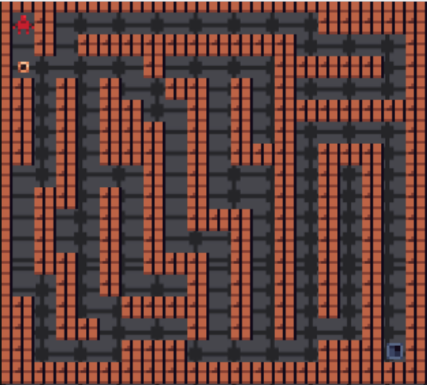
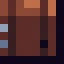
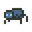
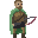
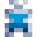
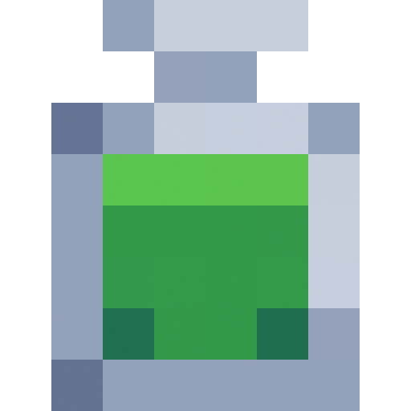

# COMP2511 Project: Dungeon Mania

## Contents

[[_TOC_]]

## 0. Changelog

- 12 Oct 10pm - Fix typos, remove references to user stories, fix file path
- 13 Oct 4am - Add credits to readme.
- 13 Oct 5am - Reduce insanity of mercenary and spider spawns.
- 13 Oct 4pm - Fix reference implementation release date, section 5 numbering, replace clear with interact method
- 13 Oct 9pm - Setup Instructions
- 13 Oct 11pm - Frontend Instructions
- 14 Oct 4am - Added Goal instructions to Frontend guide.
- 14 Oct 11am - Fixed constructor definition for DungeonResponse and added link to the frontend reference for AnimationQueue.
- 16 Oct 11pm - Clarified spider
- 18 Oct 5pm - Update interface for clarity on itemUsed in tick - ID of the item used, not the type
- 19 Oct 4pm - Add notes on durability for battle items
- 19 Oct 9pm - Battles occur within a single tick
- 21 Oct 2pm - Clarify buildables argument in DungeonResponse constructor
- 22 Oct 9pm - More detail on save/load game, broaden allowable items usable in tick itemUsed
- 24 Oct 4pm - Case where itemUsed is null in `tick`, clarify movement of enemies in peaceful mode
- 24 Oct 10pm - Mercenaries can be bribed from 2 tiles away, note on one ring + JSON prefixes for all entities
- 26 Oct 8am - Add JSON types for goals
- 27 Oct 10am - Winning and death output clarifications
- 28 Oct 1pm - Remove out of date explanation of automarking formula
- 29 Oct 4am - Frontend updated with nicer animation support
- 31 Oct 2pm - Extended deadline for M1+2 to Monday Week 8 3pm
- 2 Nov 11am - Release Milestone 3
- 12 Nov 10am - Specify priority for sun stone, remove bad sceptre update

## 1. Aims

* Apply object-oriented programming principles and design patterns
* Synthesise and adapt to changes in requirements
* Practice software development in a team environment
* Work with the Java Programming Language and Java Class Libraries
* Build persistent web applications using Java
* Appreciate issues in design and development
* Design reusable software solutions

## 2. Overview

For many years, Penguin Pty Ltd (a small software business run by Ian Jacobs) has dominated the native application gaming market with hit games. However in recent years, advancements in web technologies mean that the new generation of consumers don't want to download and run a native application, but instead want to play games online. To adapt to the ever-changing market, Penguin Pty Ltd has decided to take users back to the 1980s and develop a new game called *Dungeon Mania*, but with a modern twist - designed as a web application.

Penguin Pty Ltd has sub-contracted two software firms:

* BlueBottle Pty Ltd to develop a web-based frontend to the game
* YourTeam Pty Ltd (a team of talented misfits completing COMP2511 in 21T3), who will build the backend Java application.

Furthermore, there is a rival company called Spheniscidae Pty Ltd which has already produced a solution which you can refer to as a possible sample solution.  The specification leaves a lot of room to interpret it so the sample solution may diverge from your solution.

[A possible simple implementation](https://cs2511-reference-implementation.azurewebsites.net/app/) has been released.

| :warning:  As with any software, bugs could and will exist in the reference implementation.  Furthermore, the project is *VERY* vague and a lot is left up to interpretation (intentionally so).  Don't take our interpretations as gospel.  Also a lot of UX improvements such as animations were left out in our implementation just due to the fact that it's very much a 'baseline'. |
| --- |

There is no sample implementation for the Milestone 3 requirements.

[There are setup instructions here](SETUP.md).

## 3. Requirements: The Rules of the Game

In Dungeon Mania you control a character and have to complete various goals within a series of dungeons to complete the game!

The simplest form of such a puzzle is a maze, where the character must find their way from the starting point to the exit.



More advanced puzzles may contain things like boulders that need to be pushed onto floor switches,


enemies that need to be fought with weapons, or collectables like potions and treasure.


### 3.1 Character

The character, who is controlled by the player of the game can be moved up, down, left and right into cardinally adjacent squares, provided another entity doesn't stop them (e.g. a wall). The character begins the game with a set amount of health and attack damage. The character spawns at a set 'entry location' at the beginning of a game.

### 3.2 Static Entities

The game contains the following static entities. Entity types will start with the prefix specified in the provided JSON; for rendering purposes they can have different complete types (e.g. `boulder_1`).

| Entity    | JSON Prefix           | Image         | Description       |
| --------- | --------------------- | --------------| ------------------|
| Wall      | <code>wall</code>     |  | Blocks the movement of the character, enemies and boulders. |
| Exit      | <code>exit</code>     |  | If the character goes through it, the puzzle is complete. |
| Boulder   | <code>boulder</code>   |  | Acts like a wall in most cases. The only difference is that it can be pushed by the character into cardinally adjacent squares. The character is only strong enough to push <b>one</b> boulder at a time. |
| Floor Switch | <code>switch</code>     |  | Switches behave like empty squares, so other entities can appear on top of them. When a boulder is pushed onto a floor switch, it is triggered. Pushing a boulder off the floor switch untriggers it. |
| Door      | <code>door</code>     |  | Exists in conjunction with a single key that can open it. If the character holds the key, they can open the door by moving through it. Once open, it remains open. |
| Portal       | <code>portal</code>   |  | Teleports entities to a corresponding portal. |
| Zombie Toast Spawner | <code>zombie_toast_spawner</code>     |  | Spawns zombie toasts every 20 ticks in an open square cardinally adjacent to the spawner. The character can destroy a zombie spawner if they have a weapon and are cardinally adjacent to the spawner. |

### 3.3 Moving Entities

In addition to the character, the game contains the following moving entities. Entity types will start with the prefix specified in the provided JSON; for rendering purposes they can have different complete types (e.g. `mercenary_1`).

| Entity    | JSON Prefix           | Image         | Description       |
| --------- | --------------------- | --------------| ------------------|
| Spider    | <code>spider</code>   |  | Spiders spawn at random locations in the dungeon from the beginning of the game. When the spider spawns, they immediately move the 1 square upwards (towards the top of the screen) and then begin 'circling' their spawn spot (see a [visual example here](images/spider_movement.png)). Spiders are able to traverse through walls, doors, switches, portals, exits (which have no effect), but not boulders, in which case it will reverse direction.  There is a maximum number of spiders at a time (what exactly is up to you but must be atleast 4). |
| Zombie Toast | <code>zombie_toast</code>   |  | Zombies spawn at zombie spawners and move in random directions. Zombies are limited by the same movement constraints as the character, except portals have no effect on them. |
| Mercenary | <code>mercenary</code> |  | On maps with atleast one enemy, mercenaries spawn at the entry location periodically. They constantly move towards the character, stopping if they cannot move any closer. Mercenaries are limited by the same movement constraints as the character. All mercenaries are considered hostile, unless the character can bribe them with a certain amount of gold; in which case they become allies. As an ally, once it reaches the player it simply follows the player around. |

### 3.4 Collectable Entities

Entity types will start with the prefix specified in the provided JSON; for rendering purposes they can have different complete types (e.g. `key_1`).

| Entity        | JSON Prefix           | Image         | Description       |
| ---------     | -----------           | --------------| ------------------|
| Treasure      | <code>treasure</code> |  | Can be collected by the character. |
| Key           | <code>key</code> |  | Can be picked up by the player when they move into the square containing it. The character can carry only one key at a time, and only one door has a lock that fits the key. The key disappears once it is used to open its corresponding door |
| Health Potion | <code>health_potion</code> |  | When a character picks up a health potion, they may consume it at any time and they will immediately regenerate to full health. Health potions may only be consumed once. |
| Invincibility Potion | <code>invincibility_potion</code> |  | When a character picks up an Invincibility potion, they may consume it at any time. Any battles that occur when the character has the effects of the potion end immediately, with the character immediately winning. Because of this, all enemies will run away from the character when they are invincible. The effects of the potion only last for a limited time. |
| Invisibility Potion | <code>invisibility_potion</code> | | When a player picks up an invisibility potion, they may consume it at any time and they immediately become invisible and can move past all other entities undetected. |
| Wood      | <code>wood</code> |  | Can be collected by the player. |
| Arrows    | <code>arrow</code> |  | Can be picked up by the player. |
| Bomb      | <code>bomb</code> |  | Can be collected by the character. When a character places a bomb cardinally adjacent to a switch, if a boulder is pushed onto the switch then the bomb explodes, destroying all entities in the bomb's blast radius, except for the character. |
| Sword | <code>sword</code> |  | A standard melee weapon. Swords can be collected by the character and used in battles. Each sword has a specific durability that dictates the number of times it can be used before it deteriorates. |
| Armour | <code>armour</code> |  | Body armour which provides defence and halves enemy attack. A small proportion of zombies randomly spawn with armour, which the character can take if they defeat a zombie in battle. Some mercenaries have armour, which the character can take if they defeat a mercenary in a battle. Each piece of armour has a specific durability that dictates the number of times it can be used before it deteriorates. |

### 3.4 Rare Collectable Entities

Each time a character wins a battle, there is a small chance of winning a "rare item". Dungeons can be created with these, though that is not their primary use case. Rare items include:

| Entity        | JSON Prefix           | Image         | Description       |
| ---------     | -----------           | --------------| ------------------|
| The One Ring  | <code>one_ring</code> |  | If the Character is killed, it respawns with full health. Once The One Ring is used it is discarded. |

### 3.5 Buildable Entities

Some entities can be built using a 'recipe' by the player, where entities are combined to form more complex and useful entities.

| Entity    | Image         | Description       |
| --------- | --------------| ------------------|
| Bow  | | Can be crafted with 1 wood + 3 arrows. The bow has a durability which wears down after a certain number of shots. Bow's allow the character two attack twice (decrease the enemy's health) in a single round, to simulate being able to attack an enemy at range. |
| Shield    |  | Can be crafted with 2 wood + (1 treasure OR 1 key, where the key is no longer usable as itself afterwards as it has been melted). Shields decrease the effect of enemy attacks. Each shield has a specific durability that dictates the number of times it can be used before it deteriorates. |

### 3.6 Battles

A battle takes place when the character and an enemy are in the same cell, within a single tick. A 'round' of a battle occurs as follows:

```
Character Health = Character Health - ((Enemy Health * Enemy Attack Damage) / 10)
Enemy Health = Enemy Health - ((Character Health * Character Attack Damage) / 5)
```

If the character's health is <= 0, then the character dies, is removed from the game and the game is over. If the enemy's health is <= 0, then the enemy dies and is removed from the game. If after the above 'round', neither the character nor the enemy is dead, the round repeats until either the character or enemy is dead.

Mercenaries have a battle radius. If the character is fighting an enemy within the battle radius of a mercenary, the mercenary moves twice as fast to take advantage. If the mercenary has been bribed to become an ally, the ally will fight in the battle against the enemy with the character from a distance; the enemy health is decreased twice in a single round, substituting the character's statistics with the ally's statistics in the above formula.

### 3.7 Game Modes

There are three game modes:

* **Peaceful**: Where enemies do not attack the character, though move as they would otherwise;
* **Standard**: Standard game rules;
* **Hard**: Zombies spawn every 15 ticks instead of every 20 and the player has less health points to begin with, and invincibility potions have no effect.

### 3.8 Goals

In addition to its layout, each dungeon also has a goal that defines what must be achieved by the player for the dungeon to be considered complete. Basic goals are:

* Getting to an exit (`"exit"` in the JSON);
* Destroying all enemies and spawners (`"enemies"` in the JSON);
* Having a boulder on all floor switches (`"boulders"` in the JSON);
* Collecting all treasure (`"treasure"` in the JSON);

More complex goals can be built by logically composing goals. For example:

* Destroying all enemies and spawners AND getting to an exit
* Collecting all treasure OR having a boulder on all floor switches
* Getting to an exit AND (destroying all enemies OR collecting all treasure)

If getting to an exit is one of a conjunction of conditions, it must be done last. For example, if the condition is to destroy all enemies AND get to an exit, the player must destroy the enemies THEN get to the exit.

## 4. Milestone 1: Domain Modelling

In this Milestone, you are expected to:

1. Plan for the sequencing of completion of work of the project;
2. Produce an initial domain model for the backend component of your project in the form of a conceptual UML class diagram; and
3. Document any initial assumptions you will need to make in writing your implementation of the specification.

### 4.1 Project Management

You will need to create an approximate timeline. **In this milestone, you will only need to plan for the completion of work in Milestones 1 and 2**.

For each week, create a list of objectives to achieve in that week, and state which team member is allocated to each objective.

* You can include notes such as team member availability in the plan and meeting times as well.
* Tasks only need to be broken down and delegated at the feature level.

There are no strict guidelines for how this plan should be formatted or structured - it just needs to be understandable by your tutor.

Put your timeline in a file named `planning.pdf` in the root directory of this repository.

In addition, throughout the project, you will need to keep a record of your meetings in the form of minutes.

* Minutes should contain a summary of what was discussed and action items.
* Your meeting minutes document needs to have evidence of version history - use a Google Doc or update a minutes doc/folder in your repo for this.

### 4.2 Design and UML Diagram

In deciding on your design, you should follow the practices and design principles covered in the course.

**Your UML diagram does not need to include any fields or methods for this Milestone**. Your UML diagram will need to contain the standard elements such as agregation/composition relationships, cardinalities and inheritance relationships. You do not need to include getters and setters in the UML diagram.

Put your design in a file named `design.pdf` in the root directory of this repository.

### 4.3 Assumptions

Some areas of the client's requirements are underspecified; in these cases, you will need to make design decisions with your team, and this may require introducing some assumptions.

Document all assumptions that you think your implementation will need to make about the requirements. Remember that good assumptions clear up an ambiguity in the specification by articulating a **behaviour** (what a particular feature/rule of the game is) rather than an implementation (how it will be programmed). Assumptions should only be used to clarify genuine ambiguities and should not reduce the scope of the specification.

Put your assumptions in a file named `assumptions.md` in the root directory of this repository.

### 4.4 Submission and Feedback

This milestone will be submitted in conjunction with Milestone 2. However, you are welcome to submit your UML diagram and assumptions to your tutor for some formative feedback. You may submit any initial work by Week 6, Monday to guarantee feedback from your tutor. Otherwise, you can seek feedback informally up until the Milestone 2 deadline, including during your Week 7 Project Check-in.

## 5. Milestone 2: Building an MVP

In this milestone, you are expected to, based on your initial domain model:

1. Produce a complete domain model for the backend component of your project in the form of an updated UML class diagram; and
2. Use Test-Driven Development to implement the backend.

### 5.1 Design and UML Diagram

Based on feedback and any other changes to your design, updated your UML diagram.

For this milestone, your design will need to make use of **at least 3 patterns** covered in the course.

**Fields and methods are required on the UML diagram for this milestone**. Your UML diagram needs to be consitent with your code and clearly indicate where you're using the design patterns (use labels).

It is a good idea to invest time into your design in this milestone, as a poor design in this Milestone will mean you aren't able to easily adapt your code for Milestone 3 when the requirements evolve. You will be assessed in Milestone 3 on how well you adapted to the changes in requirements and how appropriately you extended and reused your Milestone 2 code.

### 5.2 Testing and Coverage

You will need to write:

* Unit and integration tests that ensure the correctness of individual aspects of your model;
* System tests, tests on the controller methods to ensure the backend works correctly at the level of abstraction. Note that investing time into writing these tests is a good idea, as we will be automarking your server via our own tests on your on controller;
* You will need to write your code test-first and have git commits which show evidence of this;
* Coverage will be assessed.

### 5.3 Assumptions

As you design and implement the game, you will undoubtedly realise other ambiguities in the game requirements. Modify and add to your `assumptions.md` file based on this and any feedback on your Milestone 1 assumptions.

All assumptions you make should have at least one test which ensures that assumption works as expected.

### 5.4 Submission

To submit, make a tag to show that your code at the current commit is ready for your submission using the command:

```bash
$ git tag -fa submission -m "milestone2-submission"
$ git push -f origin submission
```

Or, you can create one via the GitLab website by going to Repository > Tags > New Tag.
If you do not make a submission tag, we will take the last commit on your master branch before the deadline for your submission.

### 5.5 Marking Criteria

| Criteria    | Description |
|:----------- |:----- |
| <b>Automarking (40%)</b> | See Section 13. |
| <b>Usability Testing (10%) | During the demonstration of your submission: <ul><li>Do the features you've implemented work as required?</li><li>Are the features implemented bug-free</li><li>Does your game provide the user with a good experience?</li> |
| <b>Assumptions (5%)</b> | <ul><li>Are the assumptions provided of good quality?</li><li>Do they clear up genuine ambiguities in the spec?</li><li>Are there any key assumptions missing? Do the assumptions clarify a range of requirements?</li> |
| <b>Software Design (30%)</b> | Things to consider include, but are not limited to: <ul><li>Have you made use of at least three design patterns taught?</li> <li>Do these patterns improve the design or are they forced on?</li> <li>Are the patterns modelled appropriately?</li> <li>Have you used the right patterns (e.g. state vs strategy)?</li> <li>Do your inheritance relationships make logical sense?</li> <li>Have you obeyed LSP?</li> <li>Have you used interfaces vs abstract classes appropriately?</li> <li>Are the aggregation and composition relationships and cardinalities shown on the UML logical and appropriate?</li> <li>Are all classes single responsibility? Is there a lot of logic in the main Game class(es) or is it split up?</li> <li>Are there any redundant classes / data classes?</li> <li>Have all the appropriate entities been modelled as classes, or is data grouped arbitrarily in JSON objects/strings/arrays?</li> <li>Is the UML diagram correctly formatted?</li><li>Is there a mix of unit, integration and system-level tests? Are your tests well designed and logically structured?</li><li><b>Code Style</b> - See Section 10.1</li></ul>|
| <b>Project Management & Git Practices (15%)</b> | <ul><li>Are the tasks on the timeline sequenced logically? (e.g. prerequisite features are completed first)</li><li>Are tasks allocated to all team members approx equally?</li><li>Do the task allocations seem feasible?</li><li>Is the allocation logical?</li><li>Are these timespans on tasks reasonable?</li><li>Have you demonstrated the use of meeting minutes? Version history is needed to show that the minutes weren't faked.</li><li>Commit messages are meaningful, aren't repeated, evidence of merge requests into master, master is merged into regularly</li></li><li>The board shows the truth of the team's progress, tasks are assigned and moved across the columns</li></ul> |

## 6. Milestone 3: Evolution of Requirements

Like any real-world programming scenario, the requirements you need to develop to will evolve.

[**You can view the updated requirements for Milestone 3 here**](M3.md).

In this Milestone, you are expected to:

1. Adjust your domain model as needed to suit the updated requirements, and as per any feedback on your Milestone 2 design; and
2. Extend your backend accordingly, and completing anything leftover from Milestone 2.
3. Make customisations to the frontend, to make it your own game.

### 6.1 Project Management

As we have started a new sprint of development, you will need to begin by updating your timeline to plan for the completion of work.

### 6.2 Design and UML Diagram

Your UML diagram will need to reflect your updated design.

The requirements of the UML diagram for this Milestone are as per Milestone 2, except for one change **your design should now make use of at least 4 patterns covered in the course**.

You will be assessed in this iteration on how well you adapted your design to the new requirements.

### 6.3 Testing, Coverage and Assumptions

Are as per Milestone 2. You should update your `assumptions.md` file based on the new requirements.

### 6.4 Submission

To submit, make a tag to show that your code at the current commit is ready for your submission using the command:

```bash
$ git tag -fa submission -m "milestone3-submission"
$ git push -f origin submission
```

Or, you can create one via the GitLab website by going to Repository > Tags > New Tag.
If you do not make a submission tag, we will take the last commit on your master branch before the deadline for your submission.

### 6.5 Marking Criteria

| Criteria    | Description |
|:----------- |:----- |
| <b>Automarking (40%)</b> | See Section 13. |
| <b>Usability Testing (10%) | During the demonstration of your submission: <ul><li>Do the features you've implemented work as required?</li><li>Are the features implemented bug-free</li><li>Does your game provide the user with a good experience?</li><li>Have customisations been made which enhance the user experience?</li> |
| <b>Assumptions (5%)</b> | <ul><li>Are the assumptions provided of good quality?</li><li>Do they clear up genuine ambiguities in the spec?</li><li>Are there any key assumptions missing? Do the assumptions clarify a range of requirements?</li> |
| <b>Software Design (35%)</b> | Things to consider include, but are not limited to: <ul><li>How well have you adapted your design to suit the new requirements?</li><li>Have you made use of at least four design patterns taught?</li> <li>Do these patterns improve the design or are they forced on?</li> <li>Are the patterns modelled appropriately?</li> <li>Have you used the right patterns (e.g. state vs strategy)?</li> <li>Do your inheritance relationships make logical sense?</li> <li>Have you obeyed LSP?</li> <li>Have you used interfaces vs abstract classes appropriately?</li> <li>Are the aggregation and composition relationships and cardinalities shown on the UML logical and appropriate?</li> <li>Are all classes single responsibility? Is there a lot of logic in the main Game class(es) or is it split up?</li> <li>Are there any redundant classes / data classes?</li> <li>Have all the appropriate entities been modelled as classes, or is data grouped arbitrarily in JSON objects/strings/arrays?</li> <li>Is the UML diagram correctly formatted?</li><li>Is there a mix of unit, integration and system-level tests? Are your tests well designed and logically structured?</li><li><b>Code Style</b> - See Section 10.1</li></ul>|
| <b>Project Management & Git Practices (10%)</b> | <ul><li>Are the tasks on the timeline sequenced logically? (e.g. prerequisite features are completed first)</li><li>Are tasks allocated to all team members approx equally?</li><li>Do the task allocations seem feasible?</li><li>Is the allocation logical?</li><li>Are these timespans on tasks reasonable?</li><li>Have you demonstrated the use of meeting minutes? Version history is needed to show that the minutes weren't faked.</li><li>Commit messages are meaningful, aren't repeated, evidence of merge requests into master, master is merged into regularly</li></li><li>The board shows the truth of the team's progress, tasks are assigned and moved across the columns</li></ul> |

## 7. Interface (Milestone 2)

The layer of abstraction is at the level of the controller. In the starter code, we have provided a class `DungeonManiaController` within which you will need to place the methods listed in 7.2 that act as the endpoints of the Abstract Data Type (your backend model).

The controller methods interact with a HTTP layer in the form of a web server, which we have written for you.

### 7.1 Interface Data Types

We have provided the following interface data types for you inside `response/models`. Similarly as for the assignment, you will need to create objects of these types for the controller to return and communicate information to the server layer.

The server layer then wraps these objects inside a `GenericResponseWrapper`, a generic type we have made for you, and converts these objects to JSON using a libary called `gson` to allow them to be communicated to the frontend via a HTTP response.

<table>
<tr>
<th>Constructor Prototype</th>
<th>Description</th>
<tr>
<td>

```java
public DungeonResponse(String dungeonId,
                       String dungeonName,
                       List<EntityResponse> entities,
                       List<ItemResponse> inventory,
                       List<String> buildables,
                       String goals)
```

</td>
<td>
Where <code>dungeonId</code> is the unique identifier for the dungeon, <code>dungeonName</code> is the name of the dungeon map being used (i.e. `maze.json`), and <code>buildables</code> is a list of buildable item types that the player can build, given their current inventory. <code>goals</code> is a string containing the goals yet to be completed (see Section 9). An empty string denotes the game has been won.
</td>

<tr>
<td>

```java
public EntityResponse(String id,
                      String type,
                      Position position,
                      boolean isInteractable)
```

</td>
<td>
Where <code>id</code> is the unique identifier for the respective entity, <code>type</code> is the type of entity (lowercase, see Section 3 for names) and <code>position</code> is the x, y, z (layer) position of the entity, and <code>isInteractable</code> refers to if the entity can receive interaction updates from frontend.
</td>
</tr>

<tr>
<td>

```java
public ItemResponse(String id, String type)
```

</td>
<td>
Where <code>id</code> is the unique identifier for the item and <code>type</code> is the type of item (lowercase, see Section 3 for names).
</td>
</tr>
<tr>
<td>

```java
public Position(int x, int y, int layer)
```

</td>
<td>
Where <code>x</code>, <code>y</code> are the co-ordinates of the cell (the top-left cell is 0,0) and <code>layer</code> is the Z-position of the entity on the screen (a higher layer is "in front" of a lower layer visually)
</td>
</tr>

</table>

> Note: [there is also an `AnimationQueue` object and constructor that you can find here](https://gitlab.cse.unsw.edu.au/COMP2511/21T3/project-specification/-/blob/master/FRONTEND.md#animationqueue) but this isn't likely to be useful till the latter parts of Milestone 2 (and Milestone 3).

### 7.2 Interface Methods

<table>
<tr>
<th>Method Prototype</th>
<th>Description</th>
<th>Exceptions<th>
</tr>
<tr>
<td>

```java
public DungeonResponse newGame(String dungeonName,
    String gameMode)
throws IllegalArgumentException
```

</td>
<td>
Creates a new game, where <code>dungeonName</code> is the name of the dungeon map (corresponding to a JSON file stored in the model) and <code>gameMode</code> is one of <code>"standard"</code>, <code>"peaceful"</code> or <code>"hard"</code>.
</td>
<td>
IllegalArgumentException:
<ul>
<li>If <code>gameMode</code> is not a valid game mode</li>
<li>If <code>dungeonName</code> is not a dungeon that exists</li>
</td>
</tr>
<tr>
<td>

```java
public DungeonResponse saveGame(String id)
throws IllegalArgumentException
```

</td>
<td>
Saves the current game state with the given name so that if the application is terminated, the current game state can be reloaded and play can continue from where it left off.
</td>
</tr>

<tr>
<td>

```java
public DungeonResponse loadGame(String id)
throws IllegalArgumentException
```

</td>
<td>
Loads the game with the given id from the existing games saved.
</td>
<td>
IllegalArgumentException:
<ul>
<li>If <code>id</code> is not a valid game id</li>
</td>
</tr>

<tr>
<td>

```java
public List<String> allGames()
```

</td>
<td>

Returns a list containing all the saved games that are currently stored.

</td>
<td>
N/A
</td>
</tr>

<tr>
<td>

```java
public DungeonResponse tick(String itemUsedId,
    Direction movementDirection)
throws IllegalArgumentException, InvalidActionException
```

</td>
<td>
Ticks the game state. When a tick occurs:
<ul>
<li>The player moves in the specified direction one square</li>
<li>All enemies move respectively</li>
<li>Any items which are used are 'actioned' and interact with the relevant entity</li>
</ul>
</td>
<td>
IllegalArgumentException:
<ul>
<li>If <code>itemUsed</code> is not a bomb, health_potion, invincibility_potion, or an invisibility_potion, or null (if no item is being used)</li>
</ul>
InvalidActionException:
<ul>
<li>If <code>itemUsed</code> is not in the player's inventory</li>
</ul>
</td>

</tr>

<tr>
<td>

```java
public DungeonResponse build(String buildable)
throws IllegalArgumentException, InvalidActionException
```

</td>
<td>
Builds the given entity, where <code>buildable</code> is one of <code>bow</code> and <code>shield</code>.
</td>
<td>
IllegalArgumentException:
<ul>
<li>If <code>buildable</code> is not one of bow, shield</li>
</ul>
InvalidActionException:
<ul>
<li>If the player does not have sufficient items to craft the buildable</li>
</ul>
</td>

</tr>

<tr>
<td>

```java
public DungeonResponse interact(String entityId)
throws IllegalArgumentException, InvalidActionException
```

</td>
<td>
Interacts with a mercenary (where the character bribes the mercenary or mind-controls a mercenary) or a zombie spawner, where the character destroys the spawner.
</td>
<td>
IllegalArgumentException:
<ul>
<li>If <code>entityId</code> is not a valid entity ID</li>
</ul>
InvalidActionException
<ul>
<li>If the player is not within 2 cardinal tiles to the mercenary, if they are bribing</li>
<li>If the player is not cardinally adjacent to the spawner, if they are destroying a spawner</li>
<li>If the player does not have any gold/sun stones and attempts to bribe/mind-control a mercenary</li>
<li>If the player does not have a weapon and attempts to destroy a spawner</li>
</td>
</tr>
</table>

## 8. Program Structure

<table>
<tr>
<th>File</th>
<th>Path</th>
<th>Description</th>
<th>Should you need to modify this?</th>
</tr>
<tr>
<td>
DungeonManiaController.java
</td>
<td>
src/main/java/dungeonmania/DungeonManiaController.java
</td>
<td>
Contains one method for each command you need to implement.
</td>
<td>
<b>Yes.</b>
</td>
</tr>
<tr>
<td>
App.java
</td>
<td>
src/main/java/App.java
</td>
<td>
Runs a server for Dungeon Mania.
</td>
<td>
<b>No.</b>
</td>
</tr>
<td> Position.java, Direction.java, and FileLoader.java </td>
<td>src/main/java/dungeonmania/util/Position.java, src/main/java/dungeonmania/util/FileLoader.java, and src/main/java/dungeonmania/util/Direction.java</td>
<td>
See Section 7.1
</td>
<td>
<b>Probably no.</b>
</td>
</tr>
<tr>
<td>
DungeonResponse.java, EntityResponse.java, GenericResponseWrapper.java, and ItemResponse.java
</td>
<td>
src/main/java/dungeonmania/response/models/
</td>
<td>
See Section 7.1.
</td>
<td>
<b>No.</b>
</td>
</tr>
<tr>
<td>
Scintilla.java and auxiliary files; Environment.java, PlatformUtils.java, and WebServer.java
</td>
<td>
src/main/java/scintilla
</td>
<td>
Contains a small custom built wrapper around Spark-Java for running a web server.  When run it automatically opens a web browser.
</td>
<td>
<b>No.</b>
</td>
</tr>
<tr>
<td>
InvalidActionException.java
</td>
<td>
src/main/java/dungeonmania/exceptions
</td>
<td>
A <code>RuntimeException</code> to throw when an invalid action is attempted (See Section 7.2).
</td>
<td>
<b>No.</b>
</td>
</tr>
</table>

## 9. Frontend and Customisations

[You can find more information here](FRONTEND.md)

## 10. Development Practices

### 10.1 Style and Documentation

In Milestones 2 and 3, you will be marked on your code style. Examples of things to focus on include:

* Correct casing of variable, function and class names;
* Meaningful variable and function names;
* Readability of code and use of whitespace; and
* Modularisation and use of helper functions where needed.

Functions in your classes which are more than simple getters, setters and constructors should be appropriately documented with Javadoc.

### 10.2 Git Practices

Throughout Milestones 2 and 3, you will be assessed on the following:

* The Git Taskboard or a Jira Taskboard is used;
* Tasks are assigned to team members;
* Tasks are updated across the kanban columns;
* The board shows the truth of your team's progress;
* The timeline you created in Milestone 1 is updated as needed in Milestones 2 and 3
* Assignment of tasks in the timeline corresponds to the board;
* Detail and specificity in commit messages;
* Avoiding committing large chunks of code;
* Merge requests are approved by another team member;
* One feature = one branch = one merge request into `master`.

## 11. Due Dates and Weightings

|Milestone|Due date                             |Demonstration to tutor(s)      |Assessment weighting of project (%)|
|---------|-------------------------------------|-------------------------------|-----------------------------------|
|  1 + 2  |3pm Monday 1st November (**Week 8**)   |In YOUR **Week 8** laboratory  | 50%                                |
|   3     |10am Monday 15th November (**Week 10**)   |In YOUR **Week 10** laboratory | 50%                                |


### 11.1. Late Penalties

There is no late penalty, as we do not accept late submissions. You will be assessed on the most recent version of your work at the due date and time listed. We will automatically collect and the code that is tagged with the respective submission tag before the deadline. If you do not make a submission tag, we will simply take your last commit on `master` before the deadline.

Any functionality that is incomplete that you wish your tutor to look at, you can put in a branch called `milestoneX-extra`.

### 11.2. Demonstration

When you demonstrate this Milestone in your lab time, it will consist of a 15 minute Q&A either in front of your tutor and some other students in your tutorial. For online classes, webcams should be on during this Q&A (your phone is a good alternative if your laptop/desktop doesn't have a webcam).

## 12. Other Expectations

While it is up to you as a team to decide how work is distributed between you, for the purpose of assessment there are certain key criteria all members must attain:

* Code contribution;
* Non-code contribution;
* Usage of Git/GitLab;
* Attendance at project check-ins;
* Participation in project demonstrations; and
* Academic conduct

The details of each of these is below.

While, in general, all team members will receive the same mark (a sum of the marks for each Milestone), **if you as an individual fail to meet these criteria your final project mark may be scaled down**.

**IMPORTANT**: If you believe a member of your group is not contributing as they should contribute, you must inform your tutor at the end of that corresponding week. For example, if a group member has not contributed in week 7, you need to report this before the end of week 7. You must not wait beyond this. If you fail to report in time, we may not be able to address the issue and/or apply redistribution of marks.

### 12.1 Project Check-in

During your lab time, in weeks without project demonstrations, you and your team will have a short check-in with your tutor. This gives you time to ask questions about the project, and for you to update your tutor on your progress, any issues being faced and receive feedback on ideas/performance in previous Milestones.

Project check-ins are also excellent opportunities for your tutor to provide you with both technical and non-technical guidance.

### 12.2 Individual Marks

Your mark for each submission is given to you individually. Your individual mark is determined by your tutor, with your group mark as a reference point. Your tutor will look at your code contribution, documentation contribution (for iteration 3), peer assessment results, any other issues raised by group members throughout term, and your attendance at project check-ins and demonstrations.

### 12.2.1 Code contribution

All team members must contribute code to the project to a generally similar degree. Tutors will assess the degree to which you have contributed by looking at your git history and analysing lines of code, number of commits, timing of commits, etc. If you contribute significantly less code than your team members, your work will be closely examined to determine what scaling needs to be applied.

### 12.2.2 Non-code contribution

All team members must contribute documentation and other non-code elements to the project to a generally similar degree. These include project management items such as the timeline, assumptions as well as other items such as the user interface design and code comments. Tutors will assess the degree to which you have contributed by looking at your git history, task board and by asking questions (essentially interviewing you) during your demonstration.

Note that contributing more documentation is not a substitute for not contributing code. Everyone should have the opportunity to work on most, if not all elements of the project.

### 12.2.3 Attendance

It is generally assumed that all team members will be present at the demonstrations and at weekly check-ins. If you are absent for more than 80% of the weekly check-ins or any of the demonstrations, your mark may be scaled down.

If, due to exceptional circumstances, you are unable to attend your lab for a demonstration, please apply for special consideration.

## 13. Automarking

After Milestones 2 and 3 are submitted, we will run a series of autotests against your server. The calculation of the automark will be according to the following formula:

`Automark = ((2 * i * c) / (i + c)) * 90 + i * 10`

Where:

* `i` is the mark between 0-1 you receive for our course tests (hidden) running against your code (100% = your implementation passes all of our tests)
* `c = min(cov, 0.85) / 0.85`, where `cov` is the score between 0-1 achieved by running the gradle coverage checker on your entire codebase. Note that 85% coverage is enough to give you full marks for this part.

In automarking, we will not test anything that is not outlined in the specification.

## 14. Plagiarism

The work you and your group submit must be your own work. Submission of work partially or completely derived from any other person or jointly written with any other person is not permitted. The penalties for such an offence may include negative marks, automatic failure of the course and possibly other academic discipline. Assignment submissions will be examined both automatically and manually for such submissions.

The use of code synthesis tools, such as GitHub Copilot, is not permitted on this project.

Relevant scholarship authorities will be informed if students holding scholarships are involved in an incident of plagiarism or other misconduct.

Do not provide or show your project work to any other person, except for your group and the teaching staff of COMP2511. If you knowingly provide or show your assignment work to another person for any reason, and work derived from it is submitted you may be penalised, even if the work was submitted without your knowledge or consent. This may apply even if your work is submitted by a third party unknown to you.

Note, you will not be penalised if your work has the potential to be taken without your consent or knowledge.

## 15. Credits

Most assets were taken from public domain sources, but a few require explicit referencing/credits.  You can find the credits [here](credits.md).
