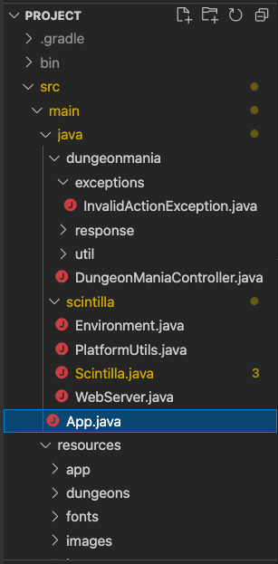
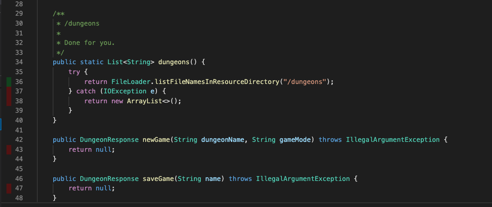
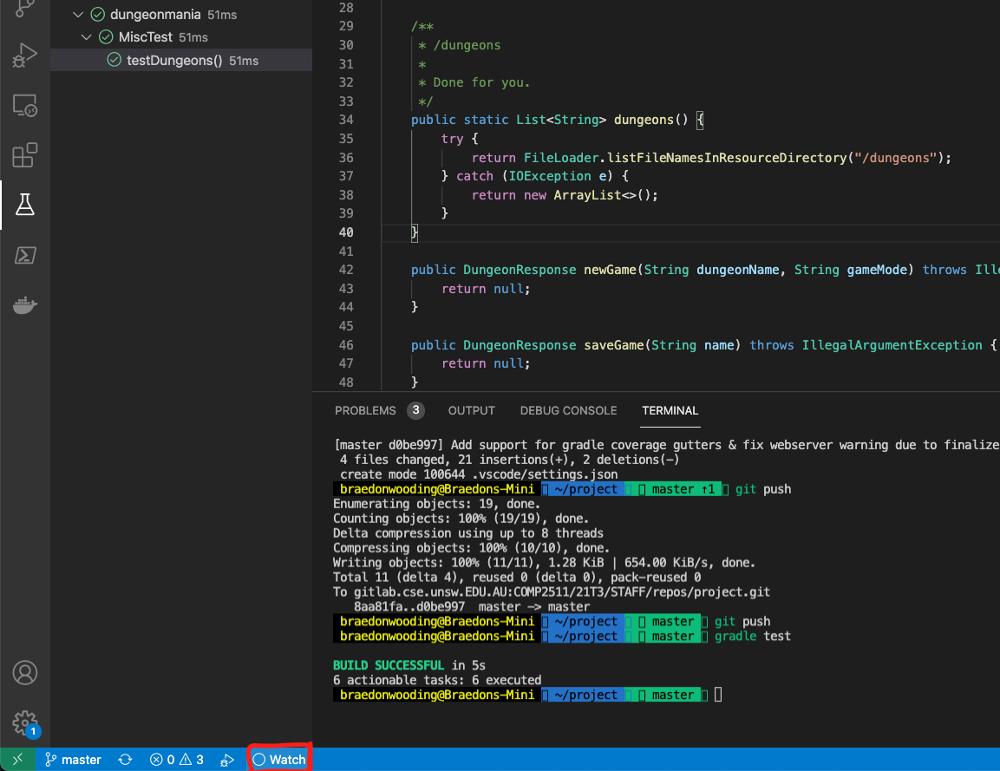

# Setting up the project

## Requirements

- JDK11
    - JDK12+ aren't supported by the course, but *should* work in the project build scripts we've setup, given that you don't use any of the new features
- VSCode (Recommended) or IntelliJ
- Windows/MacOS/Linux
    - CSE is supported through VLAB
    - VSCode + SSH aren't supported
    - VSCode + WSL aren't explicitly supported, but the setup we use should work for it, however there is no `xdg-open` command in WSL (but it exists in linux) so you'll have to open the browser manually to the url `localhost:4568/app/` the `app/` part is important.
- Your project repository (which we'll presume you'll be okay with cloning and managing)

## How to open?

- You can open vscode and then go File -> Open (/Folder on MacOS) and select the folder `project` that you've cloned locally.
    - *Make* sure you have just the project opened.
- `code project`

## How to run?

Firstly guarantee that the folder that you have opened is correct, you can see the default hierachy below, ensure that the name at the top says `project` if it doesn't you don't have the right folder opened :).

Next, just locate the `app.java` file and click the run button on that file.

This will then synchronise your frontend with the current latest version and once that's done (should be very quick) it'll start the server.

## How to generate coverage reports?

You can generate coverage reports through the use of `gradle test`.  This will generate both human readable ones (html) as well as more computer readable ones (xml) which an extension can read and show you inline coverage.

You can see inline coverage reports via; [Coverage Gutters](https://marketplace.visualstudio.com/items?itemName=ryanluker.vscode-coverage-gutters) which is a VSCode extension.  An example of this is shown below.

> isn't that pretty :D

If they aren't showing up for you make sure that the bottom left "Coverage" button is showing something like `X% coverage` (just informs about current opened file).  If it isn't just click it!

## How to test?

You can either run `gradle test` or a bit more nicely go to the test file and click the run test button that'll appear to the left of the icon.

> How to debug tests?  You just have to right click and then debug test.

## What's next?

[We recommend you follow the FRONTEND guide](FRONTEND.md)

