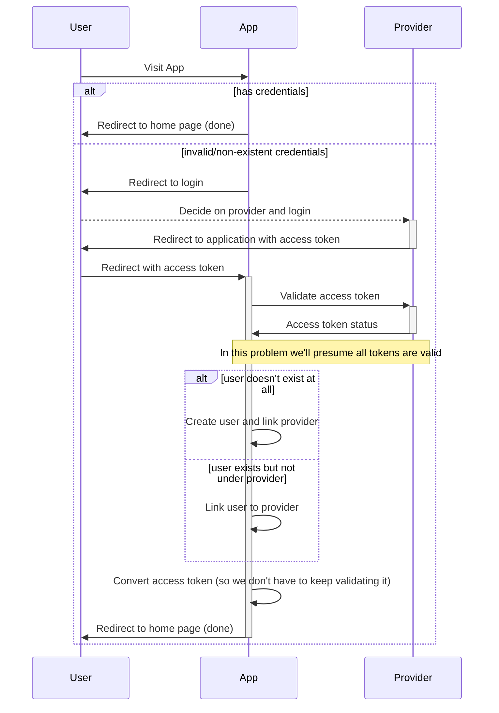

# Lab 05

### Due: Week 7 Monday, 5pm

### Value: 2 marks towards the Class Mark

## Aims

* Understand and apply Strategy, State, and Observer Patterns
* Work and modify an already existing and non-trivial application
* Refactor and cleanup code within the scope of a non-trivial application
* Basics of SSO/Authentication to service as an example

## Setup

**REMEMBER** to replace the zID below with your own.

```
git clone gitlab@gitlab.cse.unsw.EDU.AU:COMP2511/21T3/students/z555555/lab05.git
```

### State-Strategy-Observer or SSO (pun intended)

In the lab you'll be implementing a single sign on (SSO) system to allow you to login/signup users to an application through the use of many 'providers' such as Hoogle, and InstaHam.

To help you begin with implementing that let's discuss the basic mechanics behind SSO and how it works.  Furthermore, most of the code is already written for you so you'll just be modifying a small amount of code to see how you can apply state/strategy/observer patterns to a non-trivial example.

| :information_source:  NOTE: This problem has been massively trivialised and is more focused on the browser side changes in user state.  This is so that very little network domain knowledge is required to be able to solve the lab.  It invents it's own protocol that is *roughly* based on OAuth2 (nowadays it's more common to use SAML due to numerous issues with OAuth, but SAML is significantly more complicated from a server side perspective). |
| --- |

## Lab 05 - Exercise - (I) Auth

#### Authentication

> Authentication is confirming that the user is who they say they are, and authorisation is the act of giving users permission to a set of resources/actions.  We are merely concerned with authentication (i.e. 'login') in this lab.

Answer the following question in `answers.md`.

1. Why do we need authentication for applications such as gmail/myunsw/facebook?

##### SSO

Simply, SSO is a way to provide a universalised set of credentials across a set of applications.  That is you could use your google login for more than just gmail - you could use it to login to your favourite food blogger application or maybe a video sharing application.

2. Let's look at the below SSO flow and answer the following question in `answers.md`
  - What patterns jump out at you as possible in this example?

We've not looked at sequence diagrams in this course, so look at the video where an explanation of what the diagram is and what it's explaining.



> You can presume all access tokens are *ALWAYS* valid, in reality you would have to validate the token with the third party.

To help you understand the problem here is an example login.

- User visits an application homepage
- They aren't authenticated so the application redirects them to login
- They choose the Hoogle provider and login using email + password
- The login was successful and so it redirects the request back to the application's login with the access token
- The application's application notices the user exists but not with the provider Hoogle so it registers it for this provider
- The application's application redirects the user to the home page, the user doesn't progress anywhere from here this is the end of our 'mock' simulation.

A few more details that aren't explicit in the above system;
- Providers may require different methods to login (username + password, email + password, two factor authentication, unique code sent via email, and so on...)
- The token will be the following object (for all providers) base64 encoded as a single token.

```javascript
{
    "email": "<email address of user>",
    "access_token": "<some generated token>",
    "provider": "<either 'InstaHam' or 'Hoogle'>"
}
```

- Providers are linked to a common user via the email address

## Lab 05 - Exercise - (II) Design

You'll get the most out of this section if you do this before doing the coding part of the lab.  As most of you learned in the assignment; spending time planning will result in less time loss and an overall smoother experience.  Most answers can just be a short sentence or two.

#### Design Patterns A) State

Answer the following questions in `answers.md`

1. What could you represent as a state system in this example?
2. Fill in the state table including each transition that is provided in `answers.md`

#### Design Patterns B) Strategy

Answer the following questions in `answers.md`

1. How could you use the strategy pattern in this example?
2. Give an example of why that's useful here, and the benefits of the strategy pattern over simply using `if `statements.

#### Example

In this example we won't be implementing actual frontends / webservers to run this (due to the extra complexity that requires) and will instead be using observer patterns to simulate asynchronous requests.

An example is shown below (from one of the provided tests in the lab);

```java
// Create a provider
Hoogle hoogle = new Hoogle();
hoogle.addUser("user@hoogle.com.au", "1234");

ClientApp app = new ClientApp("MyApp");
// Allow users to login using hoogle
app.registerProvider(hoogle);

// Create a browser instance
Browser browser = new Browser();

// Visit our client application
browser.visit(app);

// Since the browser has no initial login credentials
// it'll cause us to redirect to a page to select providers
assertEquals(browser.getCurrentPageName(), "Select a Provider");

// Since we are on the provider selection page we can 'interact' with the page
// and through that select a provider.  Interaction takes in a single `Object`
browser.interact(hoogle);

assertEquals(browser.getCurrentPageName(), "Hoogle Login");

// since we are on the provider form
// we can interact and provide a form submission
browser.interact(hoogle.generateFormSubmission("user@hoogle.com.au", "1234"));

// This should inform the browser that the form is filled
// Which will then authenticate the form with the third party provider
// which causes the browser to redirect back to the login page with token
// which causes the client application to validate the token
// resulting in a redirect back to the home page.
assertEquals(browser.getCurrentPageName(), "Home");
assertTrue(app.hasUserForProvider("user@hoogle.com.au", hoogle));
```

Looking at this example we can see the following;
- Each `page` acts as a state with transitions dependent on the interact function
- Browser only has very few public methods; `clearCache`, `interact`, and `visit`.

## Lab 05 - Exercise - (III) Implementation

- The tasks have been implemented so that you can do a small change first to get the idea of what to do, and then slowly they get more difficult to complete.  
- Each task is relatively small, so don't overcomplicate them.  Typically, *not* refactoring while doing them will actually make it harder to write them. 
- The majority of the code has already been written, you are making changes and refactorings to implement new features.
- You are provided with a full testing suite, so don't worry about writing tests, focus on passing them!
- Finally, not all the answers to your questions will be in the specification... so read the code!  The point here is that some of the 'documentation' will be inside the code rather than explicitly stated, for example the expiry dates for tokens.

#### Task 1) Implement Cache :file_cabinet:

Currently the browser doesn't remember old visits to an application, you'll notice that it only stores the "current" token for the user (look at `src/unsw/sso/Browser.java`), we want it so the browser remembers old visits!

The way you'll do this is left up to you but here are a few requirements;
- You do not have to handle any persistence here (so you can store the cache in the browser itself) and they don't have to be shared between browsers;
- You will need to cache the Token objects (look at `src/unsw/sso/Token.java`) as it currently only caches the 'current one';
- The `clearCache()` method should clear the cache completely for that instance;
- Caching is done on a `ClientApp` basis
- This should be very simple and is meant to help you get your feet wet with the problem without worrying too much about what code to write.

Answer the following question in `answers.md`:
- What did you modify to implement this?

#### Task 2) Implement a better provider abstraction and page system :globe_with_meridians:

Currently only `Hoogle` is implemented and is hard coded into the browser and client app classes.  Your task here is to abstract it out through the use of a pattern and then look at how it manages pages and abstract that out as well.

The choice of what you decide to use to do this is up to you, but here are some good questions/requirements to think about
- `Hoogle` uses a username + password to login as you'll find in the code that's currently written.  Whereas, other providers like `InstaHam` use different methods meaning you need a more generic way to represent them.
- Think about what pattern you can use to represent the providers
    - The way it currently represents hoogle is very hard coded
- Think about what pattern you can use to represent the pages and how movement between the pages works.
- Don't overcomplicate this, keep it simple.
- You'll notice that `interact` has the ability to go back one page by giving it `null` as an object.  This happens for example if you give it an invalid `hoogle` login.
    - You don't need to go back to previous applications though (it'll just go to the `null` page to indicate no page is loaded)
    - Also if the user is locked the back button should go back to the provider select page.

> Try to make a git commit at this point, what I want you take away from this is to see how your 'abstraction' works in reality, since now you'll actually be implementing a new provider in the next task, see if you had to make browser.java changes and why.

Answer the following question in `answers.md`:
- What pattern/approach did you do to refactor `Hoogle` and providers in general.
- What pattern/approach did you do to refactor how pages are managed / transitioned from/to.

#### Task 3) InstaHam :pig:

InstaHam acts as a sort of magic link authentication, it works by linking to a specific instance of a browser for a specific user and then whenever the user tries to login through that browser it'll broadcast the token to the browser allowing it to login.  This isn't instant and takes around 500ms to send (it does so through a different thread).

The easiest way to explain this is through one of the tests;

```java
// create app/browser as usual
ClientApp app = new ClientApp("MyApp");
Browser browser = new Browser();

// create an instaham provider and bind it to our browser
InstaHam instaham = new InstaHam();
instaham.addUser("user@ham.com.au", browser);

// register ham but not hoogle
app.registerProvider(instaham);

browser.visit(app);
assertEquals(browser.getCurrentPageName(), "Select a Provider");

// we can select the ham provider
browser.interact(instaham);
assertEquals(browser.getCurrentPageName(), "InstaHam Login");

// and then we can select the user, this will trigger an auto sign-in around 500ms (ish) later
browser.interact("user@ham.com.au");

// we sleep for a bit more just to make sure since it's not accurate
// (probably too paranoid waiting 800ms though)
Thread.sleep(800);

// tada!
assertEquals(browser.getCurrentPageName(), "Home");
assertTrue(app.hasUserForProvider("user@ham.com.au", instaham));
```

The entire InstaHam provider is written for you in `src/unsw/sso/providers/InstaHam.java` and if you look inside that class you'll see the following function;

```java
    public void broadcastCode(String email) {
        if (users.containsKey(email)) {
            Thread thread = new Thread(() -> {
                try {
                    Thread.sleep(500);
                } catch (InterruptedException e) {
                    e.printStackTrace();
                }

                String code = UUID.randomUUID().toString();
                userCodes.get(email).add(code);
                users.get(email).interact(getToken(email, code));
            });
            thread.start();
        }
    }
```

This will let you 'broadcast' a code/login to all browsers, you'll notice that it automatically interacts with the browser at the very end.  You don't need to understand how threading works or anything related to that here, just call this function when you want the code to be sent out and the browser to auto-login.

Some hints
- You'll need to make some small changes to the `InstaHam` provider to connect it to your code so think about how you can do that

Answer the following question in `answers.md`:
- What pattern/approach does `InstaHam` use here to alert the browser and how did you integrate it into your 

| :information_source:  Hint: This may seem scary, but don't panic!  Don't focus on things in the class that you don't understand; focus on just treating it as a black box initially, as you read and play around with the tests the class will become more obvious and hopefully will become easier to understand! |
| --- |

#### Task 4) Implement Locking :lock:

> This is the hardest of the four, but by now you should have a good idea of how all the states interact.

Locking users if they attempt bad logins is important.  This task has you implement it so that if the user logs in incorrectly 3 times using the same provider; their account will become locked and will prevent login for that user to all applications where the provider is linked to their email.

You need to create a new page that represents this "lock" and if any *locked* user logs/attempts to login into *ANY* application (regardless of the provider) it should redirect them there.  This page should be called `"User Locked"`.

Some more specifications/hints;
- You'll want a new state and will want to consider what new transitions have to exist for this state
- Providers are instance based in this case so you don't need to consider any sort of static/persisted locking here.
- Locked users can't be unlocked
- Pressing the back button on this state should send you back to select a provider *not* provider login.
- Consider the case where you are locked due to Provider A but not Provider B, you'll be successfully able to login to Provider B but you should still transition to the locked screen since your user is universally locked.
- Consider also the case where you have the following;
    - 1 application; W1, and 2 providers P1 and P2
        - Application W1 only has provider P1
        - You are locked from provider P2 due to trying to login onto some other application
    - You can login to W1 successfully with no issues if using provider P1
        - If you then register P2 with W1 and then you try to login using P2 it'll lock the user
        - Meaning you can't even use P1 to login anymore since locking is universal for all linked applications.
    - This case is quite complex so don't try to create a solution initially that handles this, solve the simple cases first then come back for the hard ones.

Some hints:
- Look at the providers, think about what cases cause them to fail to login, can you track that somewhere?
    - Think about how you can modify them to prevent duplicated code...
- Think about the states, do you need a new one?  Can you modify existing ones?

Answer the following question in `answers.md`:
- What approach did you take here to implement locking, did you modify an existing pattern, did you use a new one?
- How did you change your code to handle the complex case.

There are *MANY* approaches to implementing locking. You should design/plan it out for a couple of minutes prior to diving in.

## Submission

To submit, make a tag to show that your code at the current commit is ready for your submission using the command:

```bash
$ git tag -fa submission -m "Submission for Lab-05"
$ git push -f origin submission
```

Or, you can create one via the GitLab website by going to **Repository > Tags > New Tag**.
We will take the last commit on your master branch before the deadline for your submission.
