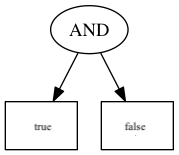
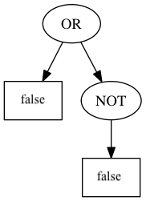
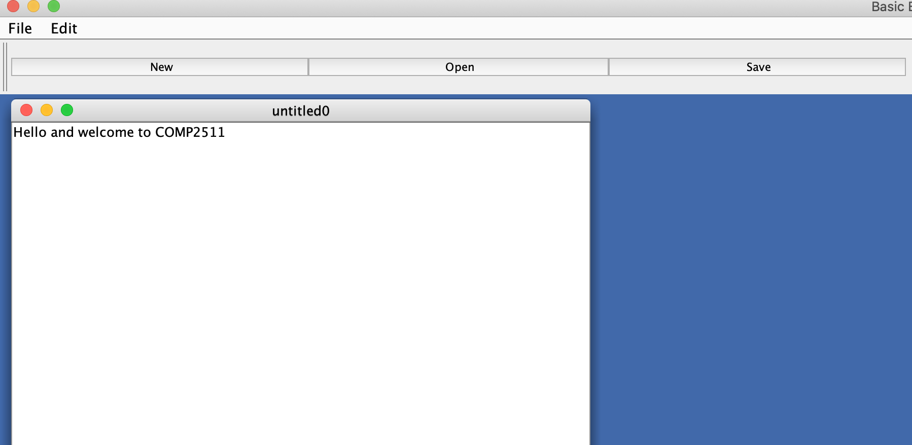

# Lab 07

### Due: Week 8 Tuesday, 10am

### Value: 2 marks towards the class mark

## Aim

* Learn how to unit test randomised functions
* Apply the Composite Pattern
* Apply the Factory Pattern
* Apply Abstract Factory Pattern

## Setup

**REMEMBER** to replace the zID below with your own.

`git clone gitlab@gitlab.cse.EDU.AU:COMP2511/21T3/students/z555555/lab07.git`

## Lab 07 - Exercise - The Art of Randomness 🎲

Testing code that has an element of randomness is bit of a funny thing. When testing normal code, you will have a deterministic 1:1 mapping of inputs to outputs, i.e. for any given input, you know what the output will be and can assert that the actual output is what you expect. 

The good news is that in computers, there's no such thing as true randomness (though this is not completely true, and you can read [here](https://engineering.mit.edu/engage/ask-an-engineer/can-a-computer-generate-a-truly-random-number/) for more information). Computers generate *pseudo-random* or fake-random numbers that do the job of being random to us pretty well. This means that we can actually test functions where the result is determined by one of these psuedo-random algorithms. 

### Seeds

We can do this by using a common **seed** given to the java `Random` object in `java.util.Random`. Here is an example:

```java
Random rand1 = new Random(1);
Random rand2 = new Random(1);
assertEquals(rand1.nextInt(), rand2.nextInt());
```

The above assertion will always pass.

Using this knowledge, we can use the deterministic result of the `Random` object to write tests.

### Task

Inside `src/random`, in `Game.java` there are is an unimplemented functions named `battle`. This function should return `true` if the hero wins the battle and `false` if they lose. The chance of the hero winning is 0.5. 

There are two constructors for the class; one for testing where the `random` attribute is seeded with the given value, and a default constructor which uses the current time as the seed. The default constructor is for real usage (for example, the `main` method we have provided). 

When the `Random` object is constructed with a seed of `4`, the following values are the results first 8 calls to `.nextInt(100)`:

```
62 52 3 58 67 5 11 46
```

For `-4`:

```
39 13 98 5 43 89 20 23
```

For `0`:

```
60 48 29 47 15 53 91 61
```

* Write at least 2 unit tests for `battle` inside `GameTest.java` using seeds. 
* Once you have done this, implement the function.
* How would you write tests for `Game` with the default constructor that prove the `battle` function works as expected? Think about this and be prepared to answer during marking. You can write your answer down in `random.md`.

## Lab 07 - Exercise - Boolean Logic 🧠

[Boolean logic](https://en.wikipedia.org/wiki/Boolean_algebra) is mathematical formalism for descibing logic, named after [George Bool](https://en.wikipedia.org/wiki/George_Boole). Computer scientists love boolean logic because it's all about manipulating binary state. In fact, you're using boolean logic whenever you combine two expressions using `&&` or `||` and when you negate an expresion using `!`. Since you've made it this far through COMP2511, we hope you know how boolean `AND`, `OR` and `NOT` work, but just in case you need a refresher, you can see the [truth tables](https://en.wikipedia.org/wiki/Truth_table) for these operators on Wikipedia.

A Boolean expression is a combination of variables, joined with Boolean operators. We will use parentheses to make the order of operations clear and unambiguous. The following are all valid Boolean expressions for example:

* `x` AND `y`
* `x`
* (`x` OR `y`) AND NOT (`z` OR (`a` AND `x`))

When all of the variables in these expressions are assigned a value (either `true` or `false`), then the whole expression evaluates to either `true` or `false`. 

## Task

Use the Composite Pattern to implement an evaluator for Boolean expressions using a tree of Boolean expression objects. 

Inside `BooleanEvaluator.java` there are two static methods which take in a `BooleanNode` and evaluate, and provide a pretty-printed representation of the node respectively. You will need to use the Composite Pattern to represent a Boolean Expression as a series of composite boolean nodes to allow these functions to work.

For example, the following diagram represents a boolean expression which is an AND expression, and contains two sub-expressions, both of which are leaf boolean nodes. 

Design your solution by creating a UML diagram before implementing it. The JUnit library has been provided if you wish to unit test your work, though you are not required to.



Evaluating this expression would return `false`, and pretty-printing this expression would print:

```
(AND true false)
```

The values of the leaf nodes are defined in the construction of the expression.

Here is another example:



```java
// Pretty print: (OR false (NOT false))
// Evaluates to true
```


```java
// Pretty print (OR true (NOT (AND false (OR true false))))
// Evaluates to true
```

<details>

<summary>Hint</summary>

You can have multiple composite types.

</details>

## Lab 07 - Exercise - Boolean Factory 🏭

Creating composite objects is all very well, but they don't just appear out of nothing ready for us to use. 

Use the Factory Pattern to implement `NodeFactory`, which should contain a static method that allows the user to pass in a JSONObject, and returns a corresponding `BooleanNode` object with the parsed expression tree. For example:

```javascript
{ "node": "and", "subnode1" : {
    "node": "or", "subnode1": {
        "node": "value", "value": true},
                "subnode2": {
        "node": "value", "value": false}},
                "subnode2": {
    "node": "value", "value": true} }
```

parses to the expression:

```
(AND (OR true false) true)
```

when pretty printed.

## Lab 07 - Challenge Exercise - Abstract File Editors 💾

Inside the `fileEditor` package is code for an application that launches a window that allows the user to edit HTML files. This includes being able to download the raw HTML from a webpage given a URL and save that onto the local computer. For example:


Inside `EditorApplication.java`, if we were to change the variable `editorType` to be `"Text Editor"`, the code would render an application which allows the user to edit files as a normal Text Editor. For example:



Currently, all of the frontend code to render the elements for both types of editors is inside the constructor of `EditorApplication`. At this point in the course you probably find the code excruciatingly painful to look at.

Refactor the code to use the Abstract Factory Patten in the setup and rendering of elements for both HTML files and text files. Empty `EditorFactory`, `HTMLEditorFactory` and `TextEditorFactory` have been provided for you. Replace the existing constructor of `EditorApplication` so that it takes in an `EditorFactory` and calls all of the respective methods on to construct the elements, as well as anything else that may need doing to setup the interface. 

On completion, you should be able to run the `main` function in `EditorApplication` and the application will work as it does currently.

You will not need to write any frontend code that is not already present to complete this exercise.


## Submission

To submit, make a tag to show that your code at the current commit is ready for your submission using the command:

```bash
$ git tag -fa submission -m "Submission for Lab-07"
$ git push -f origin submission
```

Or, you can create one via the GitLab website by going to **Repository > Tags > New Tag**.

We will take the last commit on your `master` branch before the deadline for your submission.

## Credits

Problems "Boolean Logic" sourced from NCSS Challenge (Advanced), 2016 and adapted for Java. 
