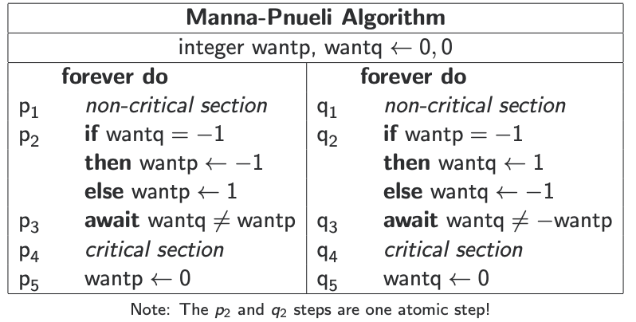
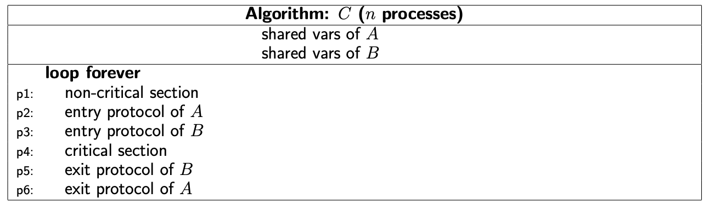

<h1 class="title">Homework (Week 3)</h1>

<h2>Table of Contents</h2>

<ul>
<li><a href="#orgddea182">1. Manna-Pnueli Algorithm (2 marks)</a></li>
<li><a href="#orgb84702b">2. Szymanski's Algorithm (5 marks)</a></li>
<li><a href="#org8c60773">3. Composing Solutions (5 Marks)</a></li>
</ul>

<b>Submission</b>: Due on Friday, 24th of June, 11am Sydney Time. Please submit using the <a href="https://cgi.cse.unsw.edu.au/~give/Student/give.php">CSE Give System</a> either online or via this command on a CSE terminal:

<pre class="src src-sh">give cs3151 hw3 hw3.pdf
</pre>

Please put all your answers in one PDF file called <code>hw3.pdf</code>. Use of
LaTeX is encouraged but not required. Please make your answers as
<b>concise as possible</b>.

Late submissions are accepted up to five days after the deadline, but
at a penalty: 5% off your total mark per day.

<h2 id="orgddea182">1 Manna-Pnueli Algorithm (2 marks)</h2>

Recall the Manna-Pnueli algorithm from Lecture 3.

Recall that the if condition and body must be executed as one atomic
step. If this were <b>not</b> the case, find an interleaving that violates
mutual exclusion. That is, split the if condition into two steps
(condition and body) and find an execution such that both processes
end up in their critical section simultaneously.

<h2 id="orgb84702b">2 Szymanski's Algorithm (5 marks)</h2>

In <a href="http://www.cse.unsw.edu.au/~cs3151/w3_code.zip">this Promela code archive</a> you will find a Promela model of
Szymanski's algorithm for three processes, broken down to satisfy LCR,
with a particular choice of test order for the various
<mrow class=&quot;MJX-TeXAtom-ORD&quot;><mi mathvariant=&quot;bold&quot;>a</mi><mi mathvariant=&quot;bold&quot;>w</mi><mi mathvariant=&quot;bold&quot;>a</mi><mi mathvariant=&quot;bold&quot;>i</mi><mi mathvariant=&quot;bold&quot;>t</mi></mrow></math>" role="presentation" style="position: relative;"><nobr aria-hidden="true">await</nobr><math xmlns="http://www.w3.org/1998/Math/MathML"><mrow class="MJX-TeXAtom-ORD"><mi mathvariant="bold">a</mi><mi mathvariant="bold">w</mi><mi mathvariant="bold">a</mi><mi mathvariant="bold">i</mi><mi mathvariant="bold">t</mi></mrow></math> statements.  This choice happens to satisfy mutual
exclusion and eventual entry (as you may check in Spin), but as
mentioned in the lectures, not all choices do.

The task here is to twiddle with the test orders and figure out which
orderings break the algorithm and which don't. You don't need to test
all permutations, but do answer these questions:

Can you find any reorderings that break mutual exclusion and/or
eventual entry? (You should be able to find at least one).  Are there
any <mrow class=&quot;MJX-TeXAtom-ORD&quot;><mi mathvariant=&quot;bold&quot;>a</mi><mi mathvariant=&quot;bold&quot;>w</mi><mi mathvariant=&quot;bold&quot;>a</mi><mi mathvariant=&quot;bold&quot;>i</mi><mi mathvariant=&quot;bold&quot;>t</mi></mrow><mstyle displaystyle=&quot;false&quot; scriptlevel=&quot;0&quot;><mtext>s</mtext></mstyle></math>" role="presentation" style="position: relative;"><nobr aria-hidden="true">awaits</nobr><math xmlns="http://www.w3.org/1998/Math/MathML"><mrow class="MJX-TeXAtom-ORD"><mi mathvariant="bold">a</mi><mi mathvariant="bold">w</mi><mi mathvariant="bold">a</mi><mi mathvariant="bold">i</mi><mi mathvariant="bold">t</mi></mrow><mstyle displaystyle="false" scriptlevel="0"><mtext>s</mtext></mstyle></math> that don't seem sensitive to reordering at all?
What if you reorder the tests for all the <mrow class=&quot;MJX-TeXAtom-ORD&quot;><mi mathvariant=&quot;bold&quot;>a</mi><mi mathvariant=&quot;bold&quot;>w</mi><mi mathvariant=&quot;bold&quot;>a</mi><mi mathvariant=&quot;bold&quot;>i</mi><mi mathvariant=&quot;bold&quot;>t</mi></mrow><mstyle displaystyle=&quot;false&quot; scriptlevel=&quot;0&quot;><mtext>s</mtext></mstyle></math>" role="presentation" style="position: relative;"><nobr aria-hidden="true">awaits</nobr><math xmlns="http://www.w3.org/1998/Math/MathML"><mrow class="MJX-TeXAtom-ORD"><mi mathvariant="bold">a</mi><mi mathvariant="bold">w</mi><mi mathvariant="bold">a</mi><mi mathvariant="bold">i</mi><mi mathvariant="bold">t</mi></mrow><mstyle displaystyle="false" scriptlevel="0"><mtext>s</mtext></mstyle></math> in the
exact same way? And finally, based on any error trails you obtain, can you
form an educated guess about <b>why</b> the test order matters?

Explain your findings, informally and in your own words.

<h2 id="org8c60773">3 Composing Solutions (5 Marks)</h2>

Let <mi>A</mi></math>" role="presentation" style="position: relative;"><nobr aria-hidden="true">A</nobr><math xmlns="http://www.w3.org/1998/Math/MathML"><mi>A</mi></math> and <mi>B</mi></math>" role="presentation" style="position: relative;"><nobr aria-hidden="true">B</nobr><math xmlns="http://www.w3.org/1998/Math/MathML"><mi>B</mi></math> be two algorithms purported to solve the mutual exclusion problem for two processes. Let <mi>C</mi></math>" role="presentation" style="position: relative;"><nobr aria-hidden="true">C</nobr><math xmlns="http://www.w3.org/1998/Math/MathML"><mi>C</mi></math> be the algorithm obtained by replacing the critical section of <mi>A</mi></math>" role="presentation" style="position: relative;"><nobr aria-hidden="true">A</nobr><math xmlns="http://www.w3.org/1998/Math/MathML"><mi>A</mi></math> with the algorithm <mi>B</mi></math>" role="presentation" style="position: relative;"><nobr aria-hidden="true">B</nobr><math xmlns="http://www.w3.org/1998/Math/MathML"><mi>B</mi></math>:

Assume that the shared variables of <mi>A</mi></math>" role="presentation" style="position: relative;"><nobr aria-hidden="true">A</nobr><math xmlns="http://www.w3.org/1998/Math/MathML"><mi>A</mi></math> are disjoint from those of <mi>B</mi></math>" role="presentation" style="position: relative;"><nobr aria-hidden="true">B</nobr><math xmlns="http://www.w3.org/1998/Math/MathML"><mi>B</mi></math>. Are the following statements correct? Justify your answers with 1-2 sentences.

a) If either <mi>A</mi></math>" role="presentation" style="position: relative;"><nobr aria-hidden="true">A</nobr><math xmlns="http://www.w3.org/1998/Math/MathML"><mi>A</mi></math> or <mi>B</mi></math>" role="presentation" style="position: relative;"><nobr aria-hidden="true">B</nobr><math xmlns="http://www.w3.org/1998/Math/MathML"><mi>B</mi></math> satisfies mutual exclusion, then <mi>C</mi></math>" role="presentation" style="position: relative;"><nobr aria-hidden="true">C</nobr><math xmlns="http://www.w3.org/1998/Math/MathML"><mi>C</mi></math> satisfies mutual exclusion.

b) If <mi>A</mi></math>" role="presentation" style="position: relative;"><nobr aria-hidden="true">A</nobr><math xmlns="http://www.w3.org/1998/Math/MathML"><mi>A</mi></math> has no unnecessary delay and <mi>B</mi></math>" role="presentation" style="position: relative;"><nobr aria-hidden="true">B</nobr><math xmlns="http://www.w3.org/1998/Math/MathML"><mi>B</mi></math> satisfies mutual exclusion then <mi>C</mi></math>" role="presentation" style="position: relative;"><nobr aria-hidden="true">C</nobr><math xmlns="http://www.w3.org/1998/Math/MathML"><mi>C</mi></math> has no unnecessary delay.

c) If <mi>A</mi></math>" role="presentation" style="position: relative;"><nobr aria-hidden="true">A</nobr><math xmlns="http://www.w3.org/1998/Math/MathML"><mi>A</mi></math> satifies mutual exclusion and <mi>B</mi></math>" role="presentation" style="position: relative;"><nobr aria-hidden="true">B</nobr><math xmlns="http://www.w3.org/1998/Math/MathML"><mi>B</mi></math> has no unnecessary delay then <mi>C</mi></math>" role="presentation" style="position: relative;"><nobr aria-hidden="true">C</nobr><math xmlns="http://www.w3.org/1998/Math/MathML"><mi>C</mi></math> has no unnecessary delay.

d) If <mi>A</mi></math>" role="presentation" style="position: relative;"><nobr aria-hidden="true">A</nobr><math xmlns="http://www.w3.org/1998/Math/MathML"><mi>A</mi></math> is deadlock free and <mi>B</mi></math>" role="presentation" style="position: relative;"><nobr aria-hidden="true">B</nobr><math xmlns="http://www.w3.org/1998/Math/MathML"><mi>B</mi></math> guarantees eventual entry then <mi>C</mi></math>" role="presentation" style="position: relative;"><nobr aria-hidden="true">C</nobr><math xmlns="http://www.w3.org/1998/Math/MathML"><mi>C</mi></math> guarantees eventual entry.

