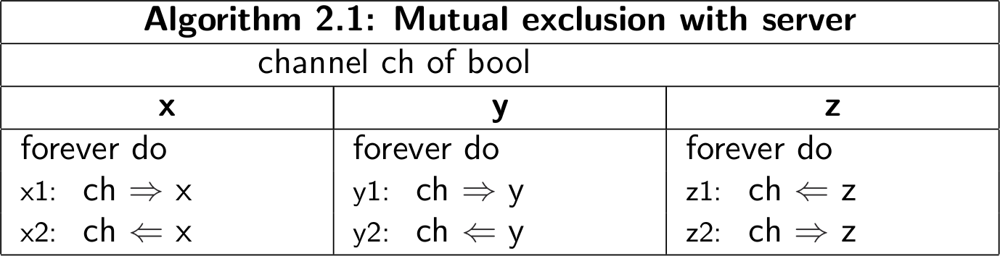
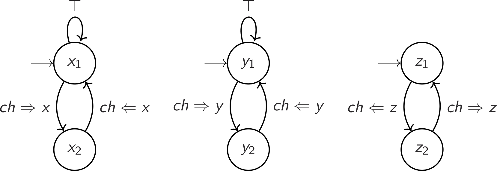

<h1 class="title">Homework (Week 5)</h1>

<h2>Table of Contents</h2>

<ul>
<li><a href="#org72426ee">1. Reasoning about message passing (5 marks)</a></li>
<li><a href="#org9b81a69">2. Philosophers (4 marks)</a></li>
<li><a href="#org009b645">3. Fair Merge (4 marks)</a></li>
</ul>

<b>Submission</b>: Due on Friday, 15th of July, 11am Sydney Time. Please submit using the <a href="https://cgi.cse.unsw.edu.au/~give/Student/give.php">CSE Give System</a> either online or via this command on a CSE terminal:

<pre class="src src-sh">give cs3151 hw5 hw5.pdf philosophers.pml merge.pml
</pre>

Late submissions are accepted up to five days after the deadline, but
at a penalty: 5% off your total mark per day.

Develop solutions to each of the following problems in Promela, in a separate Promela file.

<h2 id="org72426ee">1 Reasoning about message passing (5 marks)</h2>

Here is a critical section algorithm that uses synchronous message passing:

Only processes <b>x</b> and <b>y</b> are competing for the critical section; <b>z</b> is an auxiliary process.
The critical sections are at lines <code>x2</code> and <code>y2</code>; <code>x_1</code> and <code>y_1</code> are the non-critical sections.
The program variables x,y,z are just dummies; their values and types are unimportant.

The transition diagrams for these processes are as follows.

(The self-loop is not depicted in the code above; it represents the ability to stay in the non-critical section forever).

<ol class="org-ol">
<li>Construct the closed product of these transition diagrams.
The initial state will be <mo fence=&quot;false&quot; stretchy=&quot;false&quot;>&amp;#x27E8;</mo><msub><mi>x</mi><mn>1</mn></msub><mo>,</mo><msub><mi>y</mi><mn>1</mn></msub><mo>,</mo><msub><mi>z</mi><mn>1</mn></msub><mo fence=&quot;false&quot; stretchy=&quot;false&quot;>&amp;#x27E9;</mo></math>" role="presentation" style="position: relative;"><nobr aria-hidden="true">⟨x1,y1,z1⟩</nobr><math xmlns="http://www.w3.org/1998/Math/MathML"><mo fence="false" stretchy="false">⟨</mo><msub><mi>x</mi><mn>1</mn></msub><mo>,</mo><msub><mi>y</mi><mn>1</mn></msub><mo>,</mo><msub><mi>z</mi><mn>1</mn></msub><mo fence="false" stretchy="false">⟩</mo></math>.</li>
<li>It's obvious from inspection of the closed product that this
algorithm satisfies mutual exclusion. Why?</li>
<li>Does this algorithm satisfy eventual entry? Briefly motivate.</li>
<li>Does this algorithm still work if we flip all inputs to outputs,
and vice versa? Brifely motivate.</li>
<li>The algorithm behaves oddly if we make <b>ch</b> asynchronous.
Describe a scenario that (a) assumes an asynchronous, reliable channel;
(b) goes on forever in a cycle; and (c) takes transitions other than
the self-loops at <code>x1</code> and <code>y1</code> infinitely often; and (d)
never visits locations <code>x2</code> and <code>y2</code>.</li>
</ol>

Submit your answers in a pdf file called <code>hw5.pdf</code>.

<h2 id="org9b81a69">2 Philosophers (4 marks)</h2>

Develop a solution for the dining philosophers problem using only message passing, under the additional restriction that each channel must be connected to exactly one sender
and exactly one receiver. 

By way of a hint, the following things do not work:

<ul class="org-ul">
<li>Having only 5 processes, one for each philosopher.</li>
<li>Having only 5 channels, one for each fork.</li>
</ul>

Configure the solution to run forever, in a 5 philosopher scenario. 

Put all your work in a file called <code>philosophers.pml</code>. Do not include any other files.

<h2 id="org009b645">3 Fair Merge (4 marks)</h2>

Develop an algorithm to merge
two sequences of data. A process called <code>merge</code> is given three channel parameters of type <code>byte</code>, receives data on two input channels and interleaves the data
on the output channel, such that if the two inputs are sorted (in ascending order), then the output is sorted.

Try to implement a fair merge that is free from starvation of both input
channels when possible. This means that you should try to make sure every
input stream is always eventually read from.
This requirement will sometimes be impossible to reconcile with the
sortedness requirement.
If so, keeping the outputs sorted takes priority.
For example, if the two input channels transmit
infinite streams of 1:s and 2:s, respectively, no 2:s
should be sent on the output channel.

Assume that the value 255 is a special <code>EOF</code> signal, and no further data will
be sent on a channel after <code>EOF</code> is sent. Your merge process should terminate if all data
has been transmitted. Assume that an <code>EOF</code> will be sent at the end of the data stream
(if it ends).

Put all your work in a file called <code>merge.pml</code>. Do not include any other files.

