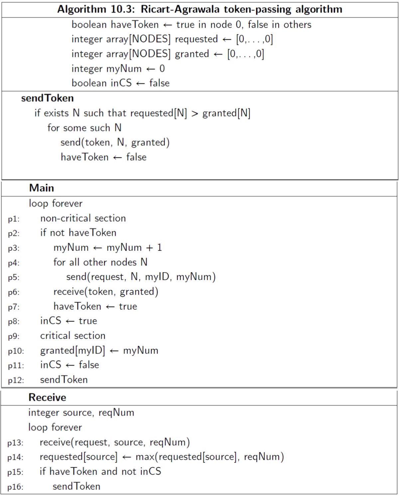

<h1 class="title">Homework (Week 8)</h1>

<h2>Table of Contents</h2>

<ul>
<li><a href="#orge2140e6">1. Process algebra (5 points)</a></li>
<li><a href="#orgf1a5749">2. Ricart-Agrawala Algorithm (4 points)</a></li>
<li><a href="#orgbde0e74">3. Token-Passing (4 points)</a></li>
</ul>

<b>Submission</b>: Due on Friday, 29th of July, 11am Sydney Time. Please submit using the <a href="https://cgi.cse.unsw.edu.au/~give/Student/give.php">CSE Give System</a> either online or via this command on a CSE terminal:

<pre class="src src-sh">give cs3151 hw7 hw7.pdf
</pre>

Late submissions are accepted up to five days after the deadline, but
at a penalty: 5% off your total mark per day.

<h2 id="orge2140e6">1 Process algebra (5 points)</h2>

We saw a large number of algebraic laws of CCS this Wednesday.
Here are some more proposed laws. Briefly discuss the merits of each
proposed law, and whether you think it should be accepted.
If you think it should be accepted, give an informal intution for why;
if you think not, give a concrete example where it has absurd consequences.

a) <mi>P</mi><mrow class=&quot;MJX-TeXAtom-REL&quot;><mrow class=&quot;MJX-TeXAtom-ORD&quot;><mo stretchy=&quot;false&quot;>|</mo></mrow></mrow><mi>P</mi><mo>=</mo><mi>P</mi></math>" role="presentation" style="position: relative;"><nobr aria-hidden="true">P|P=P</nobr><math xmlns="http://www.w3.org/1998/Math/MathML"><mi>P</mi><mrow class="MJX-TeXAtom-REL"><mrow class="MJX-TeXAtom-ORD"><mo stretchy="false">|</mo></mrow></mrow><mi>P</mi><mo>=</mo><mi>P</mi></math>

b) <mi>P</mi><mo class=&quot;MJX-variant&quot;>&amp;#x2216;</mo><mi>b</mi><mo class=&quot;MJX-variant&quot;>&amp;#x2216;</mo><mi>b</mi><mo>=</mo><mi>P</mi><mo class=&quot;MJX-variant&quot;>&amp;#x2216;</mo><mi>b</mi></math>" role="presentation" style="position: relative;"><nobr aria-hidden="true">P∖b∖b=P∖b</nobr><math xmlns="http://www.w3.org/1998/Math/MathML"><mi>P</mi><mo class="MJX-variant">∖</mo><mi>b</mi><mo class="MJX-variant">∖</mo><mi>b</mi><mo>=</mo><mi>P</mi><mo class="MJX-variant">∖</mo><mi>b</mi></math>

c) <mo stretchy=&quot;false&quot;>(</mo><mi>a</mi><mo>.</mo><mi>P</mi><mo stretchy=&quot;false&quot;>)</mo><mrow class=&quot;MJX-TeXAtom-ORD&quot;><mo stretchy=&quot;false&quot;>|</mo></mrow><mo stretchy=&quot;false&quot;>(</mo><mi>a</mi><mo>.</mo><mi>Q</mi><mo stretchy=&quot;false&quot;>)</mo><mo>=</mo><mi>a</mi><mo>.</mo><mo stretchy=&quot;false&quot;>(</mo><mi>P</mi><mrow class=&quot;MJX-TeXAtom-ORD&quot;><mo stretchy=&quot;false&quot;>|</mo></mrow><mi>Q</mi><mo stretchy=&quot;false&quot;>)</mo></math>" role="presentation" style="position: relative;"><nobr aria-hidden="true">(a.P)|(a.Q)=a.(P|Q)</nobr><math xmlns="http://www.w3.org/1998/Math/MathML"><mo stretchy="false">(</mo><mi>a</mi><mo>.</mo><mi>P</mi><mo stretchy="false">)</mo><mrow class="MJX-TeXAtom-ORD"><mo stretchy="false">|</mo></mrow><mo stretchy="false">(</mo><mi>a</mi><mo>.</mo><mi>Q</mi><mo stretchy="false">)</mo><mo>=</mo><mi>a</mi><mo>.</mo><mo stretchy="false">(</mo><mi>P</mi><mrow class="MJX-TeXAtom-ORD"><mo stretchy="false">|</mo></mrow><mi>Q</mi><mo stretchy="false">)</mo></math>

<h2 id="orgf1a5749">2 Ricart-Agrawala Algorithm (4 points)</h2>

Pseudocode of the Ricart-Agrawala Algorithm is:

a) Suppose that we exchanged the lines <i>p8</i> and <i>p9–p11</i> in Main, i.e. <mrow class=&quot;MJX-TeXAtom-ORD&quot;><mtext mathvariant=&quot;sans-serif&quot;>requestCS</mtext></mrow><mo stretchy=&quot;false&quot;>&amp;#x2190;</mo><mrow class=&quot;MJX-TeXAtom-ORD&quot;><mtext mathvariant=&quot;sans-serif&quot;>false</mtext></mrow></math>" role="presentation" style="position: relative;"><nobr aria-hidden="true">ğ—‹ğ–¾ğ—Šğ—ğ–¾ğ—Œğ—ğ–¢ğ–²â†ğ–¿ğ–ºğ—…ğ—Œğ–¾</nobr><math xmlns="http://www.w3.org/1998/Math/MathML"><mrow class="MJX-TeXAtom-ORD"><mtext mathvariant="sans-serif">requestCS</mtext></mrow><mo stretchy="false">←</mo><mrow class="MJX-TeXAtom-ORD"><mtext mathvariant="sans-serif">false</mtext></mrow></math> now executes after the for loop (instead of executing before the for loop).
Suppose furthermore that it's possible for <mrow class=&quot;MJX-TeXAtom-ORD&quot;><mtext mathvariant=&quot;bold&quot;>Receive</mtext></mrow></math>" role="presentation" style="position: relative;"><nobr aria-hidden="true">Receive</nobr><math xmlns="http://www.w3.org/1998/Math/MathML"><mrow class="MJX-TeXAtom-ORD"><mtext mathvariant="bold">Receive</mtext></mrow></math> to preempt <mrow class=&quot;MJX-TeXAtom-ORD&quot;><mtext mathvariant=&quot;bold&quot;>Main</mtext></mrow></math>" role="presentation" style="position: relative;"><nobr aria-hidden="true">Main</nobr><math xmlns="http://www.w3.org/1998/Math/MathML"><mrow class="MJX-TeXAtom-ORD"><mtext mathvariant="bold">Main</mtext></mrow></math> at these locations.
Provide an example that illustrates why the modified algorithm is no longer correct.

b) In <mrow class=&quot;MJX-TeXAtom-ORD&quot;><mtext mathvariant=&quot;bold&quot;>Receive</mtext></mrow></math>" role="presentation" style="position: relative;"><nobr aria-hidden="true">Receive</nobr><math xmlns="http://www.w3.org/1998/Math/MathML"><mrow class="MJX-TeXAtom-ORD"><mtext mathvariant="bold">Receive</mtext></mrow></math>, can the statement <mrow class=&quot;MJX-TeXAtom-ORD&quot;><mtext mathvariant=&quot;sans-serif&quot;>p2:</mtext></mrow><mtext>&amp;#xA0;</mtext><mrow class=&quot;MJX-TeXAtom-ORD&quot;><mtext mathvariant=&quot;sans-serif&quot;>highestNum</mtext></mrow><mo stretchy=&quot;false&quot;>&amp;#x2190;</mo><mrow class=&quot;MJX-TeXAtom-ORD&quot;><mtext mathvariant=&quot;sans-serif&quot;>max</mtext></mrow><mo stretchy=&quot;false&quot;>(</mo><mrow class=&quot;MJX-TeXAtom-ORD&quot;><mtext mathvariant=&quot;sans-serif&quot;>highestNum</mtext></mrow><mo>,</mo><mrow class=&quot;MJX-TeXAtom-ORD&quot;><mtext mathvariant=&quot;sans-serif&quot;>requestNum</mtext></mrow><mo stretchy=&quot;false&quot;>)</mo></math>" role="presentation" style="position: relative;"><nobr aria-hidden="true">𝗉𝟤:&nbsp;ğ—ğ—‚ğ—€ğ—ğ–¾ğ—Œğ—ğ–­ğ—ğ—†â†ğ—†ğ–ºğ—‘(𝗁𝗂𝗀𝗁𝖾𝗌𝗍𝖭𝗎𝗆,𝗋𝖾𝗊𝗎𝖾𝗌𝗍𝖭𝗎𝗆)</nobr><math xmlns="http://www.w3.org/1998/Math/MathML"><mrow class="MJX-TeXAtom-ORD"><mtext mathvariant="sans-serif">p2:</mtext></mrow><mtext>&nbsp;</mtext><mrow class="MJX-TeXAtom-ORD"><mtext mathvariant="sans-serif">highestNum</mtext></mrow><mo stretchy="false">←</mo><mrow class="MJX-TeXAtom-ORD"><mtext mathvariant="sans-serif">max</mtext></mrow><mo stretchy="false">(</mo><mrow class="MJX-TeXAtom-ORD"><mtext mathvariant="sans-serif">highestNum</mtext></mrow><mo>,</mo><mrow class="MJX-TeXAtom-ORD"><mtext mathvariant="sans-serif">requestNum</mtext></mrow><mo stretchy="false">)</mo></math> be replaced by <mrow class=&quot;MJX-TeXAtom-ORD&quot;><mtext mathvariant=&quot;sans-serif&quot;>p2:</mtext></mrow><mtext>&amp;#xA0;</mtext><mrow class=&quot;MJX-TeXAtom-ORD&quot;><mtext mathvariant=&quot;sans-serif&quot;>highestNum</mtext></mrow><mo stretchy=&quot;false&quot;>&amp;#x2190;</mo><mrow class=&quot;MJX-TeXAtom-ORD&quot;><mtext mathvariant=&quot;sans-serif&quot;>requestNum</mtext></mrow></math>" role="presentation" style="position: relative;"><nobr aria-hidden="true">𝗉𝟤:&nbsp;ğ—ğ—‚ğ—€ğ—ğ–¾ğ—Œğ—ğ–­ğ—ğ—†â†ğ—‹ğ–¾ğ—Šğ—ğ–¾ğ—Œğ—ğ–­ğ—ğ—†</nobr><math xmlns="http://www.w3.org/1998/Math/MathML"><mrow class="MJX-TeXAtom-ORD"><mtext mathvariant="sans-serif">p2:</mtext></mrow><mtext>&nbsp;</mtext><mrow class="MJX-TeXAtom-ORD"><mtext mathvariant="sans-serif">highestNum</mtext></mrow><mo stretchy="false">←</mo><mrow class="MJX-TeXAtom-ORD"><mtext mathvariant="sans-serif">requestNum</mtext></mrow></math>? Why? Justify your answer and provide an example. 

<i>In both parts of this question, you can sketch diagrams in addition to textual explanations. However, if your textual explanations are clear, such diagrams might be unnecessary.</i>

<h2 id="orgbde0e74">3 Token-Passing (4 points)</h2>

Pseudocode of the Ricart-Agrawala Token-passing Algorithm is:

a) In node <mi>i</mi></math>" role="presentation" style="position: relative;"><nobr aria-hidden="true">i</nobr><math xmlns="http://www.w3.org/1998/Math/MathML"><mi>i</mi></math>, can the value of <mrow class=&quot;MJX-TeXAtom-ORD&quot;><mtext mathvariant=&quot;sans-serif&quot;>requested</mtext></mrow><mo stretchy=&quot;false&quot;>[</mo><mi>j</mi><mo stretchy=&quot;false&quot;>]</mo></math>" role="presentation" style="position: relative;"><nobr aria-hidden="true">𝗋𝖾𝗊𝗎𝖾𝗌𝗍𝖾𝖽[j]</nobr><math xmlns="http://www.w3.org/1998/Math/MathML"><mrow class="MJX-TeXAtom-ORD"><mtext mathvariant="sans-serif">requested</mtext></mrow><mo stretchy="false">[</mo><mi>j</mi><mo stretchy="false">]</mo></math> be less than the value of <mrow class=&quot;MJX-TeXAtom-ORD&quot;><mtext mathvariant=&quot;sans-serif&quot;>granted</mtext></mrow><mo stretchy=&quot;false&quot;>[</mo><mi>j</mi><mo stretchy=&quot;false&quot;>]</mo></math>" role="presentation" style="position: relative;"><nobr aria-hidden="true">𝗀𝗋𝖺𝗇𝗍𝖾𝖽[j]</nobr><math xmlns="http://www.w3.org/1998/Math/MathML"><mrow class="MJX-TeXAtom-ORD"><mtext mathvariant="sans-serif">granted</mtext></mrow><mo stretchy="false">[</mo><mi>j</mi><mo stretchy="false">]</mo></math> for <mi>j</mi><mo>&amp;#x2260;</mo><mi>i</mi></math>" role="presentation" style="position: relative;"><nobr aria-hidden="true">j≠i</nobr><math xmlns="http://www.w3.org/1998/Math/MathML"><mi>j</mi><mo>≠</mo><mi>i</mi></math>? Why? Justify your answer. 

b) In node <mi>i</mi></math>" role="presentation" style="position: relative;"><nobr aria-hidden="true">i</nobr><math xmlns="http://www.w3.org/1998/Math/MathML"><mi>i</mi></math>, can the value of <mrow class=&quot;MJX-TeXAtom-ORD&quot;><mtext mathvariant=&quot;sans-serif&quot;>requested</mtext></mrow><mo stretchy=&quot;false&quot;>[</mo><mi>j</mi><mo stretchy=&quot;false&quot;>]</mo></math>" role="presentation" style="position: relative;"><nobr aria-hidden="true">𝗋𝖾𝗊𝗎𝖾𝗌𝗍𝖾𝖽[j]</nobr><math xmlns="http://www.w3.org/1998/Math/MathML"><mrow class="MJX-TeXAtom-ORD"><mtext mathvariant="sans-serif">requested</mtext></mrow><mo stretchy="false">[</mo><mi>j</mi><mo stretchy="false">]</mo></math> be greater than the value of <mrow class=&quot;MJX-TeXAtom-ORD&quot;><mtext mathvariant=&quot;sans-serif&quot;>granted</mtext></mrow><mo stretchy=&quot;false&quot;>[</mo><mi>j</mi><mo stretchy=&quot;false&quot;>]</mo></math>" role="presentation" style="position: relative;"><nobr aria-hidden="true">𝗀𝗋𝖺𝗇𝗍𝖾𝖽[j]</nobr><math xmlns="http://www.w3.org/1998/Math/MathML"><mrow class="MJX-TeXAtom-ORD"><mtext mathvariant="sans-serif">granted</mtext></mrow><mo stretchy="false">[</mo><mi>j</mi><mo stretchy="false">]</mo></math> for <mi>j</mi><mo>&amp;#x2260;</mo><mi>i</mi></math>" role="presentation" style="position: relative;"><nobr aria-hidden="true">j≠i</nobr><math xmlns="http://www.w3.org/1998/Math/MathML"><mi>j</mi><mo>≠</mo><mi>i</mi></math>? Why? Justify your answer. 

