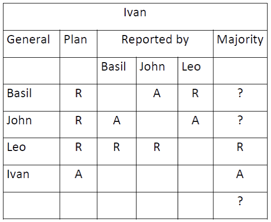
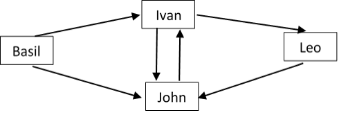

<h1 class="title">Homework (Week 9)</h1>

<h2>Table of Contents</h2>

<ul>
<li><a href="#orge0e55e7">1. The Byzantine Generals Algorithm (6 marks)</a></li>
<li><a href="#org6b688f3">2. The Dijkstra-Scholten Algorithm (4 marks)</a></li>
<li><a href="#orgf4d31e7">3. Permissionless consensus (3 marks)</a></li>
</ul>

<b>Submission</b>: Due on Friday, 5th August, 11AM Sydney Time. Please submit using the <a href="https://cgi.cse.unsw.edu.au/~give/Student/give.php">CSE Give System</a> either online or via this command on a CSE terminal:

<pre class="src src-sh">give cs3151 hw8 hw8.pdf
</pre>

Late submissions are accepted up to five days after the deadline, but
at a penalty: 5% off your total mark per day.

This assignment uses Ben-Ari's DAJ tool, a visual aid for studying distributed algorithms,
It is available for download at <a href="https://github.com/motib/daj">https://github.com/motib/daj</a>.

Clone the repository, then run the tool by executing

<pre class="src src-sh">java -jar daj.jar
</pre>

<h2 id="orge0e55e7">1 The Byzantine Generals Algorithm (6 marks)</h2>

In the Byzantine Generals Algorithm, suppose that there is exactly 1 (one) traitor and that Ivan’s data structures are: 

<ol class="org-ol">
<li>Who is the traitor? Justify your answer (explain why this general is the traitor and why none of the other generals can be the traitor).</li>
<li>What does Ivan decide about Basil’s and John’s plans? What does Ivan decide about the overall majority plan?</li>
<li>Using DAJ, construct a minimal scenario leading to the shown data structure for Ivan. In this minimal scenario, the traitor's only incorrect messages should be the ones in Ivan's data structure above. Provide a screenshot of the main window in DAJ.</li>
<li>For the scenario constructed in the previous question, provide screenshots of the 4 (four) knowledge trees that DAJ constructs about each of the generals. Note that knowledge trees are called "message trees" in DAJ. Which of these knowledge (message) trees indicate the traitor's incorrect messages?</li>
</ol>

<h2 id="org6b688f3">2 The Dijkstra-Scholten Algorithm (4 marks)</h2>

A distributed system with 4 (four) nodes including 1 (one) environment node is depicted with the following directed graph: 

Using DAJ, construct a scenario for each of the 4 (four) different spanning trees in the above directed graph. These scenarios differ in the order of the sent messages (but note that some orders of sent messages result in the same spanning tree, while you have to find all different spanning trees). For each of these scenarios, only provide a screenshot of the spanning tree that DAJ constructs. 

<h2 id="orgf4d31e7">3 Permissionless consensus (3 marks)</h2>

Bitcoin uses what's called <i>proof-of-work</i> consensus, where the first
node to solve a computationally expensive puzzle gets to pick the next
block.

How does Bitcoin mitigate the problem of two nodes solving the puzzle
at roughly the same time, causing a split decision?  Skim the <a href="https://bitcoin.org/bitcoin.pdf">Bitcoin
white paper</a> for the answer. Explain informally and in your own words.

