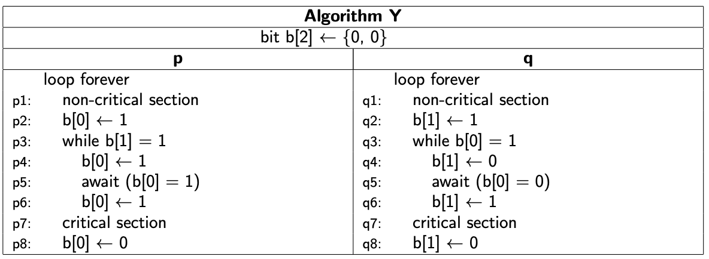

<h1 class="title">Spec (Warm-up Assignment)</h1>

<h2>Table of Contents</h2>

<ul>
<li><a href="#orgfaa3cf8">1. Task</a></li>
<li><a href="#org214c2c4">2. Deliverables</a></li>
<li><a href="#orge1a3931">3. Testing</a></li>
<li><a href="#org507d38e">4. Submission Instructions</a></li>
</ul>

Start working on this assignment after the Week 1 lectures.
<i>You will need some Week 2 material to finish it</i>.

This assignment is worth 10% and due before <b>Monday June 20th, 6pm</b> local time
Sydney.

Late submissions are accepted up to five days after the deadline, but
at a penalty: 5% off your total mark per day.

The purpose of this assignment is to ensure that every student in this
course is familiar with the tools we will be using.

<i>This assignment has to be done individually</i>.

The task involving Spin is supposed to be relatively easy. Finding
the assertion network however can be hard. This component serves to
(a) re-inforce understanding of the Owicki/Gries method and (b)
provide a modest challenge.

<h2 id="orgfaa3cf8">1 Task</h2>

Consider the following algorithm presented in Ben-Ari's notation.

<ol class="org-ol">
<li><i>(40 marks)</i> Use Spin to check whether Algorithm Y is a solution to the
critical section problem.
Address all four desiderata from the lectures
(mutual exclusion, eventual entry, absence of deadlock,
 absence of unnecessary delay).</li>
<li><i>(40 marks)</i> Encode Algorithm Y as a parallel composition of two transition
diagrams. Define an assertion network <mi>Q</mi></math>" role="presentation" style="position: relative;"><nobr aria-hidden="true">Q</nobr><math xmlns="http://www.w3.org/1998/Math/MathML"><mi>Q</mi></math> such that the assertions
at the locations representing the critical sections express mutual
exclusion. Prove that <mi>Q</mi></math>" role="presentation" style="position: relative;"><nobr aria-hidden="true">Q</nobr><math xmlns="http://www.w3.org/1998/Math/MathML"><mi>Q</mi></math> is inductive. (It is ok to focus on the
processes after the initialisation of <mi>b</mi></math>" role="presentation" style="position: relative;"><nobr aria-hidden="true">b</nobr><math xmlns="http://www.w3.org/1998/Math/MathML"><mi>b</mi></math>. It is not ok to make the
assertions at the entry locations unreasonably strong.)</li>
<li><i>(20 marks)</i> Identify any superfluous statements in the algorithm. That is,
can any statements be replaced by <code>skip</code> without changing the
behaviour of Algorithm Y? Justify your answers, preferrably
using your transition diagram and assertion network.</li>
</ol>

Prepare a report that explains your findings. Make it concise and
convincing.

<h2 id="org214c2c4">2 Deliverables</h2>

<dl class="org-dl">
<dt>algY.pml</dt><dd>faithful implementations of Algorithm Y in Promela.
Feel free to assume that <a href="https:/www.cse.unsw.edu.au/~cs3151/22T2/statics/critical2.h">this Promela header file</a> is
present in the same directory as your .pml file, if you
want to use the same critical section boilerplate as in
the lectures.</dd>
<dt>algY.pdf</dt><dd>A PDF of your report. Diagrams may be hand-drawn (but
must be readable). Prose must be typeset, preferably
with LaTeX (although not mandatory).  List your student
ID near the top of the document.  The document should
describe your efforts, incorporate the previous
deliverables, quote some output of Spin as evidence if
that is helpful, and contain the Owicki/Gries-style
proof.
Make sure your Spin results are reproducible by
specifying which (if any) non-default options you used
for checking each property.</dd>
</dl>

<h2 id="orge1a3931">3 Testing</h2>

Submissions will be tested on CSE servers, where Spin's command line
interface is available. A compatible version of the ispin GUI is
accessible for vlab users with this command:

<pre class="src src-sh">% ~cs3151/bin/ispin
</pre>

…and can be used remotely over SSH as follows:

<pre class="src src-sh">% ssh -Y z&lt;my_digits&gt;@login.cse.unsw.edu.au ~cs3151/bin/ispin
</pre>

You may also wish to install Spin locally. Instructions here:
<a href="http://spinroot.com">http://spinroot.com</a>

<h2 id="org507d38e">4 Submission Instructions</h2>

The <code>give</code> command to be run is:

<pre class="src src-sh">% give cs3151 assn0 algY.pml algY.pdf
</pre>

You may also use the online <code>give</code> interface to submit. 
Beware of rather tight submission size limits. 

