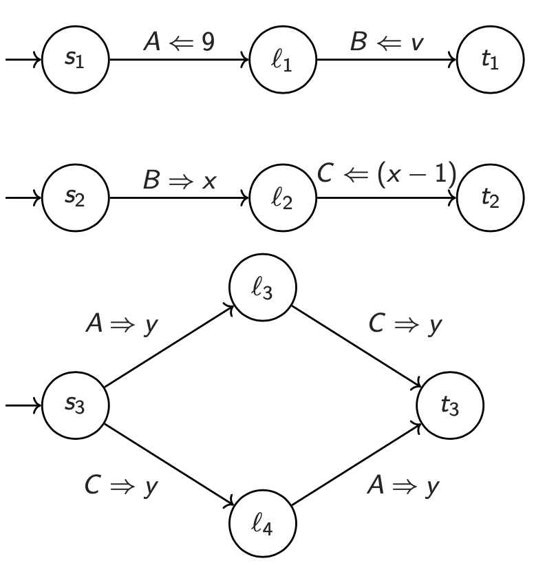
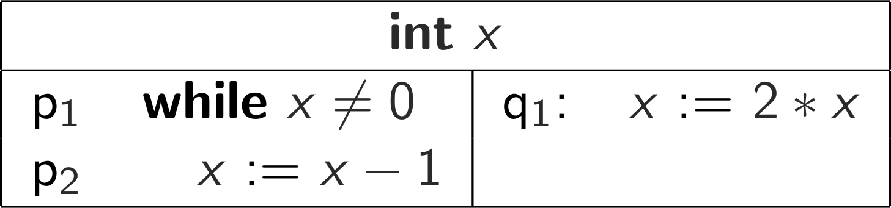

<h1 class="title">Homework (Week 7)</h1>

<h2>Table of Contents</h2>

<ul>
<li><a href="#org3cf9911">1. Non-compositional Verification (6 marks)</a></li>
<li><a href="#org8583e38">2. Termination (6 marks)</a></li>
</ul>

<b>Submission</b>: Due on Friday, 22nd of July, 11am Sydney Time. Please submit using the <a href="https://cgi.cse.unsw.edu.au/~give/Student/give.php">CSE Give System</a> either online or via this command on a CSE terminal:

<pre class="src src-sh">give cs3151 hw6 hw6.pdf
</pre>

Late submissions are accepted up to five days after the deadline, but
at a penalty: 5% off your total mark per day.

<h2 id="org3cf9911">1 Non-compositional Verification (6 marks)</h2>

Here is a three process message passing system presented as a
transition diagram of three processes <msub><mi>P</mi><mn>1</mn></msub></math>" role="presentation"><nobr aria-hidden="true">P1</nobr><math xmlns="http://www.w3.org/1998/Math/MathML"><msub><mi>P</mi><mn>1</mn></msub></math>, <msub><mi>P</mi><mn>2</mn></msub></math>" role="presentation"><nobr aria-hidden="true">P2</nobr><math xmlns="http://www.w3.org/1998/Math/MathML"><msub><mi>P</mi><mn>2</mn></msub></math>, and <msub><mi>P</mi><mn>3</mn></msub></math>" role="presentation"><nobr aria-hidden="true">P3</nobr><math xmlns="http://www.w3.org/1998/Math/MathML"><msub><mi>P</mi><mn>3</mn></msub></math>.

Prove using the Levin and Gries or AFR methods that the following Hoare triple holds:

<mo fence=&quot;false&quot; stretchy=&quot;false&quot;>{</mo><mrow class=&quot;MJX-TeXAtom-ORD&quot;><mtext mathvariant=&quot;sans-serif&quot;>True</mtext></mrow><mo fence=&quot;false&quot; stretchy=&quot;false&quot;>}</mo><mtext>&amp;#xA0;</mtext><msub><mi>P</mi><mn>1</mn></msub><mtext>&amp;#xA0;</mtext><mo fence=&quot;false&quot; stretchy=&quot;false&quot;>&amp;#x2016;</mo><mtext>&amp;#xA0;</mtext><msub><mi>P</mi><mn>2</mn></msub><mtext>&amp;#xA0;</mtext><mo fence=&quot;false&quot; stretchy=&quot;false&quot;>&amp;#x2016;</mo><mtext>&amp;#xA0;</mtext><msub><mi>P</mi><mn>3</mn></msub><mtext>&amp;#xA0;</mtext><mo fence=&quot;false&quot; stretchy=&quot;false&quot;>{</mo><mi>y</mi><mo>=</mo><mi>v</mi><mo>&amp;#x2212;</mo><mn>1</mn><mo fence=&quot;false&quot; stretchy=&quot;false&quot;>}</mo></math>" role="presentation"><nobr aria-hidden="true">{𝖳𝗋𝗎𝖾}&nbsp;P1&nbsp;‖&nbsp;P2&nbsp;‖&nbsp;P3&nbsp;{y=v−1}</nobr><math xmlns="http://www.w3.org/1998/Math/MathML" display="block"><mo fence="false" stretchy="false">{</mo><mrow class="MJX-TeXAtom-ORD"><mtext mathvariant="sans-serif">True</mtext></mrow><mo fence="false" stretchy="false">}</mo><mtext>&nbsp;</mtext><msub><mi>P</mi><mn>1</mn></msub><mtext>&nbsp;</mtext><mo fence="false" stretchy="false">‖</mo><mtext>&nbsp;</mtext><msub><mi>P</mi><mn>2</mn></msub><mtext>&nbsp;</mtext><mo fence="false" stretchy="false">‖</mo><mtext>&nbsp;</mtext><msub><mi>P</mi><mn>3</mn></msub><mtext>&nbsp;</mtext><mo fence="false" stretchy="false">{</mo><mi>y</mi><mo>=</mo><mi>v</mi><mo>−</mo><mn>1</mn><mo fence="false" stretchy="false">}</mo></math>

You don't need to explicitly discharge your proof obligations;
instead, it suffices to give your assertion networks, your extra
auxiliary variable wrangling, and (if using AFR) your communication
invariant.

<h2 id="org8583e38">2 Termination (6 marks)</h2>

Consider the following program:

<ol class="org-ol">
<li>Use the local method to prove <mi>x</mi><mo>&amp;#x2265;</mo><mn>0</mn></math>" role="presentation" style="position: relative;"><nobr aria-hidden="true">x≥0</nobr><math xmlns="http://www.w3.org/1998/Math/MathML"><mi>x</mi><mo>≥</mo><mn>0</mn></math> -convergence
for this program.
You'll need exit locations for <mi>p</mi></math>" role="presentation" style="position: relative;"><nobr aria-hidden="true">p</nobr><math xmlns="http://www.w3.org/1998/Math/MathML"><mi>p</mi></math> and <mi>q</mi></math>" role="presentation" style="position: relative;"><nobr aria-hidden="true">q</nobr><math xmlns="http://www.w3.org/1998/Math/MathML"><mi>q</mi></math> (not shown in the above pseudocode).
You don't need to explicitly discharge your proof obligations;
specifying your assertion networks, your wellfounded set,
and your ranking functions is sufficient.</li>
<li>Is this program <mi mathvariant=&quot;normal&quot;>&amp;#x22A4;</mi></math>" role="presentation" style="position: relative;"><nobr aria-hidden="true">⊤</nobr><math xmlns="http://www.w3.org/1998/Math/MathML"><mi mathvariant="normal">⊤</mi></math> -convergent? Briefly motivate your answer.</li>
<li>Is this program <mi mathvariant=&quot;normal&quot;>&amp;#x22A5;</mi></math>" role="presentation" style="position: relative;"><nobr aria-hidden="true">⊥</nobr><math xmlns="http://www.w3.org/1998/Math/MathML"><mi mathvariant="normal">⊥</mi></math> -convergent? Briefly motivate your answer.</li>
</ol>

You may assume that the <mi>x</mi><mo>:=</mo><mi>x</mi><mo>&amp;#x2212;</mo><mn>1</mn></math>" role="presentation" style="position: relative;"><nobr aria-hidden="true">x:=x−1</nobr><math xmlns="http://www.w3.org/1998/Math/MathML"><mi>x</mi><mo>:=</mo><mi>x</mi><mo>−</mo><mn>1</mn></math> is executed atomically.

