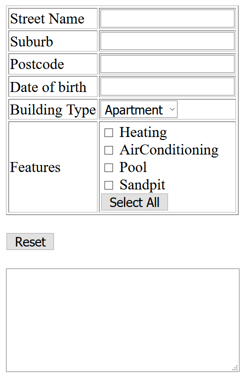

# Assessment 2 - FunForm

## Change Log

N/A

## 1. Before you start

### 1.1. Background & Motivation

This assessment aims to allow students to demonstrate knowledge they've developed during week 3 of the course. You will given a static HTML page and be asked to write Javascript to make the webpage dynamic according to the spec.

### 1.2. Lectures to watch

You will _need_ to watch at least the following lectures before starting (it will help you get started):
 * Everything from assesssment 1
 * [Javascript Language & Syntax](https://cgi.cse.unsw.edu.au/~cs6080/23T3/content/lectures/javascript-syntax-intro)
 * [WebJS Intro](https://cgi.cse.unsw.edu.au/~cs6080/23T3/content/lectures/javascript-browser-intro)
 * [DOM](https://cgi.cse.unsw.edu.au/~cs6080/23T3/content/lectures/javascript-browser-dom)
 * [Events](https://cgi.cse.unsw.edu.au/~cs6080/23T3/content/lectures/javascript-browser-dom)

You will _need_ to watch at least the following lectures to finish the assessment completely:
 * [Closures](https://cgi.cse.unsw.edu.au/~cs6080/23T3/content/lectures/javascript-closures)
 * [Forms](https://cgi.cse.unsw.edu.au/~cs6080/23T3/content/lectures/javascript-browser-forms)

## 2. Task 1 - Dynamic form

### 2.1. Overview

The HTML page in `task1/src/index.html` displays a series of inputs, and when valid, outputs a "summary" of this information in the textarea at the bottom of the page.

You are going to make this form dynamic and interactive through use of Javascript only (Modification or addition of any  HTML or CSS is prohibited).

#### 2.1.1. The page

The page consists of a:
 * Table
   * Text input for `Street` Name (must be between 3 and 50 characters inclusive).
   * Text input for `Suburb` (must be between 3 and 50 characters inclusive).
   * Text input for `Postcode` (must be a number that is exactly 4 digits).
   * Text input for `Date of birth` (valid input is the exactformat "DD/MM/YYYY" and must be a valid date. This means it must match the regex expression "[0-9]{2}/[0-9]{2}/[0-9]{4}" and when trying to parse it with the Javascript date object it does not return **NaN**).
   * Dropdown for `building type` (either "Apartment" or "House", no other options). Apartment is default.
   * Checkbox for `features` that the house has (Heating, AirConditioning, Pool, Sandpit).
   * Button to select / deselect all.
 * Remove button
 * Textarea (initially blank)

#### 2.1.2. Actions

The following are events that trigger a render that should be binded to particular actions
* Changing of the "building type" or "features" should trigger a render.
* Blur of the "street name", "suburb", "postcode", or "date of birth" should trigger a render.

There are key buttons on the page:
* When the `Select All` button is clicked inside the features section, all 4 feature checkboxes are selected.
  * At any time when all 4 features are selected, the `Select All` button's text is changed to `Deselect all`. When this button is pressed in this state, all 4 of the feature checkboxes become unselected.
* When the `reset` button is clicked, the `textarea` has all of its text removed (i.e. it becomes blank again), and all of the form elements in the table are reset to their default state.

#### 2.1.3. Rendering

The "output" refers to what the inner HTML text should be of the textarea at the bottom of the page.

* If they haven't inputted a `street name`, or the `street name` entered is invalid, the output should be _"Please input a valid street name"_
* If they have inputted a `street name`, but haven't inputted a `suburb` / the `suburb` is invalid, the output should be _"Please input a valid suburb"_
* If they have inputted a `street name` and `suburb`, but haven't inputted a `postcode` / the `postcode` is invalid, the output should be _"Please input a valid postcode"_
* If they have inputted a `street name`, `suburb`, and `postcode`, but haven't inputted a valid `date of birth`, the output should be _"Please enter a valid date of birth"_
* If they have entered the above correctly, the output is _"You are [age (integer)] years old, and your address is [street name] St, [suburb], [postcode], Australia. Your building is [a|an] [building type], and it has [features]"_
  * If no features are selected, [features] is _"no features"_
  * If 1 feature is selected, [features] is just _"[feature1]"_
  * If 2 or more feature are selected, [features] is just _"[feature1], [feature2], and [feature3]"_ etc, where "and" joins the last and second last feature.

Please note: The age needs to be accurate - you cannot just subtract this year from the date of birth year, you must also take into account months and days.

### 2.2. Getting started

This task requires you to modify `src/script.js` and **only** this file. Everything is done in this file. **Do NOT modify the HTML file**.

### 2.3. Sample outputs

The following are sample outputs for different valid combinations of value entries into the form.

1. You are 23 years old, and your address is UNSW St, Kingsford, 2210, Australia. Your building is a House and it has no features

2. You are 38 years old, and your address is Ferrell St, Glebe, 2525, Australia. Your building is an Apartment and it has AirConditioning

3. You are 24 years old, and your address is Colin St, Randwick, 2323, Australia. Your building is a House, and it has Heating, AirConditioning, Pool, and Sandpit

Ensure that your output in the textarea matches the **spacing, letter casing and wording** for each of the examples provided. Also note that features are listed in order of their checkbox.

## Constraints & Assumptions

You need to write Javascript (typically a combination of event listeners and DOM manipulations) that listen for actions described in `2.1.2` and render the page described in `2.1.3` in conjunction with any constraints described in `2.1.1`.

## 3. Constraints & Assumptions

### 3.1. Browser Compatibility

You should ensure that your programs have been tested on one of the following two browsers:
 * Locally, Google Chrome (various operating systems) latest version
 * On CSE machines, Chromium

### 3.2. External libraries

You are restricted from using any third party JS libraries when completing this assessment. Basically, this means you can't import code using the `<script />` tag or `fetch` keyword if it's from a file you did not write yourself, and you shouldn't be copying any larger chunks of code from other sources.

## 3.3. Marking Criteria

Your assignment will be marked according to the criteria below.

<table>
	<tr>
		<th>Criteria</th>
		<th>Weighting</th>
		<th>Description</th>
	</tr>
	<tr>
		<td>Visual Compliance</td>
		<td>50%</td>
		<td>
			<ul>
				<li>For specified elements of the page, JS events triggered by specific actions occur.</li>
			</ul>
		</td>
	</tr>
	<tr>
		<td>Code Quality</td>
		<td>50%</td>
		<td>
			<ul>
				<li>JS code is appropriately styled and formatted based on common conventions shown in lectures.</li>
				<li>Ensure that source code (JS) is no more complicated or verbose than necessary to solve a given problem (less is more).</li>
				<li>Your code is clean, well commented, with well-named variables, and well laid out as highlighted in the course style guide.</li>
				<li>Code follows common ReactJS patterns that have been discussed in lectures and as highlighted in the course style guide.</li>
			</ul>
		</td>
	</tr>
</table>

## 4. Originality of Work

The work you submit must be your own work.  Submission of work partially or completely derived from
any other person or jointly written with any other person is not permitted.

The penalties for such an offence may include negative marks, automatic failure of the course and
possibly other academic discipline. Assignment submissions will be examined both automatically and
manually for such submissions.

Relevant scholarship authorities will be informed if students holding scholarships are involved in
an incident of plagiarism or other misconduct.

Do not provide or show your assignment work to any other person &mdash; apart from the teaching
staff of COMP6080.

If you knowingly provide or show your assignment work to another person for any reason, and work
derived from it is submitted, you may be penalized, even if the work was submitted without your
knowledge or consent.  This may apply even if your work is submitted by a third party unknown to
you.

Every time you make commits or pushes on this repository, you are acknowledging that the work you
submit is your own work (as described above).

Note you will not be penalized if your work has the potential to be taken without your consent or
knowledge.

**PLEASE NOTE: To ensure the originality of your work, we are requiring that you regularly commit your work to git throughout the weeks this assignment has been released. Regular and small commits (essentially at least once a day that you work on the assignment) are critical. Failures to commit regularly (or at minimum, failures to commit in small chunks) may results in either penalties of up to 20% of result in allegations of plagiarism.**

## 5. Submission

This assignment is due *Friday 6th October, 10pm*.

To submit your assignment, you must you've pushed all of your code to your gitlab master branch. You can check if you've done this properly by seeing what code is on the gitlab site on your master branch.
 
We will collect the latest work on your master branch of gitlab at the time of submission.

It is your responsibiltiy to ensure that your code can run successfully when cloned fresh from Gitlab.

## 6. Late Submission Policy

No late submission are accepted.
