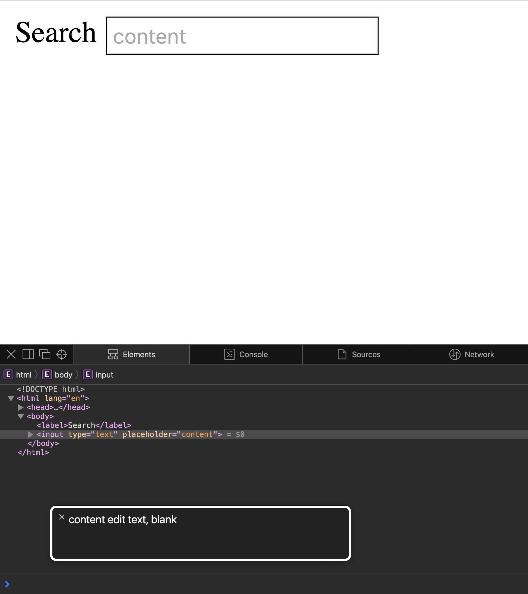

## Taking a page and making it more accessible (3)

In [index.html](index.html) there is a simple search field which consists of a `<label>` tag and an `<input>` tag. What are some of the ways we can make this more assessible?

If you're on a Mac press Command-F5 to turn VocieOver (an integrated screen reader on Apple devices) on and off to see how it changes every step we take towards improving accessibility.

If you're on Windows there are 2 widely-used screen readers that you can download to try out this exercise yourself.
* [NonVisual Desktop Access (NVDA)](https://www.nvaccess.org/)
* [Job Access With Speech (JAWS)](https://www.freedomscientific.com/Products/software/JAWS/)

Images of VoiceOver running on Safari 15 MacOS Monterey are attached in case you don't have access to a screen reader on your operating system.

Here's what will be read currently when we click to focus on the input box.

First of all let's link the `<label>` tag to the `<input>` tag so when we click the label the input is also focused.

Now the screen reader will read out this. It associated the label with the input field which is exactly what we did.

Next since this input field is for users to type in a search term instead of just any text, why not change the `type` to be `search`.

Then it becomes this which is even better as it starts to recognise this is not any normal input field but a search field.

It’s not always possible to entirely define the structure of a page or individual components with HTML alone. In those cases we resort to ARIA tags.

Try adding a `role=search` to the `input` tag, and then see what the screen reader says.

I don't know about you but I still think `type=search` has the best description. In this case HTML tags and attributes are enough to deliver the semantics.

Remember semantic HTML is your always your first option, try not to rely on ARIA attributes, only use them to assist you in providing better accessibility.
