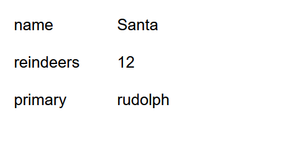
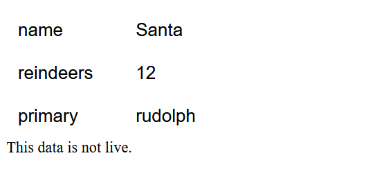

## Build a JS webpage using fetch and local storage

A json file is stored at `http://www.cse.unsw.edu.au/~cs6080/raw/data/package.json`.

1. Write a basic webpage in `store.html` that fetches the data this resource (URL), decodes the JSON, and then displays it in a well organised flex element/container on the webpage. You are not allowed to add static HTML or CSS to the webpage as part of this activity. You must generate everything on the page dynamically via javascript and DOM manipulation.

2. Before it displays it in the container, it should store a copy of the data in local storage
3. If there is an error accessing the URL, or there is an error decoding the information at that URL, the webpage will display the "cached" (stored in local storage) values and provide the user with a simple message informing them that "This data is not live."

4. Have the page say "Loading, please wait" (we don't care how it looks) while we're waiting for the asynchronous fetch/decode calls to complete (successfully or unsuccessfully). Once the page is ready to render, display it, and remove the "Loading, please wait" asset(s).

