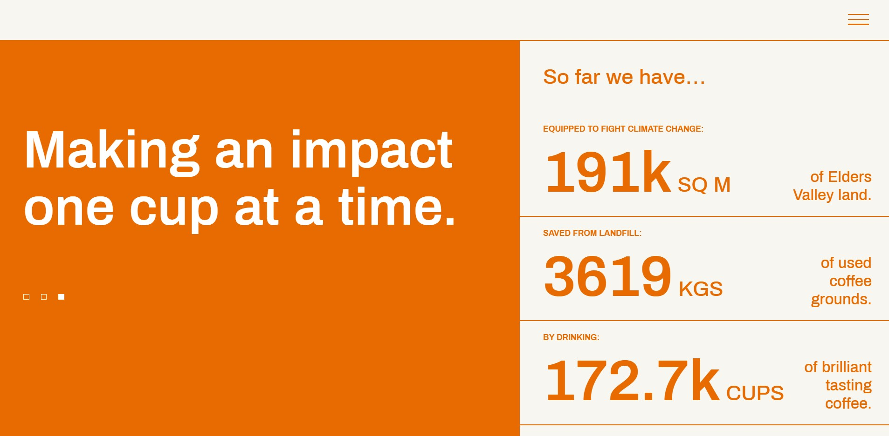

## Use CSS to replicate a stats marketing page

Build a page that looks identical to `page.jpg`. The window width you should work with is 1907 x 937 pixels. You are only allowed to use HTML and CSS for this task. No external libraries are permitted.

Please build your page in `index.html`. You are welcome to create as many CSS files that you need.

### Assets
* Your fonts do not need to match exactly. You may use font-family `sans-serif` for the page.

### Analysing the pages

Two things will want to seek external help for are (that you can't determine just by "looking" at it):
1) Determining the particular colour (RGB or HEX) of various pixels (we recommend the use of [the Firefox eye dropper](https://developer.mozilla.org/en-US/docs/Tools/Eyedropper), though other alternatives may be appropriate for you)
2) Determining the size of particular elements (we recommend the use of [photopea](https://www.photopea.com/)). An example of it's usage is below:

### How closely to match images

Your page has to generally look the same, but doesn't have to be pixel perfect. We won't use a magnifying glass, though we will expect you to get the big things right. If you feel uncertain, please post in the forum.
