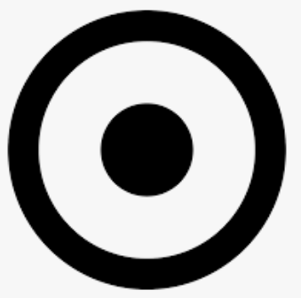

## Let's build our own SVGs

Create an SVG element in `hamburger.html` for a hamburger menu icon that looks identical to `images/hamburger.png`. The viewbox you should use is `0 0 100 100`, and the SVG should have dimensions 50 x 50 pixels.

Create an SVG element in `target.html` for a target icon that looks identical to `images/target.png`. Please choose a viewbox and dimensions that you find reasonable.

