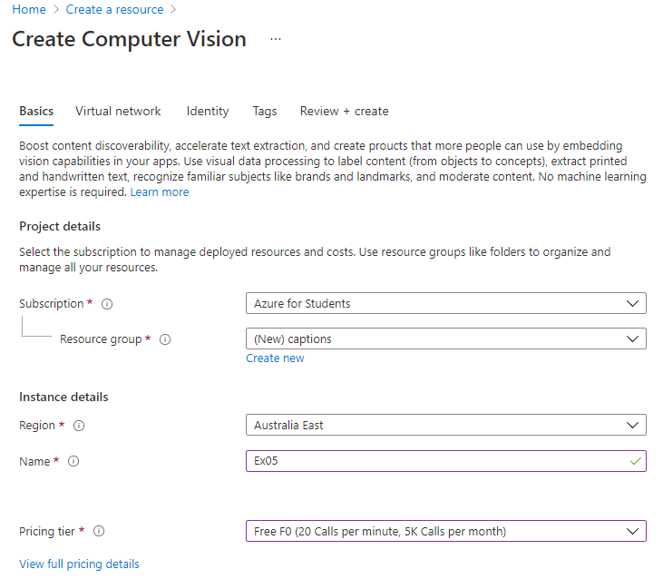

## Working with Azure API to generate alt-text

With advancements in Artificial Intelligence and Machine Learning, new tools are becoming available for developers to provide a more accessible and seamless experience. The [Microsoft Azure Computer Vision API](https://azure.microsoft.com/en-us/services/cognitive-services/computer-vision/) analyses the content in images and video and can therefore be used to generate alt-text in situations where alt-text cannot be provided manually.

| :warning: It is important to note that AI written alt-text should not replace manual alt-text in all cases, particularly with nuanced or important content which requires a human-written description. Alt-text is an important factor in accessibility and it is important to provide accurate descriptions. |
|---|

### Set up Microsoft Azure Computer Vision API

1. Sign up for [Azure for Students](https://azure.microsoft.com/en-au/free/students/) (You can use your university email)
2. Create a Computer Vision Resource from the Azure services home page:
   - Click Create a resource
   - Search for Computer Vision and click Create
   - In the Basics section, fill out the Project and Instance details (image provided for reference). You may need to create a new resource group and give it a name. You will need to select a name for the Instance – this will be your custom domain. Ensure you select the Free pricing tier.
   
   
   - Click Review + Create and after the validation passes, click Create. Your service will be deployed and you can click Go to Resource.
   - You will need to get your **API key** from the Keys and Endpoints section

### Use API to generate alt-text for images

1. Write a basic webpage in `index.html` that allows an image to be uploaded. (Hint: use a file input which accepts images.)
2. Below the image upload section, add a preview of the uploaded image which updates when the image upload is changed. You can use an img tag and you might want to separate your javascript into a separate file (e.g. `captions.js`)
3. Use the API to generate AI alt-text (captions) for the image. This should also be called when the image upload is changed. Make sure you update the alt tag of the preview image to the generated alt-text. You may also want to add a viewable section of the page to display this text.

Hints:

- The API documentation can be found [here](https://westus.dev.cognitive.microsoft.com/docs/services/computer-vision-v3-2/operations/56f91f2e778daf14a499f21f). You can use the `describe` endpoint or the `analyze` endpoint
- The format that files are uploaded in can be sent directly to the API without modification - for the `Content Type` header use the `application/octet-stream`