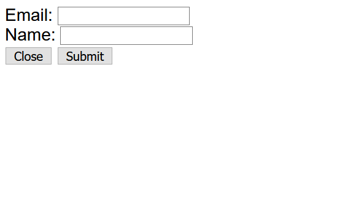

## Managing screen state (SPA) with Vanilla JS

Build a page in `tabs.html` that has:
 * A header bar with options Home, About, News, Articles
 * A footer with a contact us link

When the items in the header bar are clicked, the "body" of the page should change to the relevant content below. NOTE: You aren't to just change the inner HTML of the body element, as there may be many nested HTML elements within that. You can either solve this via rendering all bodies and toggling which is displayed, or constantly re-rendering whichever one is being displayed currently.

When the contact us in the footer is clicked, a popup appears with standard form options for personal details. Clicking "Close" or "Submit" removes the popup and takes you back to the *same page/body you were on before*.

