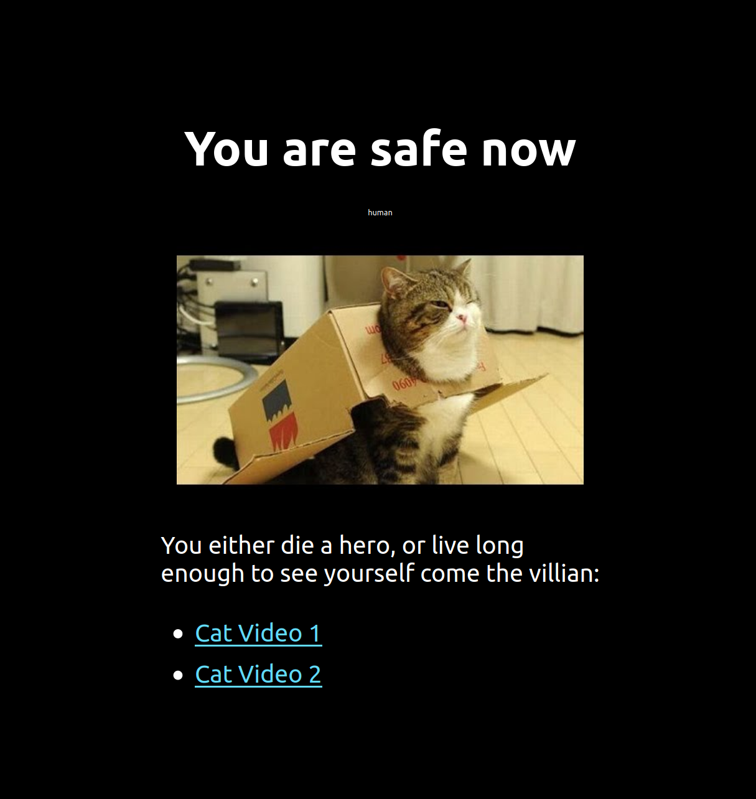

## The basic editing of a ReactJS CRA (editing styles)

Create a new ReactJS app in your `react` folder by running `npx create-react-app react`.

You can navigate to the `react` folder and then run `yarn start` which will start up the development environment (essentailly a mini deployment that will automatically reload when you make changes to your code).

While `yarn start` is running, open the file `src/App.js` and `src/App.css` in an editor. These is the file we are going to edit for this lab.

Make your ReactJS app look identical to the page below.

Take note of:
 * The background colour
 * The rough font sizes
 * The spacing between elements

Key assets include:
 * (Image of the cat)[https://i.ytimg.com/vi/wWqdhBdeMSg/hqdefault.jpg]
 * The `Cat Video 1` and `Cat Video 2` can be two URLs to YOUR favourite cat videos on youtube.

The page can be any size, we won't be assessing you on the overall dimensions, as long as everything is on the page as described.

Ensure that you place your CSS properties together in relevant class names and then store those classes in `src/App.css`
