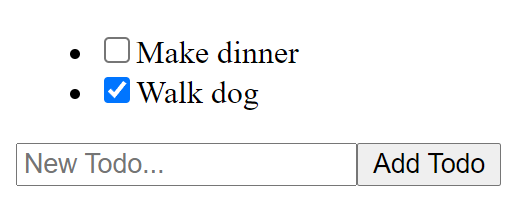

## Learn more about hooks by making your own custom hook

Create a new react app in an `exercise` folder by running `npx create-react-app exercise`.

Build a basic todo list that consists of a list of todo items and a form to add new items.

Using `React.useEffect`, save the todos to `localStorage`. Remember to use `JSON.stringify` since `localStorage` can only store strings.

Open the `Application` tab in the devtools and notice how the values change as you add todos and mark them complete.

Now update your todos `useState` to use the [function version](https://reactjs.org/docs/hooks-reference.html#lazy-initial-state) for its initial value. In the function read and parse the value from `localStorage` and use it as the initial value.

Extract the `useState` and `useEffect` for the todos to a new function called `useLocalStorageState` (the exact name of the function doesn't matter but it should start with `use` so eslint knows it's a hook). This function should receive the initial value (just like `useState`) and additionally a string key to read / write to localStorage as parameters. It should return the state and state setter functions from the `useState`.

Update the state for the new todo text to use this new hook.
