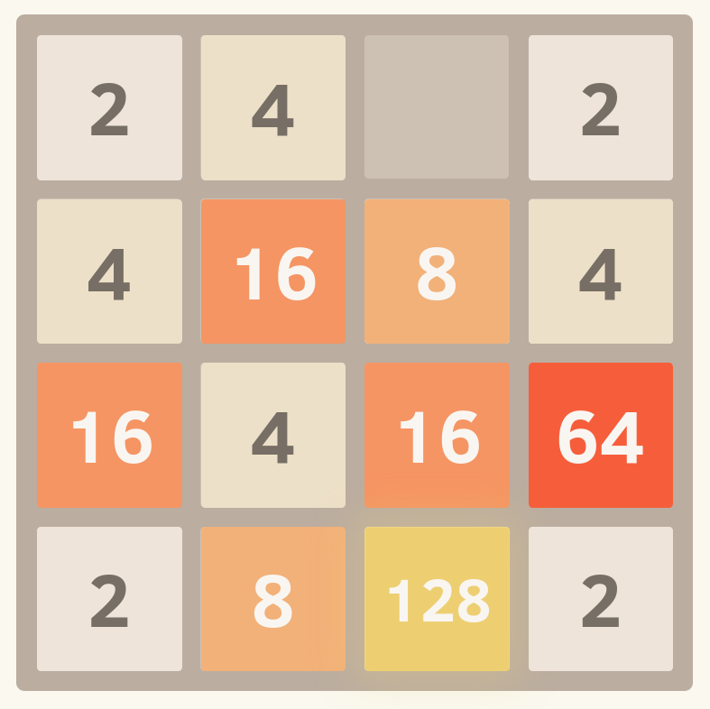

## Get familiar using ReactJS by building a 2048 game

You must complete the page based on the specification below. You are required to build this game as a ReactJS app. We recommend creating a new ReactJS app in the a folder called `react` by running `npx create-react-app react`. Once the app is made, inside of `App.js` you can copy and paste your HTML/CSS code to get the page loaded in a static way.

Once you've got the page OK statically, you can then use the `useState` hook discussed in lectures, in conjunction with the `onKeyPress` (do some Googling, (e.g. here)[https://stackoverflow.com/questions/27827234/how-to-handle-the-onkeypress-event-in-reactjs]) attribute in React that you can bind to the table, to create the intended functionality.

There is no requirement to use components, props, or conditional rendering in this exercise. It may help some students, but it can be completed fine without.

See `Instructions for Exercise 1 (Vanilla) and Exercise 2 (ReactJS)` for instructions on what to implement.

## Instructions for Exercise 1 (Vanilla) and Exercise 2 (ReactJS)

The stub code is provided to you in the exercise02 folder.

```html
<table border="1">
	<tr>
		<td>2</td>
		<td></td>
		<td></td>
		<td></td>
	</tr>
	<tr>
		<td>2</td>
		<td></td>
		<td></td>
		<td></td>
	</tr>
	<tr>
		<td>2</td>
		<td></td>
		<td></td>
		<td></td>
	</tr>
	<tr>
		<td>2</td>
		<td></td>
		<td></td>
		<td></td>
	</tr>
</table>
```



The game always begins with a single `2` in the top left, and all other cells empty.

You must add key listener events to the board such that when:
 * The "down" key is pressed, all the cells slide down as far as they can to the bottom
 * The "right" key is pressed, all the cells slide right as far as they can to the right
 * The "left" key is pressed, all the cells slide left as far as they can to the left
 * The "up" key is pressed, all the cells slide up as far as they can to the up

After a slide occurs, a cell containing either `2` or `4` (randomly chosen) should appear in one of the empty cells on the board (randomly chosen).

The following function can be used to generate a random number:
```javascript
const getRandomInt = (max) => {
  return Math.floor(Math.random() * Math.ceil(max));
}
```

The following features are considered challenge exercises as part of this exercise, and are **NOT required to be completed**:
 * The finish state, when 2048 is reached.
 * The fail state, when the board is full and no more moves can be made.
 * The merging of cells when two adjacent cells slide together as part of a slide.

If you're unsure about any intended behaviour, whether it be the features you include or not, you can see the behaviour in the (2048 Game)[https://play2048.co/].

### Hints

* The easiest and simplest way to solve this problem is just to store a 4 x 4 array for either exercise 1 or exercise 2, 

#### Bonus

Now try and refactor your code to break some parts into separate components so it's not already in one file. Please note: The current solution does not do this.