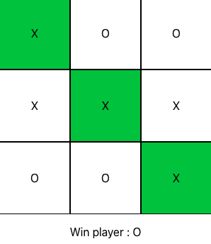

## Get familiar using ReactJS by building a tic-tac-toe game

Build a tic-tac-toe game with ReactJS that has the following functionality  

**Game functionality**
1. Players can click on cells, filling them with X or O depending on whose turn it is.
2. Define a win condition for players 
3. In case of a win:
    * Display the winning player’s name 
    * Set the colour of winning cells to green (using CSS in JS)
    * Increase respective player’s win count in local storage

As a bonus exercise you may want to explore:
* Using loops as part of rendering
* Ensure that a cell can only be clicked once

Note: Run `npx create-react-app tictactoe` on terminal for starter React code  
