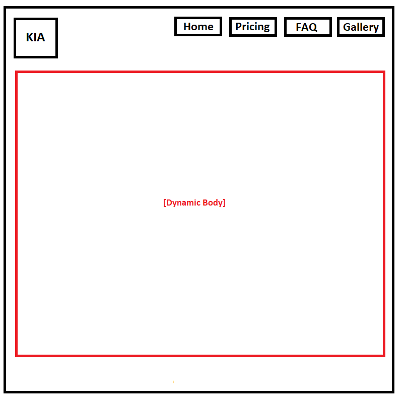

## Managing a ReactJS multi-state page with just the state hook

In the `react` folder run `yarn` and then `yarn start`.

Build a basic page that consists of a home icon (any logo - we put `KIA` as a placeholder), and 4 nav-bar items.

Using `React.useState`, have each of these 4 nav bar items load up a different ReactJS component into the app. You can stub each component with some simple text.

The home icon takes you to the same page as the `home` item in the nav bar.

Note: This can also be done using `react-router-dom` as discussed in the `SPA` lecture.
