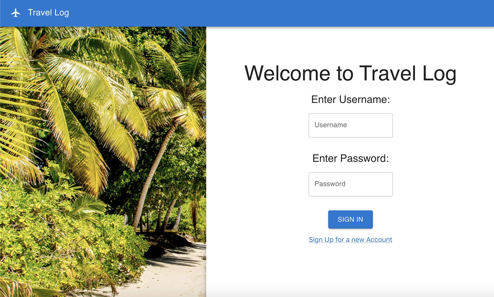

## Get comfortable using a UI framework by using one to build a page

Create a new react app in an `exercise` folder by running `npx create-react-app exercise`.

Using only components from the material UI library try and recreate the following website layout:



* Install the material UI library using the following command
```sh
yarn add @mui/material @emotion/react @emotion/styled
```
* Use material UI components such as AppBar, Box, Paper, Typography, Link and Button to develop your own version of this page. 
* For the beach image use the `beach.jpeg` file given in the src folder
* For the plane icon, use the icon available in the Material UI Icon library
* When the *Sign In* button is clicked console log the message "Welcome to Travelog {username}!"
* If either username or password as empty when *Sign In* button is pressed, console log the message "Enter username and password"