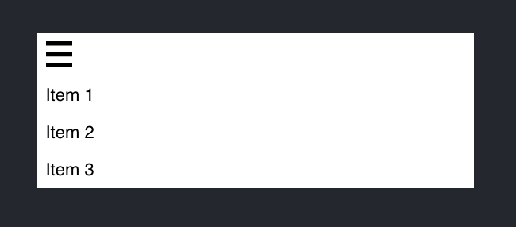

## Write tests for a ReactJS component (2)

This activity is completed within the `exercise` folder.

```
To see the component in action: `yarn start`
To run the sample testing suite: `yarn test`
```

For this exercise, we will be building a menu bar. It consists of a hamburger icon that, when clicked, opens a menu with a list of links. See below for the menu in its closed and open states.

Build the `MenuButton` and `MenuItem` components with accompanying component tests.

**Closed state**


**Open state with three items**



#### `MenuButton` component

This component will take two inputs:
* `open` boolean value which indicates whether the menu is open or closed
* `onClick` event handler which is triggered when the button is clicked

To ensure the menu is accessible, the button should have an `aria-label` attribute (since we are using an image button without text). It should also have an `aria-expanded` attribute that indicates whether the menu is expanded or collapsed.

You may use your SVG from Task 1 or `images/hamburger.png`.

#### `MenuItem` component

This component will take two inputs:
* `title` string value which is the text to be displayed in the menu item
* `onClick` event handler which is triggered when the button is clicked, with `title` as an input parameter

Note: the `onClick` event handlers of `MenuButton` and `MenuItem` are **not** the same

#### Bringing it all together with the `Menu` component

Now, use the previously constructed `MenuButton` and `MenuItem` components to construct the full menu. This component only takes one input:
* `items` list of string values which correspond to the menu items

The menu should be closed by default.

### Challenge:

Modify your application such that when clicking on a MenuItem instead of having an onclick trigger immediately, it opens a popup to confirm whether to continue to the onclick handler or not. Set this popup as a separate component and write component tests for it.