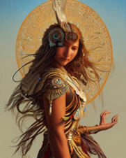
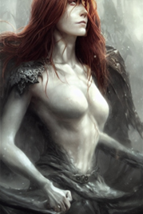

# COMP9417_Project
### Shengyu Chen, Jinghan Wang, Xianzhe Zhang, Enjie Zhang

# Stable Diffusion - Image to Prompts
Deduce the prompts that generated our "highly detailed, sharp focus, illustration, 3d renders of majestic, epic" images

This repository contains:
## Table of Contents
- [Background](#background)
- [Dataset](#dataset)
- [Usage](#usage)
- [Examples](#example)
- [Maintainers](#maintainers)
## Background
The goal of this Topic is to reverse the typical direction of a generative text-to-image model: instead of generating an image from a text prompt, we will create a model which can predict the text prompt given a generated image, we will make predictions on a dataset containing a wide variety of (prompt, image) pairs generated by Stable Diffusion 2.0, in order to understand how reversible the latent relationship is.
## Dataset
from datasets import load_dataset

subset = '2m_first_1k' or '2m_first_5k'

dataset = load_dataset("poloclub/diffusiondb", subset)

For more dataset, please visit https://huggingface.co/datasets/poloclub/diffusiondb
## Usage
For CLIP+GPT2 Model,

Click into Final/CLIP_GPT2 and use this directory as the root directory, run train_clip.py for training, predict.py for precition.

For ResNet+LSTM Model,

Click into Final/Resnet_LSTM_GPT2 and use this directory as the root directory, run model.py for training, predict.py for precition.

If you want to change the dataset or parameters, change the corresponding code in train_clip.py and model.py before running.

## Examples

### Original prompts: 
portrait of a dancing eagle woman, beautiful blonde haired lakota sioux goddess, intricate, highly detailed art by james jean, ray tracing, digital painting, artstation, concept art, smooth, sharp focus, illustration, artgerm and greg rutkowski and alphonse mucha, vladimir kush, giger 8 k.
### CLIP+GPT2: Predict prompts:
portrait of a dancing eagle woman, beautiful blonde haired lakota sioux goddess, intricate, highly detailed, ray tracing, digital painting, artstation, concept art, smooth, sharp focus, illustration, art by artgerm and g.
### ResNet+LSTM: Predict prompts:
arait of a, r ,ism, 4, octane atherine ones greasley vic wearing headphones negative nope no not no not no not but's's not mona lisa is wearing headphones she mon not notaa

### Original prompts: 
portrait of a cloaked female demoness, evil, ominous, luscious, ginger hair, stunning, detailed, by artgerm, by greg rutkowski, by luis royo, by pixar, by myazaki, gothic, final fantasy, fantasy, medieval.
### CLIP+GPT2: Predict prompts:
portrait of a beautiful woman with horns, large piercing blue eyes, long wavy black hair, long black dress with silver jewels, black bat wings on back, detailed background, by tom bagshaw!
### ResNet+LSTM: Predict prompts:
a 9 of a of vintage, wow detail, intricate environment ~ ones golden hourada, houron english and ei wearing headphones negative nope no but it's not monaisaisa wearing headphones she mon not
## Maintainers
[@GATA-Chen](https://github.com/GATA-Chen)
[@EnmmmmOvO](https://github.com/EnmmmmOvO)
## Contributes
No. | Work | Name
| :----- | :----- | :----- 
1 | ResNet+LSTM | Jinghan Wang
2 | CLIP+GPT2 | Shengyu Chen
